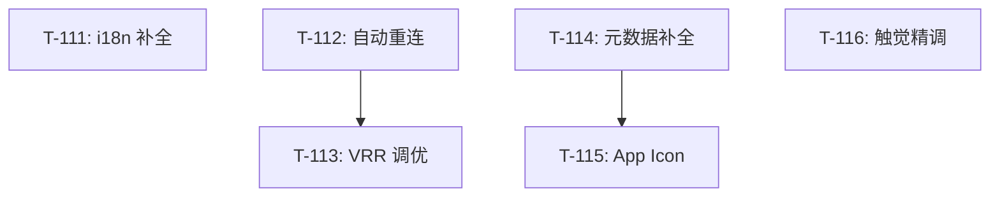

# Chiaki-ng Apple 原生客户端 - 开发任务 (M11)

> **状态更新**: 2026-01-27 (absorb sync)
> **阶段目标**: Beta 1 发布冲刺：生产就绪、体验打磨与稳定性增强 (M11)

## 任务概览

| 编号 | 名称 | 优先级 | TDD 模式 | 状态 |
|------|------|--------|----------|------|
| **T-111** | **i18n：深度本地化与 xcstrings 迁移** | P0 | 🟢 可选 | ⏳ 待处理 |
| **T-112** | **稳定性：NetworkMonitor 与自动重连** | P0 | 🔴 强制 | ✅ 已完成 |
| **T-113** | **性能：Metal 渲染器节能调优 (VRR)** | P1 | ⚪ 不适用 | ⏳ 待处理 |
| **T-114** | **分发：Info.plist 隐私说明与元数据补全** | P1 | ⚪ 不适用 | ⏳ 待处理 |
| **T-115** | **分发：多平台 App Icon 资产准备** | P2 | ⚪ 不适用 | ⏳ 待处理 |
| **T-116** | **体验：语义化触觉反馈 (CoreHaptics) 精调** | P2 | 🟢 可选 | ⏳ 待处理 |

## 任务详情

### T-111: i18n：深度本地化与 xcstrings 迁移
- **目标**: 实现 100% 本地化覆盖，移除硬编码。
- **关联需求**: F-015, AC-044
- **涉及文件**: `Localizable.xcstrings`, 全局 SwiftUI 视图
- **验收标准**:
  - [ ] 所有的 `Text` 和 `String(localized:)` 均有对应的键值。
  - [ ] Accessibility 标签完成本地化。
- **测试方法**: UT-15.1 (静态扫描)。

### T-112: 稳定性：NetworkMonitor 与自动重连 ✅
- **目标**: 处理 WiFi/5G 切换时的会话保持。
- **关联需求**: F-016, AC-045
- **涉及文件**:
  - `Chiaki/Core/Network/NetworkMonitor.swift` ✅
  - `Chiaki/Features/Streaming/StreamingViewModel.swift` ✅
- **验收标准**:
  - [x] 断网后 UI 提示"正在尝试重连"。
  - [x] 网络恢复后 5s 内自动恢复视频流。
- **测试方法**: 🔴 **TDD**: IT-16.1。
- **完成提交**: `d378546` refactor(streaming): extract modules from StreamingViewModel

### T-113: 性能：Metal 渲染器节能调优 (VRR)
- **目标**: 降低静态画面下的 GPU 功耗。
- **关联需求**: F-017, AC-046
- **涉及文件**: `Chiaki/Core/Render/MetalVideoRenderer.swift`
- **验收标准**: 静态画面下 GPU 负载显著降低。

### T-114: 分发：Info.plist 隐私说明与元数据补全
- **目标**: 满足 App Store 隐私审核要求。
- **关联需求**: F-018, AC-047
- **涉及文件**: `Info.plist`
- **验收标准**: 包含具体的麦克风、蓝牙和局域网扫描用途说明。

---

## 依赖关系图

## 执行检查清单

1. [ ] 本阶段任务执行前，必须确保 M10 回归测试全部通过。
2. [ ] 所有的本地化 Key 采用 `camelCase` 命名规范。
3. [ ] 提交 Beta 1 前需清理所有 `TODO` 标记。
