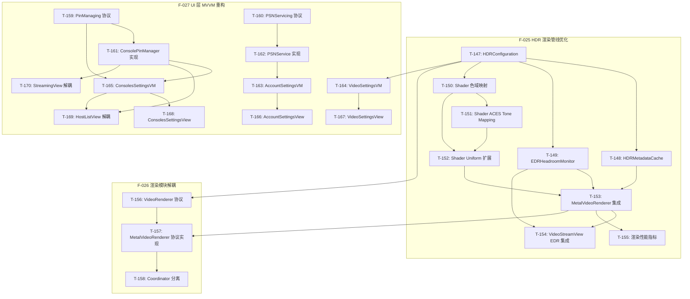
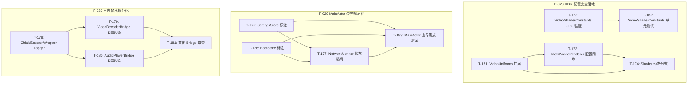
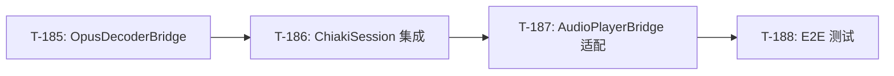

# Chiaki-ng Apple 原生客户端 - 开发任务

> **状态更新**: 2026-02-04
> **当前里程碑**: M13 (HDR 配置完全落地、MainActor 边界规范化、日志输出规范化)
> **M12 状态**: 100% 完成 (24/24)
> **M11 归档**: [archive/04-dev-tasks-archive.md](archive/04-dev-tasks-archive.md) (35 任务)

---

## M11 归档摘要

> **阶段目标**: Beta 1 发布冲刺 | **完成率**: 97% (35/36)
> **详情**: [查看归档文件](archive/04-dev-tasks-archive.md)

| 状态 | 数量 | 说明 |
|------|------|------|
| ✅ 已完成 | 30 | T-111~T-134, T-136~T-139, T-145~T-146 |
| 📦 早前归档 | 5 | T-140~T-144 |
| ⏳ 进行中 | 1 | T-115 (待设计师资产) |

### T-115: 分发：多平台 App Icon 资产准备 ⏳

- **关联需求**: F-018, AC-048
- **当前进度**: tvOS 配置已完成，待设计师提供实际图像资产
- **涉及文件**: `Assets.xcassets/AppIcon.appiconset/`

---

# 开发任务 (M12)

> **状态更新**: 2026-02-04
> **阶段目标**: HDR 渲染优化、渲染模块解耦、UI 层 MVVM 合规重构
> **完成率**: 100% (24/24 任务完成)

## M12 任务概览

| 编号 | 名称 | 优先级 | TDD 模式 | 依赖 | 状态 |
|------|------|--------|----------|------|------|
| **T-147** | HDR: HDRConfiguration 统一配置结构 | P0 | 🔴 强制 | - | ✅ |
| **T-148** | HDR: HDRMetadataCache 抖动抑制 | P0 | 🔴 强制 | T-147 | ✅ |
| **T-149** | HDR: EDRHeadroomMonitor 动态监听 | P0 | 🔴 强制 | T-147 | ✅ |
| **T-150** | HDR: Shader 色域映射 (Rec.2020→P3) | P0 | 🔴 强制 | T-147 | ✅ |
| **T-151** | HDR: Shader ACES Tone Mapping | P1 | 🔴 强制 | T-150 | ✅ |
| **T-152** | HDR: Shader Uniform 扩展 | P0 | 🟡 推荐 | T-150, T-151 | ✅ |
| **T-153** | HDR: MetalVideoRenderer 集成 | P0 | 🟡 推荐 | T-148, T-149, T-152 | ✅ |
| **T-154** | HDR: VideoStreamView EDR 集成 | P0 | 🟢 可选 | T-149, T-153 | ✅ |
| **T-155** | Stats: 渲染性能指标扩展 | P1 | 🔴 强制 | T-153 | ✅ |
| **T-156** | Render: VideoRenderer 协议抽象 | P0 | 🔴 强制 | T-147 | ✅ |
| **T-157** | Render: MetalVideoRenderer 协议实现 | P0 | 🔴 强制 | T-156, T-153 | ✅ |
| **T-158** | Render: VideoStreamView.Coordinator 分离 | P1 | 🟡 推荐 | T-157 | ✅ |
| **T-159** | Protocol: PinManaging 协议定义 | P0 | 🔴 强制 | - | ✅ |
| **T-160** | Protocol: PSNServicing 协议定义 | P0 | 🔴 强制 | - | ✅ |
| **T-161** | Protocol: ConsolePinManager 协议实现 | P0 | 🟡 推荐 | T-159 | ✅ |
| **T-162** | Protocol: PSNService 协议实现 | P0 | 🟡 推荐 | T-160 | ✅ |
| **T-163** | VM: AccountSettingsViewModel | P0 | 🔴 强制 | T-162 | ✅ |
| **T-164** | VM: VideoSettingsViewModel | P1 | 🔴 强制 | T-147 | ✅ |
| **T-165** | VM: ConsolesSettingsViewModel | P1 | 🔴 强制 | T-159, T-161 | ✅ |
| **T-166** | View: AccountSettingsView 重构 | P0 | 🟢 可选 | T-163 | ✅ |
| **T-167** | View: VideoSettingsView 重构 | P1 | 🟢 可选 | T-164 | ✅ |
| **T-168** | View: ConsolesSettingsView 重构 | P1 | 🟢 可选 | T-165 | ✅ |
| **T-169** | View: HostListView Singleton 解耦 | P0 | 🟢 可选 | T-161, T-165 | ✅ |
| **T-170** | View: StreamingView/ControllerSettingsView 解耦 | P1 | 🟢 可选 | T-161 | ✅ |

---

## M12 任务详情

### T-147: HDR: HDRConfiguration 统一配置结构 ✅

**目标**: 创建统一的 HDR 配置结构，集中管理所有 HDR 相关设置。

**关联需求**: F-025, F-026 | AC-088

**测试用例**: UT-032.1~6

**TDD 模式**: 🔴 强制

**完成提交**: `11af485` feat(video): add HDRConfiguration unified structure (T-147)

**涉及文件**:
- `Chiaki/Core/Video/HDRConfiguration.swift` (新建)
- `ChiakiTests/HDRConfigurationTests.swift` (新建)

**验收标准**:
- [x] `HDRConfiguration` 结构包含 enabled, edrIntensity, colorSpace, colorRange, tonemapMode, gamutMappingEnabled
- [x] 提供 `.sdr` 和 `.hdr` 静态预设
- [x] `isHDR` 计算属性正确判断 (enabled && bt2020)
- [x] 实现 Codable 和 Equatable
- [x] 所有属性有合理默认值

**测试方法**:
```bash
swift test --filter HDRConfigurationTests
```

**Review 要点**:
- [x] 枚举值与 Shader 常量对齐
- [x] 默认值与现有行为兼容

---

### T-148: HDR: HDRMetadataCache 抖动抑制 ✅

**目标**: 实现 HDR 元数据缓存,避免 HDR/SDR 状态频繁切换。

**关联需求**: F-025 | AC-083

**测试用例**: UT-029.1~5

**TDD 模式**: 🔴 强制

**依赖**: T-147

**完成提交**: `4e315cb` feat(video): add HDRMetadataCache jitter suppression (T-148)

**涉及文件**:
- `Chiaki/Core/Video/HDRMetadataCache.swift` (新建)
- `ChiakiTests/HDRMetadataCacheTests.swift` (新建)

**验收标准**:
- [x] 初始状态为 SDR (confirmedHDR = false)
- [x] 需要连续 5 帧 HDR 才能确认为 HDR 模式
- [x] 需要连续 5 帧 SDR 才能切换回 SDR 模式
- [x] 单帧抖动不改变状态
- [x] `reset()` 方法清除所有状态

**测试方法**:
```bash
swift test --filter HDRMetadataCacheTests
```

**Review 要点**:
- [x] 阈值可配置或有合理常量
- [x] 线程安全（如需从多线程调用）

---

### T-149: HDR: EDRHeadroomMonitor 动态监听 ✅

**目标**: 实现 EDR Headroom 动态监听，支持 macOS 和 iOS。

**关联需求**: F-025 | AC-081

**测试用例**: UT-028.1~4, IT-011.1~4

**TDD 模式**: 🔴 强制

**依赖**: T-147

**完成提交**: `f02af86` feat(video): add EDRHeadroomMonitor dynamic headroom tracking (T-149)

**涉及文件**:
- `Chiaki/Core/Video/EDRHeadroomMonitor.swift` (新建)
- `ChiakiTests/EDRHeadroomMonitorTests.swift` (新建)

**验收标准**:
- [x] macOS: 监听 `NSScreen.maximumExtendedDynamicRangeColorComponentValue`
- [x] iOS 16+: 使用 `UIScreen.currentEDRHeadroom`
- [x] 初始值 ≥ 1.0
- [x] 值变化平滑过渡（避免突变）
- [x] 追踪最大可用 Headroom
- [x] 正确清理 observer/displayLink

**测试方法**:
```bash
swift test --filter EDRHeadroomMonitorTests
```

**Review 要点**:
- [x] 平台条件编译正确 (`#if os(macOS)`)
- [x] DisplayLink 正确配置帧率
- [x] 内存管理（deinit 清理）

---

### T-150: HDR: Shader 色域映射 (Rec.2020→P3) ✅

**目标**: 在 Metal Shader 中实现 Rec.2020 到 Display P3 色域映射。

**关联需求**: F-025 | AC-080

**测试用例**: UT-027.1~6

**TDD 模式**: 🔴 强制

**依赖**: T-147

**完成提交**: `d353a35` feat(video): add Rec.2020 to P3 gamut mapping (T-150)

**涉及文件**:
- `Chiaki/Core/Video/MetalVideoRenderer.swift` (修改 - 嵌入式 shader)
- `Chiaki/Core/Video/VideoShaders.txt` (修改 - 参考文档)
- `Chiaki/Core/Video/VideoShaderConstants.swift` (新建 - Swift 侧常量)
- `ChiakiTests/ColorSpaceConversionTests.swift` (新建)

**验收标准**:
- [x] 添加 `kRec2020_to_P3_Matrix` 常量矩阵
- [x] 添加 `applyGamutMapping()` 函数
- [x] 白点映射 (1,1,1) → 接近 (1,1,1)
- [x] 负值软裁剪（不产生 NaN）
- [x] 矩阵可逆（行列式非零）

**测试方法**:
```bash
xcodebuild test -scheme Chiaki -destination 'platform=macOS' -only-testing:ChiakiTests/ColorSpaceConversionTests
```

**Review 要点**:
- [x] 矩阵值与标准参考一致
- [x] 在正确位置调用（PQ EOTF 后，EDR 缩放前）

---

### T-151: HDR: Shader ACES Tone Mapping ✅

**目标**: 实现 ACES Filmic Tone Mapping 用于 HDR→SDR 降级。

**关联需求**: F-025 | AC-084

**测试用例**: UT-030.1~5

**TDD 模式**: 🔴 强制

**依赖**: T-150

**完成提交**: `47555af` feat(video): add ACES Filmic tone mapping for HDR→SDR (T-151)

**涉及文件**:
- `Chiaki/Core/Video/MetalVideoRenderer.swift` (修改 - 嵌入式 shader)
- `Chiaki/Core/Video/VideoShaders.txt` (修改 - 参考文档)
- `Chiaki/Core/Video/VideoShaderConstants.swift` (修改 - Swift 侧常量)
- `ChiakiTests/TonemappingTests.swift` (新建)

**验收标准**:
- [x] 实现 `acesTonemap()` 函数
- [x] 黑色保留: (0,0,0) → (0,0,0)
- [x] 高光压缩: (10,10,10) → < (1,1,1)
- [x] 输出范围 ∈ [0, 1]
- [x] 单调性: x1 < x2 → f(x1) < f(x2)

**测试方法**:
```bash
swift test --filter TonemappingTests
```

**Review 要点**:
- [x] ACES 参数与标准一致
- [x] 条件调用（tonemapMode == 1 时）

---

### T-152: HDR: Shader Uniform 扩展 ✅

**目标**: 扩展 Shader Uniform 结构以支持新的 HDR 参数。

**关联需求**: F-025 | AC-081, AC-082, AC-084

**测试用例**: IT-011.2

**TDD 模式**: 🟡 推荐

**依赖**: T-150, T-151

**完成提交**: `cb61b66` feat(video): extend shader uniforms with HDR parameters (T-152)

**涉及文件**:
- `Chiaki/Core/Video/MetalVideoRenderer.swift` (修改 - 嵌入式 shader 及 Swift 结构)
- `ChiakiTests/HDRIntegrationTests.swift` (新建)

**验收标准**:
- [x] `VideoUniforms` 新增 `edrHeadroom: Float`
- [x] `VideoUniforms` 新增 `tonemapMode: UInt32`
- [x] Swift 侧 `VideoUniforms` 与 Metal 侧内存布局一致 (112 bytes, 16-byte aligned)
- [x] Fragment Shader 根据 uniforms 选择处理路径

**测试方法**:
```bash
swift test --filter HDRIntegrationTests
```

**Review 要点**:
- [x] 内存对齐正确 (添加 `_padding` 确保 16 字节对齐)
- [x] 默认值与现有行为兼容

---

### T-153: HDR: MetalVideoRenderer 集成 ✅

**目标**: 将所有 HDR 组件集成到 MetalVideoRenderer。

**关联需求**: F-025 | AC-080, AC-082, AC-083

**测试用例**: IT-011.1~4

**TDD 模式**: 🟡 推荐

**依赖**: T-148, T-149, T-152

**完成提交**: `2cd83ef` feat(video): integrate HDRMetadataCache for jitter suppression (T-153)

**涉及文件**:
- `Chiaki/Core/Video/MetalVideoRenderer.swift` (修改)
- `ChiakiTests/VideoRendererHDRTests.swift` (新建)

**验收标准**:
- [x] 集成 `HDRMetadataCache` 用于抖动抑制
- [x] 添加 `edrHeadroom` 属性接收外部值
- [x] 添加 `hdrConfiguration` 属性
- [x] `updateUniforms()` 方法正确填充所有 HDR 相关字段
- [x] 根据 PixelFormat 检测 HDR 帧

**测试方法**:
```bash
xcodebuild test -scheme Chiaki -destination 'platform=macOS' -only-testing:ChiakiTests/VideoRendererHDRTests
```

**Review 要点**:
- [x] 线程安全（帧提交可能来自不同线程）
- [x] 不破坏现有 SDR 渲染逻辑

---

### T-154: HDR: VideoStreamView EDR 集成 ✅

**目标**: 在 VideoStreamView 中集成 EDR Headroom 监听和传递。

**关联需求**: F-025 | AC-081, AC-082

**测试用例**: E2E-011.1~3

**TDD 模式**: 🟢 可选

**依赖**: T-149, T-153

**完成提交**: `ecc9ad7` feat(video): integrate EDR headroom monitoring in VideoStreamView (T-154)

**涉及文件**:
- `Chiaki/Core/Video/VideoStreamView.swift` (修改)

**验收标准**:
- [x] 持有 `EDRHeadroomMonitor` 实例
- [x] 在 `updateNSView`/`updateUIView` 中传递 headroom 到 renderer
- [x] HDR 模式下配置 `rgba16Float` (macOS) / `rgb10a2Unorm` (iOS/tvOS) 像素格式
- [x] HDR 模式下配置 `extendedLinearDisplayP3` 色彩空间
- [x] 动态切换像素格式（HDR↔SDR）

**测试方法**: 手动测试 + E2E-011 (可通过 Build 验证)

**Review 要点**:
- [x] 像素格式切换时机正确
- [x] 无内存泄漏

---

### T-155: Stats: 渲染性能指标扩展 ✅

**目标**: 扩展 StreamStatsManager 以支持详细渲染性能指标。

**关联需求**: F-025 | AC-085

**测试用例**: UT-031.1~5

**TDD 模式**: 🔴 强制

**依赖**: T-153

**完成提交**: `80c9ffb` feat(stats): extend performance metrics with decode/render timing (T-155)

**涉及文件**:
- `Chiaki/Core/Streaming/StreamStatsManager.swift` (修改)
- `ChiakiTests/StreamStatsManagerTests.swift` (修改)

**验收标准**:
- [x] 新增 `decodeTimeMs`, `renderTimeMs` 属性
- [x] 新增 `p95LatencyMs`, `p99LatencyMs` 属性
- [x] 实现百分位计算（采样窗口 100）
- [x] `recordDecodeTime()`, `recordRenderTime()` 方法
- [x] P99 ≥ P95 恒成立

**测试方法**:
```bash
# 由于使用了 swift-testing，通过 xcodebuild 运行
xcodebuild test -scheme Chiaki -destination 'platform=macOS' -only-testing:ChiakiTests/StreamStatsManagerTests
```

**Review 要点**:
- [x] 采样窗口大小合理
- [x] 计算效率可接受

---

### T-156: Render: VideoRenderer 协议抽象 ✅

**目标**: 定义 VideoRenderer 协议，实现渲染器抽象。

**关联需求**: F-026 | AC-086

**测试用例**: UT-033.1~6

**TDD 模式**: 🔴 强制

**依赖**: T-147

**完成提交**: 待提交

**涉及文件**:
- `Chiaki/Core/Video/VideoRenderer.swift` (修改)
- `Chiaki/Core/Video/MetalVideoRenderer.swift` (修改)
- `ChiakiTests/VideoRendererTests.swift` (新建)

**验收标准**:
- [x] 协议定义 `submitFrame(_:)` 方法
- [x] 协议定义 `render(to:descriptor:)` 方法
- [x] 协议定义 `displayMode`, `zoomFactor`, `hdrConfiguration`, `edrHeadroom` 属性
- [x] 协议定义 `setBrightness`, `setContrast`, `setSaturation` 方法
- [x] 协议定义 `frameSize`, `hasFrame` 查询属性
- [x] 定义 `VideoDisplayMode`, `TonemapMode` 枚举

**测试方法**:
```bash
xcodebuild test -scheme Chiaki -destination 'platform=macOS' -only-testing:ChiakiTests/VideoRendererProtocolTests
```

**Review 要点**:
- [x] 协议足够抽象，不暴露 Metal 细节
- [x] Sendable 合规

---

### T-157: Render: MetalVideoRenderer 协议实现 ✅

**目标**: 重构 MetalVideoRenderer 以实现 VideoRenderer 协议。

**关联需求**: F-026 | AC-086, AC-089

**测试用例**: UT-033.1~6, UT-034.1~3

**TDD 模式**: 🔴 强制

**依赖**: T-156, T-153

**完成提交**: 待提交 (与 T-156, T-158 合并提交)

**涉及文件**:
- `Chiaki/Core/Video/MetalVideoRenderer.swift` (重构)

**验收标准**:
- [x] `MetalVideoRenderer` 实现 `VideoRenderer` 协议
- [x] **移除** `MTKViewDelegate` 实现
- [x] 所有协议方法正确实现
- [x] 通过依赖注入接收 `HDRConfiguration`
- [x] `edrHeadroom` 可从外部设置

**测试方法**:
```bash
xcodebuild test -scheme Chiaki -destination 'platform=macOS' -only-testing:ChiakiTests/VideoRendererProtocolTests
```

**Review 要点**:
- [x] 不再直接实现 MTKViewDelegate
- [x] 无破坏性变更（MTKViewDelegateBridge 接管 delegate）

---

### T-158: Render: VideoStreamView.Coordinator 分离 ✅

**目标**: 将 MTKViewDelegate 实现移至 VideoStreamView.Coordinator。

**关联需求**: F-026 | AC-087

**测试用例**: UT-035.1~3, IT-012.1~3

**TDD 模式**: 🟡 推荐

**依赖**: T-157

**完成提交**: 待提交 (与 T-156, T-157 合并提交)

**涉及文件**:
- `Chiaki/Core/Video/VideoStreamView.swift` (重构)

**验收标准**:
- [x] `MTKViewDelegateBridge` 实现 `MTKViewDelegate` (替代原 Coordinator 设计)
- [x] Bridge/Coordinator 持有 `VideoRenderer` 引用
- [x] `draw(in:)` 调用 `renderer.render(to:descriptor:)`
- [x] `mtkView(_:drawableSizeWillChange:)` 正确处理
- [x] View 通过 Coordinator 与 Renderer 交互

**实现说明**:
- 使用 `MTKViewDelegateBridge` 类实现 MTKViewDelegate
- 通过 `VideoStreamView.Coordinator` 持有 bridge 引用防止提前释放
- VRR 逻辑从 MetalVideoRenderer 移至 Bridge

**测试方法**:
```bash
xcodebuild test -scheme Chiaki -destination 'platform=macOS' -only-testing:ChiakiTests/VideoRendererTests
```

**Review 要点**:
- [x] Bridge/Coordinator 生命周期正确
- [x] 无循环引用 (使用 weak 引用)

---

### T-159: Protocol: PinManaging 协议定义 ✅

**目标**: 定义 PinManaging 协议，抽象 PIN 管理逻辑。

**关联需求**: F-027 | AC-095

**测试用例**: UT-039.1~4

**TDD 模式**: 🔴 强制

**依赖**: -

**完成提交**: `3c05c37` feat(protocol): define PinManaging protocol abstraction (T-159)

**涉及文件**:
- `Chiaki/Shared/Protocols/PinManaging.swift` (新建)
- `ChiakiTests/PinManagingTests.swift` (新建)
- `Chiaki/Core/Storage/ConsolePinManager.swift` (修改)

**验收标准**:
- [x] 协议定义 `setPin(_:for:)` 方法
- [x] 协议定义 `clearPin(for:)` 方法
- [x] 协议定义 `hasPin(for:) -> Bool` 方法
- [x] 协议定义 `requiresPinEntry(for:) -> Bool` 方法
- [x] 协议定义 `getPin(for:) -> String?` 方法
- [x] 协议继承 `AnyObject, Sendable`

**测试方法**:
```bash
swift test --filter PinManagingTests
```

**Review 要点**:
- [x] 方法签名与现有 ConsolePinManager 一致
- [x] 无副作用方法标记合适

---

### T-160: Protocol: PSNServicing 协议定义 ✅

**目标**: 定义 PSNServicing 协议，抽象 PSN 服务逻辑。

**关联需求**: F-027 | AC-095

**测试用例**: UT-040.1~2

**TDD 模式**: 🔴 强制

**依赖**: -

**完成提交**: `d081981` feat(protocol): define PSNServicing protocol abstraction (T-160, T-162)

**涉及文件**:
- `Chiaki/Shared/Protocols/PSNServicing.swift` (新建)
- `ChiakiTests/PSNServicingTests.swift` (新建)

**验收标准**:
- [x] 协议定义 `account: PSNAccount?` 属性
- [x] 协议定义 `isSignedIn: Bool` 属性
- [x] 协议定义 `authState: PSNAuthState` 属性
- [x] 协议定义 `signOut()` 方法
- [x] 协议定义 `manualRefresh() async throws` 方法
- [x] 协议定义 `startOAuthLogin() -> URL` 方法

**测试方法**:
```bash
swift test --filter PSNServicingTests
```

**Review 要点**:
- [x] 方法签名与现有 PSNService 一致
- [x] async 方法正确标记

---

### T-161: Protocol: ConsolePinManager 协议实现 ✅

**目标**: 让 ConsolePinManager 实现 PinManaging 协议。

**关联需求**: F-027 | AC-095

**测试用例**: UT-039.1~4

**TDD 模式**: 🟡 推荐

**依赖**: T-159

**完成提交**: `3c05c37` feat(protocol): define PinManaging protocol abstraction (T-159)

**实现说明**: 与 T-159 合并完成，ConsolePinManager 通过扩展声明遵守 PinManaging 协议

**涉及文件**:
- `Chiaki/Core/Storage/ConsolePinManager.swift` (修改)

**验收标准**:
- [x] `ConsolePinManager` 实现 `PinManaging` 协议
- [x] 所有协议方法已有实现（扩展声明即可）
- [x] 现有调用方无需修改

**测试方法**:
```bash
swift test --filter PinManagingTests
```

**Review 要点**:
- [x] 无破坏性变更
- [x] 协议扩展位置合理

---

### T-162: Protocol: PSNService 协议实现 ✅

**目标**: 让 PSNService 实现 PSNServicing 协议。

**关联需求**: F-027 | AC-095

**测试用例**: UT-040.1~2

**TDD 模式**: 🟡 推荐

**依赖**: T-160

**完成提交**: `d081981` feat(protocol): define PSNServicing protocol abstraction (T-160, T-162)

**实现说明**: 与 T-160 合并完成，PSNService 通过扩展声明遵守 PSNServicing 协议，桥接现有 API

**涉及文件**:
- `Chiaki/Shared/Protocols/PSNServicing.swift` (扩展)

**验收标准**:
- [x] `PSNService` 实现 `PSNServicing` 协议
- [x] 所有协议方法已有实现（扩展声明即可）
- [x] 现有调用方无需修改

**测试方法**:
```bash
swift test --filter PSNServicingTests
```

**Review 要点**:
- [x] 无破坏性变更
- [x] 协议扩展位置合理

---

### T-163: VM: AccountSettingsViewModel ✅

**目标**: 创建 AccountSettingsViewModel 封装 PSN 操作。

**关联需求**: F-027 | AC-091

**测试用例**: UT-036.1~6, IT-013.1

**TDD 模式**: 🔴 强制

**依赖**: T-162

**完成提交**: `b1bda8a` feat(viewmodel): add AccountSettingsViewModel for PSN operations (T-163)

**涉及文件**:
- `Chiaki/Features/Settings/ViewModels/AccountSettingsViewModel.swift` (新建)
- `ChiakiTests/AccountSettingsViewModelTests.swift` (新建)

**验收标准**:
- [x] `@Observable` 类
- [x] 通过构造函数注入 `PSNServicing`
- [x] 暴露 `account`, `isSignedIn`, `isRefreshing`, `errorMessage` 状态
- [x] 实现 `signOut()` 方法
- [x] 实现 `refreshToken() async` 方法
- [x] 实现 `getLoginURL() -> URL` 方法

**测试方法**:
```bash
swift test --filter AccountSettingsViewModelTests
```

**Review 要点**:
- [x] 依赖注入正确
- [x] 错误处理完善
- [x] 状态更新在主线程

---

### T-164: VM: VideoSettingsViewModel ✅

**目标**: 创建 VideoSettingsViewModel 封装 HDR 设置逻辑。

**关联需求**: F-027 | AC-093

**测试用例**: UT-037.1~6, IT-013.3

**TDD 模式**: 🔴 强制

**依赖**: T-147

**完成提交**: `46e3b06` feat(viewmodel): add VideoSettingsViewModel for HDR settings (T-164)

**涉及文件**:
- `Chiaki/Features/Settings/ViewModels/VideoSettingsViewModel.swift` (新建)
- `ChiakiTests/VideoSettingsViewModelTests.swift` (新建)

**验收标准**:
- [x] `@Observable` 类
- [x] 通过构造函数注入 `SettingsStore`
- [x] 暴露 `hdrEnabled`, `hdrPeakNits`, `hdrPeakMode`, `edrIntensity` 属性
- [x] `hdrPeakNits` 正确处理 Double ↔ Int 转换
- [x] 实现 `shouldShowEDRIntensity`, `shouldShowColorSpace` 计算属性
- [x] 实现 `validateSettings()` 方法

**测试方法**:
```bash
swift test --filter VideoSettingsViewModelTests
```

**Review 要点**:
- [x] Binding 转换逻辑正确
- [x] 验证逻辑完善

---

### T-165: VM: ConsolesSettingsViewModel ✅

**目标**: 创建 ConsolesSettingsViewModel 封装主机管理逻辑。

**关联需求**: F-027 | AC-094

**测试用例**: UT-038.1~5, IT-013.2

**TDD 模式**: 🔴 强制

**依赖**: T-159, T-161

**完成提交**: `59c5e02` feat(viewmodel): add ConsolesSettingsViewModel for host management (T-165)

**涉及文件**:
- `Chiaki/Features/Settings/ViewModels/ConsolesSettingsViewModel.swift` (新建)
- `ChiakiTests/ConsolesSettingsViewModelTests.swift` (新建)

**验收标准**:
- [x] `@Observable` 类
- [x] 通过构造函数注入 `HostStore` 和 `PinManaging`
- [x] 暴露 `registeredHosts`, `hiddenHosts` 属性
- [x] 实现 `removeHost(_:)` 方法（同时清除 PIN）
- [x] 实现 `hideHost(_:)`, `unhideHost(_:)` 方法
- [x] 实现 `hasPin(for:)`, `setPin(_:for:)`, `clearPin(for:)` 代理方法

**测试方法**:
```bash
swift test --filter ConsolesSettingsViewModelTests
```

**Review 要点**:
- [x] 删除主机时清除关联 PIN
- [x] 代理方法正确转发

---

### T-166: View: AccountSettingsView 重构 ✅

**目标**: 重构 AccountSettingsView 使用 ViewModel。

**关联需求**: F-027 | AC-091

**测试用例**: IT-014.2

**TDD 模式**: 🟢 可选

**依赖**: T-163

**完成提交**: `1361575` refactor(view): use AccountSettingsViewModel in AccountSettingsView (T-166)

**涉及文件**:
- `Chiaki/Features/Settings/AccountSettingsView.swift` (重构)

**验收标准**:
- [x] **移除** `@State private var psnService = PSNService.shared`
- [x] 使用 `@State private var viewModel = AccountSettingsViewModel()`
- [x] 所有 PSN 操作通过 viewModel 调用
- [x] UI 绑定 viewModel 状态

**测试方法**: 代码审查 + 手动测试

**Review 要点**:
- [x] 无直接 Service 访问
- [x] 错误提示正确显示

---

### T-167: View: VideoSettingsView 重构 ✅

**目标**: 重构 VideoSettingsView 使用 ViewModel。

**关联需求**: F-027 | AC-093

**测试用例**: -

**TDD 模式**: 🟢 可选

**依赖**: T-164

**完成提交**: `079b998` refactor(view): use VideoSettingsViewModel in VideoSettingsView (T-167)

**涉及文件**:
- `Chiaki/Features/Settings/VideoSettingsView.swift` (重构)

**验收标准**:
- [x] **移除** 复杂的 Binding 计算属性 (hdrPeakModeBinding, hdrPeakNitsBinding)
- [x] 使用 `VideoSettingsViewModel`
- [x] UI 绑定 viewModel 属性 (hdrEnabled, hdrPeakMode, hdrPeakNits)
- [x] HDR 设置逻辑简化

**测试方法**: 代码审查 + 手动测试

**Review 要点**:
- [x] Binding 简化
- [x] 设置变更正确保存

---

### T-168: View: ConsolesSettingsView 重构 ✅

**目标**: 重构 ConsolesSettingsView 使用 ViewModel。

**关联需求**: F-027 | AC-094

**测试用例**: -

**TDD 模式**: 🟢 可选

**依赖**: T-165

**完成提交**: `4360f31` refactor(view): use ConsolesSettingsViewModel in ConsolesSettingsView (T-168)

**涉及文件**:
- `Chiaki/Features/Settings/ConsolesSettingsView.swift` (重构)

**验收标准**:
- [x] **移除** 直接 `hostStore.removeHost(host)` 调用
- [x] 使用 `ConsolesSettingsViewModel`
- [x] 所有主机操作通过 viewModel 调用

**测试方法**: 代码审查 + 手动测试

**Review 要点**:
- [x] 无直接 Store 修改
- [x] PIN 操作正确代理 (viewModel.removeHost 自动清除 PIN)

---

### T-169: View: HostListView Singleton 解耦 ✅

**目标**: 移除 HostListView 中的直接 Manager 访问。

**关联需求**: F-027 | AC-090

**测试用例**: UT-041.1~3, IT-014.1

**TDD 模式**: 🟢 可选

**依赖**: T-161, T-165

**完成提交**: `4259fc9` refactor(view): decouple HostListView from singletons (T-169)

**涉及文件**:
- `Chiaki/Features/HostList/HostListView.swift` (修改)
- `Chiaki/Features/HostList/HostListViewModel.swift` (扩展)

**验收标准**:
- [x] **移除** 直接 `HostManager.shared` 访问 (RegistrationView 调用)
- [x] **移除** 直接 `ConsolePinManager.shared` 访问
- [x] 通过 HostListViewModel 代理 PIN 操作 (hasPin, setPin, clearPin)
- [x] 所有 Manager 调用通过 ViewModel

**测试方法**: 代码审查 + IT-014.1

**Review 要点**:
- [x] 无 `.shared` 直接访问
- [x] ViewModel 正确扩展 (添加 PinManaging 依赖和 PIN 代理方法)

---

### T-170: View: StreamingView/ControllerSettingsView 解耦 ✅

**目标**: 移除其他 View 中的直接 Manager 访问。

**关联需求**: F-027 | AC-092

**测试用例**: IT-014.3

**TDD 模式**: 🟢 可选

**依赖**: T-161

**完成提交**: `08744e3` refactor(view): decouple StreamingView and ControllerSettingsView from singletons (T-170)

**涉及文件**:
- `Chiaki/Features/Streaming/StreamingView.swift` (修改)
- `Chiaki/Features/Streaming/StreamingViewModel.swift` (扩展)
- `Chiaki/Features/Settings/ControllerSettingsView.swift` (修改)

**验收标准**:
- [x] StreamingView **移除** 直接 `ConsolePinManager.shared` 访问
- [x] ControllerSettingsView **移除** 直接 `ControllerManager.shared` 访问
- [x] 通过 ViewModel 或 Environment 注入依赖

**实现说明**:
- StreamingViewModel 添加 PinManaging 依赖和 requiresPinEntry 计算属性
- ControllerSettingsView 通过 @Environment(ControllerManager.self) 注入

**测试方法**: 代码审查 + IT-014.3

**Review 要点**:
- [x] 无 `.shared` 直接访问
- [x] 依赖注入方式合理

---

## M12 依赖关系图



## M12 执行检查清单

1. [x] 开始前确保 M11 所有任务已完成（除 T-115 App Icon）
2. [x] 建议执行顺序：T-147 → T-159/T-160 → T-148~T-152 → T-156 → T-161~T-165 → T-153~T-158 → T-166~T-170
3. [x] 核心逻辑任务（🔴 强制 TDD）必须先写测试
4. [x] 每个任务完成后运行 `/devdocs-sync --trace` 更新追溯

---

# 开发任务 (M13)

> **状态更新**: 2026-02-04
> **阶段目标**: HDR 配置完全落地、MainActor 边界规范化、日志输出规范化
> **完成率**: 0% (0/13 任务完成)
> **来源**: F-028~F-030 (REVIEW_SUMMARY 审查 → INS-048, INS-050, INS-051)

## M13 任务概览

| 编号 | 名称 | 优先级 | TDD 模式 | 依赖 | 状态 |
|------|------|--------|----------|------|------|
| **T-171** | HDR: VideoUniforms 扩展 | P0 | 🔴 强制 | - | ⏳ |
| **T-172** | HDR: VideoShaderConstants CPU 验证 | P0 | 🔴 强制 | - | ⏳ |
| **T-173** | HDR: MetalVideoRenderer 配置同步 | P0 | 🟡 推荐 | T-171 | ⏳ |
| **T-174** | HDR: Shader 动态分支 (edrIntensity/gamutMapping) | P0 | 🟡 推荐 | T-171, T-173 | ⏳ |
| **T-175** | MainActor: SettingsStore 标注 | P0 | 🔴 强制 | - | ⏳ |
| **T-176** | MainActor: HostStore 标注 | P0 | 🔴 强制 | - | ⏳ |
| **T-177** | MainActor: NetworkMonitor 状态隔离 | P1 | 🟡 推荐 | T-175, T-176 | ⏳ |
| **T-178** | Logging: ChiakiSessionWrapper Logger 替换 | P1 | 🟢 可选 | - | ⏳ |
| **T-179** | Logging: VideoDecoderBridge DEBUG 保护 | P1 | 🟢 可选 | T-178 | ⏳ |
| **T-180** | Logging: AudioPlayerBridge DEBUG 保护 | P1 | 🟢 可选 | T-178 | ⏳ |
| **T-181** | Logging: 其他 Bridge 层审查 | P2 | 🟢 可选 | T-178~T-180 | ⏳ |
| **T-182** | Test: VideoShaderConstants 单元测试 | P0 | 🔴 强制 | T-172 | ⏳ |
| **T-183** | Test: MainActor 边界集成测试 | P1 | 🔴 强制 | T-175~T-177 | ⏳ |

## M13 任务详情

---

### T-171: HDR: VideoUniforms 扩展

> **关联需求**: F-028, AC-097
> **关联测试**: UT-042.1~4
> **TDD 模式**: 🔴 强制

**任务描述**:
扩展 `VideoUniforms` 结构，添加 `edrIntensity` 和 `gamutMappingEnabled` 字段，使 HDRConfiguration 的配置能够传递到 Shader。

**涉及文件**:
- `Chiaki/Core/Video/MetalVideoRenderer.swift` (修改 VideoUniforms)

**验收标准**:
- [ ] `VideoUniforms` 包含 `edrIntensity: Float` 字段（默认 1.0）
- [ ] `VideoUniforms` 包含 `gamutMappingEnabled: UInt32` 字段（默认 1）
- [ ] 结构大小保持 16 字节对齐
- [ ] `VideoUniforms.default` 返回正确默认值

**测试方法**: UT-042.1~4 单元测试

**Review 要点**:
- [ ] 字段类型与 Shader 匹配（Float/UInt32）
- [ ] 对齐填充正确
- [ ] 默认值合理

---

### T-172: HDR: VideoShaderConstants CPU 验证

> **关联需求**: F-028, AC-100
> **关联测试**: UT-044.1~10
> **TDD 模式**: 🔴 强制

**任务描述**:
创建 `VideoShaderConstants.swift`，定义 CPU 端 Shader 常量（PQ EOTF、色域映射矩阵、ACES 参数），用于验证 GPU Shader 行为一致性。

**涉及文件**:
- `Chiaki/Core/Video/VideoShaderConstants.swift` (新建)

**验收标准**:
- [ ] 定义 PQ EOTF 常量（m1, m2, c1, c2, c3）
- [ ] 定义 `rec2020ToP3Matrix` 色域映射矩阵
- [ ] 定义 YUV→RGB 矩阵（BT.709, BT.2020）
- [ ] 实现 `pqEOTF(_:)` CPU 端函数
- [ ] 实现 `applyGamutMapping(_:)` CPU 端函数
- [ ] 实现 `acesTonemap(_:)` CPU 端函数

**测试方法**: UT-044.1~10 单元测试（先写测试）

**Review 要点**:
- [ ] 常量值与 Shader 源码一致
- [ ] 矩阵列主序正确
- [ ] 函数实现与 Shader 逻辑一致

---

### T-173: HDR: MetalVideoRenderer 配置同步

> **关联需求**: F-028, AC-097, AC-098, AC-099
> **关联测试**: UT-043.1~4, IT-015.1~2
> **TDD 模式**: 🟡 推荐

**任务描述**:
修改 `MetalVideoRenderer` 的 `hdrConfiguration` 设置器，同步 `edrIntensity` 和 `gamutMappingEnabled` 到 Uniforms。添加独立的 setter 方法用于实时预览。

**涉及文件**:
- `Chiaki/Core/Video/MetalVideoRenderer.swift` (修改)

**验收标准**:
- [ ] `hdrConfiguration` didSet 同步 `edrIntensity`
- [ ] `hdrConfiguration` didSet 同步 `gamutMappingEnabled`
- [ ] 添加 `setEDRIntensity(_:)` 方法（clamp 到 0.5~2.0）
- [ ] 添加 `setGamutMappingEnabled(_:)` 方法
- [ ] 添加只读属性暴露当前值（用于测试）

**测试方法**: UT-043.1~4 单元测试, IT-015.1~2 集成测试

**Review 要点**:
- [ ] 边界 clamp 正确
- [ ] triggerRedraw 调用正确
- [ ] 线程安全（frameLock 使用）

---

### T-174: HDR: Shader 动态分支 (edrIntensity/gamutMapping)

> **关联需求**: F-028, AC-098, AC-099
> **关联测试**: IT-015.1~2, E2E-012.1
> **TDD 模式**: 🟡 推荐

**任务描述**:
修改 `MetalVideoRenderer` 中的运行时 Shader 源码，根据 `gamutMappingEnabled` 条件执行色域映射，根据 `edrIntensity` 调整 EDR 输出强度。

**涉及文件**:
- `Chiaki/Core/Video/MetalVideoRenderer.swift` (修改 shaderSource)

**验收标准**:
- [ ] Shader VideoUniforms 结构与 Swift 一致
- [ ] `gamutMappingEnabled == 1` 时执行 `applyGamutMapping()`
- [ ] EDR 输出乘以 `uniforms.edrIntensity`
- [ ] BGRA fragment shader 同步更新

**测试方法**: IT-015.1~2 集成测试, E2E-012.1 手动验证

**Review 要点**:
- [ ] Shader 结构与 Swift 对齐
- [ ] 条件分支逻辑正确
- [ ] 无性能回退（分支在 GPU 上高效）

---

### T-175: MainActor: SettingsStore 标注

> **关联需求**: F-029, AC-101
> **关联测试**: UT-045.1~3, IT-016.1
> **TDD 模式**: 🔴 强制

**任务描述**:
为 `SettingsStore` 类整体添加 `@MainActor` 标注，确保所有属性和方法在主线程执行。

**涉及文件**:
- `Chiaki/Core/Storage/SettingsStore.swift` (修改)

**验收标准**:
- [ ] `SettingsStore` 类声明添加 `@MainActor`
- [ ] `static let shared` 保持 `@MainActor`
- [ ] 所有公开方法可在 MainActor 上调用
- [ ] 编译无警告

**测试方法**: UT-045.1~3 单元测试, IT-016.1 集成测试

**Review 要点**:
- [ ] 类级别标注正确
- [ ] 无遗漏的 nonisolated 方法
- [ ] 调用方迁移检查

---

### T-176: MainActor: HostStore 标注

> **关联需求**: F-029, AC-102
> **关联测试**: UT-046.1~3, IT-016.2
> **TDD 模式**: 🔴 强制

**任务描述**:
为 `HostStore` 类整体添加 `@MainActor` 标注，确保所有属性和方法在主线程执行。

**涉及文件**:
- `Chiaki/Core/Storage/HostStore.swift` (修改)

**验收标准**:
- [ ] `HostStore` 类声明添加 `@MainActor`
- [ ] `static let shared` 保持 `@MainActor`
- [ ] CRUD 方法可在 MainActor 上调用
- [ ] 编译无警告

**测试方法**: UT-046.1~3 单元测试, IT-016.2 集成测试

**Review 要点**:
- [ ] 类级别标注正确
- [ ] Logger 调用兼容
- [ ] 调用方迁移检查

---

### T-177: MainActor: NetworkMonitor 状态隔离

> **关联需求**: F-029, AC-103
> **关联测试**: IT-016.3
> **TDD 模式**: 🟡 推荐

**任务描述**:
审查 `NetworkMonitor`，确保状态属性（isConnected, connectionType）的更新在 MainActor 上执行。

**涉及文件**:
- `Chiaki/Core/Network/NetworkMonitor.swift` (修改)

**验收标准**:
- [ ] `isConnected` 属性标注 `@MainActor`
- [ ] `connectionType` 属性标注 `@MainActor`
- [ ] `pathUpdateHandler` 回调使用 `Task { @MainActor in }` 包装
- [ ] 编译无警告

**测试方法**: IT-016.3 集成测试

**Review 要点**:
- [ ] 属性隔离正确
- [ ] 回调线程切换正确
- [ ] 无数据竞争

---

### T-178: Logging: ChiakiSessionWrapper Logger 替换

> **关联需求**: F-030, AC-104
> **关联测试**: UT-047.1~2, CR-002
> **TDD 模式**: 🟢 可选

**任务描述**:
将 `ChiakiSessionWrapper` 中的所有 `print()` 调用替换为 `Logger` 系统调用，使用正确的日志级别。

**涉及文件**:
- `Chiaki/Core/Bridge/ChiakiSession.swift` (修改)

**验收标准**:
- [ ] 无裸 `print()` 调用
- [ ] 错误使用 `Logger.session.error()`
- [ ] 警告使用 `Logger.session.warning()`
- [ ] 信息使用 `Logger.session.info()`
- [ ] 调试使用 `Logger.session.debug()` 或 `logDebug()`

**测试方法**: UT-047.1~2, CR-002 代码审查

**Review 要点**:
- [ ] 日志级别选择正确
- [ ] 无信息泄露（敏感数据）
- [ ] 格式一致

---

### T-179: Logging: VideoDecoderBridge DEBUG 保护

> **关联需求**: F-030, AC-105
> **关联测试**: UT-047.3~4, CR-003
> **TDD 模式**: 🟢 可选

**任务描述**:
审查 `VideoDecoderBridge` 和 `VideoToolboxDecoder`，为高频日志（如帧解码信息）添加 `#if DEBUG` 保护。

**涉及文件**:
- `Chiaki/Core/Video/VideoDecoderBridge.swift` (修改)
- `Chiaki/Core/Video/VideoToolboxDecoder.swift` (修改)

**验收标准**:
- [ ] 帧级日志使用 `#if DEBUG` 保护
- [ ] `logVerbose()` 调用有 DEBUG 保护
- [ ] 错误日志保留（不受 DEBUG 限制）
- [ ] Release 构建无 verbose 输出

**测试方法**: UT-047.3~4, CR-003 代码审查

**Review 要点**:
- [ ] 保护范围正确
- [ ] 不影响错误追踪
- [ ] 编译期过滤

---

### T-180: Logging: AudioPlayerBridge DEBUG 保护

> **关联需求**: F-030, AC-105
> **关联测试**: CR-003
> **TDD 模式**: 🟢 可选

**任务描述**:
审查 `AudioPlayerBridge`，为高频日志（如音频缓冲区信息）添加 `#if DEBUG` 保护。

**涉及文件**:
- `Chiaki/Core/Audio/AudioPlayerBridge.swift` (修改)

**验收标准**:
- [ ] 缓冲区级日志使用 `#if DEBUG` 保护
- [ ] 错误日志保留
- [ ] Release 构建无 verbose 输出

**测试方法**: CR-003 代码审查

**Review 要点**:
- [ ] 保护范围正确
- [ ] 不影响错误追踪

---

### T-181: Logging: 其他 Bridge 层审查

> **关联需求**: F-030, AC-106
> **关联测试**: CR-004
> **TDD 模式**: 🟢 可选

**任务描述**:
审查其他 Bridge 层文件（ChiakiDiscovery, ChiakiRegist），统一日志输出方式。

**涉及文件**:
- `Chiaki/Core/Bridge/ChiakiDiscovery.swift` (审查/修改)
- `Chiaki/Core/Bridge/ChiakiRegist.swift` (审查/修改)

**验收标准**:
- [ ] 无裸 `print()` 调用
- [ ] 使用 `Logger.discovery` / `Logger.regist` 类别
- [ ] 日志级别正确

**测试方法**: CR-004 代码审查, 自动化脚本

**Review 要点**:
- [ ] 日志类别正确
- [ ] 一致的格式

---

### T-182: Test: VideoShaderConstants 单元测试

> **关联需求**: F-028, AC-100
> **关联测试**: UT-044.1~10
> **TDD 模式**: 🔴 强制

**任务描述**:
为 `VideoShaderConstants` 编写完整的单元测试，验证 PQ EOTF、色域映射、ACES Tone Mapping 的正确性。

**涉及文件**:
- `Tests/ChiakiTests/Video/VideoShaderConstantsTests.swift` (新建)

**验收标准**:
- [ ] testPQEOTF_Black: 输入 0.0 → 输出 0.0
- [ ] testPQEOTF_SDRWhite: 输入 0.508 → ~0.0203
- [ ] testPQEOTF_Peak: 输入 1.0 → ~1.0
- [ ] testGamutMapping_White: 白点保持不变
- [ ] testGamutMapping_NoNegatives: 无负值输出
- [ ] testACES_Black: 输入 0 → 输出 0
- [ ] testACES_Clamp: 高输入 clamp 到 1.0
- [ ] testACES_SDRRange: 中灰合理响应
- [ ] testBT709_WhitePoint: Y=1,U=0,V=0 → 白色
- [ ] testRec2020ToP3Matrix: 矩阵值正确

**测试方法**: `xcodebuild test` 运行单元测试

**Review 要点**:
- [ ] 测试覆盖所有关键函数
- [ ] 精度要求合理（accuracy 参数）
- [ ] 边界条件覆盖

---

### T-183: Test: MainActor 边界集成测试

> **关联需求**: F-029, AC-101, AC-102, AC-103
> **关联测试**: IT-016.1~3
> **TDD 模式**: 🔴 强制

**任务描述**:
编写集成测试验证 `@MainActor` 标注的有效性，包括后台线程访问和状态更新隔离。

**涉及文件**:
- `Tests/ChiakiTests/Storage/MainActorBoundaryTests.swift` (新建)

**验收标准**:
- [ ] testBackgroundAccessToSettingsStore: 后台访问需要 MainActor.run
- [ ] testBackgroundAccessToHostStore: 后台访问需要 MainActor.run
- [ ] testNetworkMonitorStateUpdateOnMainActor: 状态更新在 MainActor

**测试方法**: `xcodebuild test` 运行集成测试

**Review 要点**:
- [ ] 测试异步边界正确
- [ ] expectation 超时合理
- [ ] 覆盖关键场景

---

## M13 依赖关系图



## M13 执行检查清单

1. [ ] 开始前确保 M12 所有任务已完成
2. [ ] 建议执行顺序：
   - **Phase 1**: T-171, T-172 (无依赖，可并行)
   - **Phase 2**: T-175, T-176, T-178 (无依赖，可并行)
   - **Phase 3**: T-173, T-182 (依赖 Phase 1)
   - **Phase 4**: T-174, T-177, T-179, T-180 (依赖 Phase 2/3)
   - **Phase 5**: T-181, T-183 (依赖 Phase 4)
3. [ ] 核心逻辑任务（🔴 强制 TDD）必须先写测试
4. [ ] 每个任务完成后运行 `/devdocs-sync --trace` 更新追溯
5. [ ] T-178~T-181 完成后运行 `check_logging_compliance.sh` 验证

---

## M13 需求追溯汇总

| AC 编号 | 验收标准 | 任务 | 测试 |
|---------|----------|------|------|
| AC-097 | Shader 动态分支 | T-171, T-173, T-174 | UT-042, UT-043, IT-015 |
| AC-098 | EDR 强度应用 | T-173, T-174 | UT-043, IT-015, E2E-012 |
| AC-099 | 色域映射开关 | T-173, T-174 | UT-043, IT-015, E2E-012 |
| AC-100 | 单元测试覆盖 | T-172, T-182 | UT-044 |
| AC-101 | SettingsStore 标注 | T-175 | UT-045, IT-016 |
| AC-102 | HostStore 标注 | T-176 | UT-046, IT-016 |
| AC-103 | 其他 Store 审查 | T-177 | IT-016, CR-001 |
| AC-104 | Logger 统一 | T-178 | UT-047, CR-002 |
| AC-105 | DEBUG 保护 | T-179, T-180 | UT-047, CR-003 |
| AC-106 | Bridge 层审查 | T-181 | CR-004 |

---

# Bug 修复任务

## BUG-005: 音频播放异常（咯哒声/杂音）

> **来源**: 用户反馈
> **严重程度**: P0
> **状态**: 🔄 修复中
> **关联 Bug 记录**: [05-bugfix-log.md#BUG-005](05-bugfix-log.md#bug-005-音频播放异常咯哒声杂音)

### 问题摘要

音频数据未经 Opus 解码直接传给 AudioPlayer，导致播放压缩数据产生"咯哒"声。需要在 Swift 端集成 Opus 解码器。

### 任务列表

| 编号 | 名称 | 优先级 | TDD 模式 | 依赖 | 状态 |
|------|------|--------|----------|------|------|
| **T-185** | Audio: OpusDecoderBridge 创建 | P0 | 🔴 强制 | - | ✅ |
| **T-186** | Audio: ChiakiSession Opus 集成 | P0 | 🟡 推荐 | T-185 | ✅ |
| **T-187** | Audio: AudioPlayerBridge 接口适配 | P0 | 🟡 推荐 | T-186 | ✅ |
| **T-188** | Audio: 音频流端到端测试 | P0 | 🔴 强制 | T-187 | ⏳ |

---

### T-185: Audio: OpusDecoderBridge 创建 ✅

> **关联需求**: F-001 (核心流媒体)
> **关联测试**: UT-048.1~4
> **TDD 模式**: 🔴 强制
> **优先级**: P0
> **完成提交**: 待提交

**任务描述**:
创建 `OpusDecoderBridge` Swift 类，封装 libchiaki 的 `ChiakiOpusDecoder` C 结构。

**涉及文件**:
- `Chiaki/Core/Audio/OpusDecoderBridge.swift` (新建) ✅
- `ChiakiTests/OpusDecoderBridgeTests.swift` (待补充)

**验收标准**:
- [ ] 初始化时调用 `chiaki_opus_decoder_init()`
- [ ] 正确设置回调函数 `chiaki_opus_decoder_set_cb()`
- [ ] 提供 `getAudioSink() -> ChiakiAudioSink` 方法
- [ ] 正确处理 deinit 清理 `chiaki_opus_decoder_fini()`
- [ ] 解码后的 PCM 数据通过 Swift 回调传递
- [ ] 支持配置变更回调（settings_cb）

**API 设计**:
```swift
final class OpusDecoderBridge {
    typealias SettingsCallback = (UInt32, UInt32) -> Void  // channels, rate
    typealias FrameCallback = (UnsafePointer<Int16>, Int) -> Void  // samples, count

    init(log: UnsafeMutablePointer<ChiakiLog>?)
    func setCallbacks(settings: @escaping SettingsCallback, frame: @escaping FrameCallback)
    func getAudioSink() -> ChiakiAudioSink
}
```

**Review 要点**:
- [ ] C 回调到 Swift 闭包的桥接正确
- [ ] 内存管理（Unmanaged 正确使用）
- [ ] 线程安全（回调可能来自不同线程）

---

### T-186: Audio: ChiakiSession Opus 集成 ✅

> **关联需求**: F-001 (核心流媒体)
> **关联测试**: IT-017.1~2
> **TDD 模式**: 🟡 推荐
> **依赖**: T-185
> **优先级**: P0
> **完成提交**: 待提交

**任务描述**:
修改 `ChiakiSessionWrapper`，使用 `OpusDecoderBridge` 替代直接的 audio sink 设置。

**涉及文件**:
- `Chiaki/Core/Bridge/ChiakiSession.swift` (修改) ✅

**修改要点**:

1. 添加属性:
```swift
private var opusDecoder: OpusDecoderBridge?
```

2. 在 `connect()` 中初始化 Opus 解码器:
```swift
// 初始化 Opus 解码器
opusDecoder = OpusDecoderBridge(log: chiakiLog)
opusDecoder?.setCallbacks(
    settings: { [weak self] channels, rate in
        self?.audioPlayerBridge?.configure(sampleRate: Double(rate), channelCount: channels)
    },
    frame: { [weak self] samples, count in
        self?.audioPlayerBridge?.receiveAudio(samples: samples, frameCount: count)
    }
)

// 使用 Opus 解码器的 sink 替代直接 sink
var audioSink = opusDecoder!.getAudioSink()
chiaki_session_set_audio_sink(session, &audioSink)
```

3. 移除旧的 `audioHeaderCallback` 和 `audioFrameCallback`

**验收标准**:
- [ ] 使用 `OpusDecoderBridge.getAudioSink()` 设置 audio sink
- [ ] 移除直接的 audio header/frame 回调
- [ ] Opus 解码器正确初始化和清理
- [ ] settings 回调正确配置 AudioPlayerBridge
- [ ] frame 回调正确传递 PCM 数据

**Review 要点**:
- [ ] 生命周期管理正确
- [ ] 弱引用避免循环引用
- [ ] 错误处理完善

---

### T-187: Audio: AudioPlayerBridge 接口适配 ✅

> **关联需求**: F-001 (核心流媒体)
> **关联测试**: UT-048.5~6
> **TDD 模式**: 🟡 推荐
> **依赖**: T-186
> **优先级**: P0
> **完成提交**: 待提交

**任务描述**:
验证并适配 `AudioPlayerBridge` 接口，确保与 Opus 解码器输出兼容。

**涉及文件**:
- `Chiaki/Core/Audio/AudioPlayer.swift` (无需修改，接口已兼容)
- `Chiaki/Core/Audio/AudioPlayerBridge.swift` (验证通过)

**验收标准**:
- [ ] `receiveAudio(samples:frameCount:)` 正确处理 Opus 解码输出
- [ ] `configure(sampleRate:channelCount:)` 支持动态配置
- [ ] frame_size 参数正确计算 (samples_count / channels)
- [ ] 无额外转换开销

**关键点**:
- Opus 解码器输出格式: Int16 PCM，samples_count 是总样本数
- AudioPlayer 期望格式: Int16 PCM，frameCount 是帧数（samples / channels）
- 确保单位转换正确

**Review 要点**:
- [ ] 样本数与帧数转换正确
- [ ] 缓冲区大小计算正确
- [ ] 无数据丢失

---

### T-188: Audio: 音频流端到端测试

> **关联需求**: F-001 (核心流媒体)
> **关联测试**: E2E-013.1~3
> **TDD 模式**: 🔴 强制
> **依赖**: T-187
> **优先级**: P0

**任务描述**:
创建端到端测试验证音频流完整性，从 Opus 数据接收到 PCM 播放。

**涉及文件**:
- `ChiakiTests/AudioStreamE2ETests.swift` (新建)

**验收标准**:
- [ ] 测试 Opus 解码器初始化成功
- [ ] 测试模拟 Opus 数据解码正确
- [ ] 测试 PCM 数据正确传递到 AudioPlayer
- [ ] 测试音频参数配置正确传递

**手动测试**:
- [ ] 连接真实 PS5 并验证音频正常
- [ ] 检查无杂音、无咯哒声
- [ ] 验证音量调节正常
- [ ] 验证暂停/恢复正常

**Review 要点**:
- [ ] 测试覆盖关键路径
- [ ] 模拟数据与真实格式一致
- [ ] 断言明确有效

---

### BUG-005 依赖关系图



### BUG-005 执行检查清单

1. [ ] 开始前阅读 `opusdecoder.h` 和 `opusdecoder.c` 理解 C API
2. [ ] T-185 完成后编写单元测试验证桥接正确
3. [ ] T-186 完成后进行手动连接测试
4. [ ] T-187~T-188 完成后进行完整端到端验证
5. [ ] 所有任务完成后更新 `05-bugfix-log.md` 状态为"已修复"

---

## BUG-004: 唤醒主机后首次连接失败

> **来源**: 用户反馈
> **严重程度**: P1
> **状态**: ✅ 已修复
> **关联 Bug 记录**: [05-bugfix-log.md#BUG-004](05-bugfix-log.md#bug-004-唤醒主机后首次连接失败)

### 问题摘要

主机唤醒后首次进入串流界面失败，再次连接成功。根因是 `wakeAndConnect()` 轮询 HostManager 状态，但发现服务可能未运行导致状态不更新。

### T-184: 修复唤醒后连接逻辑

> **关联需求**: F-003 (串流会话管理)
> **关联测试**: 待定
> **TDD 模式**: 🟡 推荐
> **优先级**: P1

**任务描述**:
修复 `StreamingViewModel.wakeAndConnect()` 唤醒后连接失败的问题。确保唤醒后能正确检测主机在线状态。

**涉及文件**:
- `Chiaki/Features/Streaming/StreamingViewModel.swift` (修改)
- `Chiaki/Domain/Services/HostManager.swift` (可能修改)
- `Chiaki/Core/Bridge/ChiakiDiscovery.swift` (可能修改)

**根因分析**:
1. `wakeAndConnect()` 发送唤醒信号后轮询 `HostManager.host(byId:)` 检查状态
2. 状态更新依赖 `DiscoveryService` 的发现回调
3. 如果发现服务未运行或未能及时发现主机，状态保持 `.standby`
4. 超时后返回错误

**修复方案选项**:

| 方案 | 描述 | 优点 | 缺点 |
|------|------|------|------|
| A: 启动发现服务 | 在唤醒前确保 DiscoveryService 启动 | 简单，复用现有逻辑 | 依赖广播发现，可能有延迟 |
| B: 主动 TCP 探测 | 唤醒后主动尝试 TCP 连接探测 | 更快检测到主机 | 需要新增探测逻辑 |
| C: 直接尝试连接 | 唤醒后直接尝试连接，失败则重试 | 最简单 | 可能消耗更多资源 |

**建议方案**: A（启动发现服务）+ 增加重试机制

**验收标准**:
- [ ] 唤醒后首次连接成功率 > 95%
- [ ] 唤醒到连接成功时间 < 15 秒
- [ ] 不影响其他连接流程
- [ ] 错误信息清晰（如超时则显示具体原因）

**测试方法**:
- 手动测试：唤醒主机后立即连接
- 集成测试：模拟发现服务状态

**Review 要点**:
- [ ] 发现服务生命周期管理正确
- [ ] 轮询逻辑不会阻塞主线程
- [ ] 超时后正确清理资源
