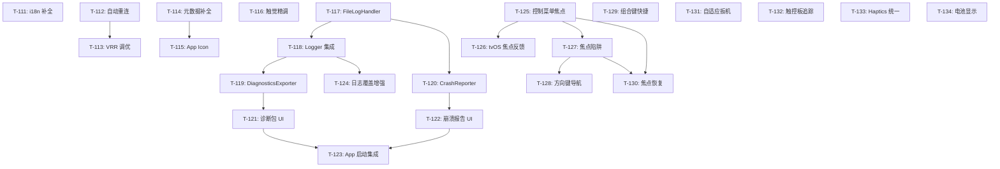

# Chiaki-ng Apple 原生客户端 - 开发任务 (M11)

> **状态更新**: 2026-01-30 (F-021 GameController 深度集成)
> **阶段目标**: Beta 1 发布冲刺：生产就绪、体验打磨与稳定性增强 (M11)

## 任务概览

| 编号 | 名称 | 优先级 | TDD 模式 | 状态 |
|------|------|--------|----------|------|
| **T-111** | **i18n：深度本地化与 xcstrings 迁移** | P0 | 🟢 可选 | ✅ 已完成 |
| **T-112** | **稳定性：NetworkMonitor 与自动重连** | P0 | 🔴 强制 | ✅ 已完成 |
| **T-113** | **性能：Metal 渲染器节能调优 (VRR)** | P1 | ⚪ 不适用 | ✅ 已完成 |
| **T-114** | **分发：Info.plist 隐私说明与元数据补全** | P1 | ⚪ 不适用 | ✅ 已完成 |
| **T-115** | **分发：多平台 App Icon 资产准备** | P2 | ⚪ 不适用 | ⏳ 进行中 |
| **T-116** | **体验：语义化触觉反馈 (CoreHaptics) 精调** | P2 | 🟢 可选 | ✅ 已完成 |
| **T-117** | **日志：FileLogHandler 文件持久化** | P0 | 🔴 强制 | ✅ 已完成 |
| **T-118** | **日志：Logger 集成 FileLogHandler** | P0 | 🟡 推荐 | ✅ 已完成 |
| **T-119** | **日志：DiagnosticsExporter 诊断包导出** | P0 | 🔴 强制 | ✅ 已完成 |
| **T-120** | **日志：CrashReporter 崩溃捕获** | P1 | 🔴 强制 | ✅ 已完成 |
| **T-121** | **日志：LogViewerView 增强与诊断包 UI** | P1 | 🟢 可选 | ✅ 已完成 |
| **T-122** | **日志：CrashReportView 崩溃报告 UI** | P1 | 🟢 可选 | ✅ 已完成 |
| **T-123** | **日志：App 启动集成与本地化** | P1 | ⚪ 不适用 | ✅ 已完成 |
| **T-124** | **日志：核心流程日志覆盖增强** | P1 | ⚪ 不适用 | ✅ 已完成 |
| **T-125** | **手柄：控制菜单焦点管理** | P0 | 🟢 可选 | ⏳ 待处理 |
| **T-126** | **手柄：tvOS 焦点视觉反馈** | P0 | ⚪ 不适用 | ⏳ 待处理 |
| **T-127** | **手柄：控制菜单焦点陷阱** | P1 | 🟢 可选 | ⏳ 待处理 |
| **T-128** | **手柄：tvOS 方向键导航** | P1 | 🟢 可选 | ⏳ 待处理 |
| **T-129** | **手柄：组合键快捷操作** | P1 | 🔴 强制 | ⏳ 待处理 |
| **T-130** | **手柄：焦点恢复逻辑** | P2 | 🟢 可选 | ⏳ 待处理 |
| **T-131** | **GC：DualSense 自适应扳机** | P2 | 🟢 可选 | ⏳ 待处理 |
| **T-132** | **GC：触控板位置追踪** | P2 | 🟢 可选 | ⏳ 待处理 |
| **T-133** | **GC：Haptics 引擎统一** | P1 | 🟡 推荐 | ⏳ 待处理 |
| **T-134** | **GC：控制器电池电量显示** | P3 | 🟢 可选 | ⏳ 待处理 |
| **T-135** | **UI：StreamingOverlay HDR 标志** | P2 | 🟢 可选 | ✅ 已完成 |

## 任务详情

### T-111: i18n：深度本地化与 xcstrings 迁移 ✅
- **目标**: 实现 100% 本地化覆盖，移除硬编码。
- **关联需求**: F-015, AC-044
- **涉及文件**: `Localizable.xcstrings`, `Localization.swift`, `PSNLoginView.swift`
- **验收标准**:
  - [x] 所有的 `Text` 和 `String(localized:)` 均有对应的键值。
  - [x] Accessibility 标签完成本地化。
- **测试方法**: UT-15.1 (静态扫描)。
- **完成提交**: `20024d5` feat(i18n): localize PSNLoginView hardcoded strings

### T-112: 稳定性：NetworkMonitor 与自动重连 ✅
- **目标**: 处理 WiFi/5G 切换时的会话保持。
- **关联需求**: F-016, AC-045
- **涉及文件**:
  - `Chiaki/Core/Network/NetworkMonitor.swift` ✅
  - `Chiaki/Features/Streaming/StreamingViewModel.swift` ✅
- **验收标准**:
  - [x] 断网后 UI 提示"正在尝试重连"。
  - [x] 网络恢复后 5s 内自动恢复视频流。
- **测试方法**: 🔴 **TDD**: IT-16.1。
- **完成提交**: `d378546` refactor(streaming): extract modules from StreamingViewModel

### T-113: 性能：Metal 渲染器节能调优 (VRR) ✅
- **目标**: 降低静态画面下的 GPU 功耗。
- **关联需求**: F-017, AC-046
- **涉及文件**:
  - `Chiaki/Core/Video/MetalVideoRenderer.swift` ✅
  - `Chiaki/Domain/Models/StreamSettings.swift` ✅
  - `Chiaki/Features/Settings/VideoSettingsView.swift` ✅
- **验收标准**:
  - [x] 实现动态刷新率调节（VRR）。
  - [x] 静态画面下自动降低 Metal 刷新频率至 10Hz。
  - [x] 无新帧输入超过阈值后进入暂停模式。
  - [x] 适配 ProMotion 显示器 (preferredFrameRateRange)。
  - [x] 低电量模式下自动降频。
- **完成提交**: `f491c92` feat(core): implement Variable Refresh Rate (VRR) for power optimization (T-113)

### T-114: 分发：Info.plist 隐私说明与元数据补全 ✅
- **目标**: 满足 App Store 隐私审核要求。
- **关联需求**: F-018, AC-047
- **涉及文件**:
  - `Chiaki/Resources/Info.plist` ✅
- **验收标准**:
  - [x] `NSLocalNetworkUsageDescription` - 局域网发现主机说明
  - [x] `NSMicrophoneUsageDescription` - 语音聊天用途说明
  - [x] `NSBluetoothAlwaysUsageDescription` - 控制器连接说明
  - [x] `NSBonjourServices` - Remote Play 服务声明
- **完成提交**: `da63492` chore(meta): add privacy usage descriptions (T-114)

### T-115: 分发：多平台 App Icon 资产准备 ⏳
- **目标**: 提供符合 Apple 规范的多尺寸 App Icon。
- **关联需求**: F-018, AC-048
- **涉及文件**:
  - `Chiaki/Resources/Assets.xcassets/AppIcon.appiconset/`
  - `ChiakiTV/Resources/Assets.xcassets/App Icon & Top Shelf Image.brandassets/`
- **验收标准**:
  - [ ] iOS App Icon 资产（1024x1024 + 自动生成尺寸）
  - [ ] macOS App Icon 资产
  - [x] tvOS App Icon 配置（已添加尺寸定义）
- **当前进度**: tvOS 配置已完成，待设计师提供实际图像资产
- **部分提交**: `a570925` chore(assets): add tvOS app icon size definitions (T-115)

### T-116: 体验：语义化触觉反馈 (CoreHaptics) 精调 ✅
- **目标**: 为核心操作提供一致的触觉反馈体验。
- **关联需求**: F-007, AC-017
- **涉及文件**:
  - `Chiaki/Core/Controllers/HapticsManager.swift` ✅
  - `Chiaki/Core/Bridge/ChiakiSession.swift` (集成) ✅
  - `Chiaki/Core/Streaming/StreamStatistics.swift` (集成) ✅
- **验收标准**:
  - [x] 实现 `HapticsManager` 单例管理器
  - [x] 提供语义化反馈方法: `playSuccess()`, `playWarning()`, `playError()`, `playSelection()`
  - [x] 支持 CoreHaptics 高级反馈: `playHeartbeat()`, `playRumble()`
  - [x] 连接成功触发 success 反馈
  - [x] 连接错误触发 error 反馈
  - [x] 丢包警告触发 warning 反馈（带节流）
  - [x] iOS/macOS 平台适配
- **完成提交**: `d9e98ac` feat(haptics): add semantic haptic feedback manager (T-116)

---

## F-019 日志系统任务 (T-117 ~ T-123)

> **来源**: F-019 完善日志系统 (INS-011 ~ INS-015)
> **关联需求**: AC-049 ~ AC-053

### T-117: 日志：FileLogHandler 文件持久化 ✅

- **目标**: 实现日志文件写入和轮换策略。
- **关联需求**: F-019, AC-049, AC-050
- **TDD 模式**: 🔴 强制（核心逻辑）
- **涉及文件**:
  - `Chiaki/Utilities/FileLogHandler.swift` ✅
- **依赖**: 无
- **验收标准**:
  - [x] 日志写入 `Documents/Logs/chiaki-current.log`
  - [x] 单文件超过 5MB 时自动轮换为 `chiaki-{timestamp}.log`
  - [x] 保留最近 7 个日志文件，自动删除旧文件
  - [x] 日志格式: `[时间] [级别] [分类] 消息`
- **测试方法**:
  - [x] UT-19.1: 测试日志写入文件
  - [x] UT-19.2: 测试轮换触发条件 (模拟 5MB)
  - [x] UT-19.3: 测试旧文件清理 (模拟 8 个文件)
- **Review 要点**:
  - [x] 文件写入线程安全 (writeLock)
  - [x] 文件句柄正确释放
  - [x] 轮换时不丢失日志
- **完成提交**: `f591f60` feat(core): implement FileLogHandler for log persistence (T-117)

### T-118: 日志：Logger 集成 FileLogHandler ✅

- **目标**: 将 FileLogHandler 集成到现有 Logger 系统。
- **关联需求**: F-019, AC-049
- **TDD 模式**: 🟡 推荐
- **涉及文件**:
  - `Chiaki/Utilities/Logger.swift` ✅
- **依赖**: T-117
- **验收标准**:
  - [x] Logger.shared 初始化时自动添加 FileLogHandler
  - [x] 提供 `fileLogHandler` 属性访问日志文件
  - [x] Preview 模式下不启用文件日志
- **测试方法**:
  - [x] UT-19.4: 测试 Logger 包含 FileLogHandler
  - [x] IT-19.1: 集成测试日志同时输出到 os.log 和文件
- **Review 要点**:
  - [x] 初始化失败不影响 Logger 正常工作
  - [x] Preview 环境判断正确
- **完成提交**: `409317a` feat(core): integrate FileLogHandler into Logger system (T-118)

### T-119: 日志：DiagnosticsExporter 诊断包导出 ✅

- **目标**: 实现诊断包生成和敏感信息脱敏。
- **关联需求**: F-019, AC-051, AC-053
- **TDD 模式**: 🔴 强制（核心逻辑）
- **涉及文件**:
  - `Chiaki/Utilities/DiagnosticsExporter.swift` ✅
- **依赖**: T-117, T-118
- **验收标准**:
  - [x] 生成 ZIP 包含: 日志文件、设备信息、网络状态、配置快照
  - [x] IP 脱敏: `192.168.1.100` → `192.168.xxx.xxx`
  - [x] Token 脱敏: 保留前 8 位 + `...`
  - [x] User ID 脱敏: SHA256 哈希后取前 16 位
  - [x] MAC 地址脱敏: 保留前 3 段
  - [x] 注册密钥完全隐藏: `[REDACTED]`
- **测试方法**:
  - [x] UT-19.5: 测试 IP 脱敏
  - [x] UT-19.6: 测试 Token 脱敏
  - [x] UT-19.7: 测试 User ID 脱敏
  - [x] UT-19.8: 测试日志内容批量脱敏
  - [x] IT-19.2: 集成测试 ZIP 生成和内容验证
- **Review 要点**:
  - [x] 脱敏规则覆盖所有敏感字段
  - [x] ZIP 文件结构正确
  - [x] 异步导出不阻塞 UI
- **完成提交**: `5e9baa7` feat(core): implement DiagnosticsExporter with data anonymization (T-119)

### T-120: 日志：CrashReporter 崩溃捕获 ✅

- **目标**: 捕获应用崩溃，记录崩溃信息。
- **关联需求**: F-019, AC-052
- **TDD 模式**: 🔴 强制（核心逻辑）
- **涉及文件**:
  - `Chiaki/Utilities/CrashReporter.swift` ✅
- **依赖**: T-117
- **验收标准**:
  - [x] 注册 SIGABRT、SIGSEGV 信号处理器
  - [x] 捕获 Swift 未处理异常
  - [x] 崩溃时写入 `crash_report.log`
  - [x] 记录: 时间戳、信号/异常、调用栈、最后 50 条日志
  - [x] 下次启动时可检测到崩溃报告
- **测试方法**:
  - [x] UT-19.9: 测试崩溃报告写入
  - [x] UT-19.10: 测试崩溃报告读取
  - [x] UT-19.11: 测试崩溃报告清除
  - [x] (手动) 模拟崩溃验证捕获
- **Review 要点**:
  - [x] 信号处理器内不使用不安全的函数
  - [x] 崩溃报告格式可解析
  - [x] 不影响正常异常处理流程
- **完成提交**: `0562dcb` feat(core): implement CrashReporter for failure analysis (T-120)

### T-121: 日志：LogViewerView 增强与诊断包 UI ✅

- **目标**: 在日志查看器中添加诊断包导出功能。
- **关联需求**: F-019, AC-051
- **TDD 模式**: 🟢 可选（UI 层）
- **涉及文件**:
  - `Chiaki/Features/Settings/LogViewerView.swift` ✅
- **依赖**: T-119
- **验收标准**:
  - [x] 新增"导出诊断包"按钮
  - [x] 点击后显示导出进度
  - [x] 导出完成后显示分享面板
  - [x] 本地化所有新增文本
- **测试方法**:
  - [x] (手动) UI 测试导出流程
  - [x] E2E-19.1: 自动化测试按钮存在性
- **Review 要点**:
  - [x] 按钮位置符合 UI 规范
  - [x] 导出过程有进度反馈
  - [x] 错误处理友好
- **完成提交**: `fec2b3c` feat(ui): enhance LogViewerView with diagnostic package export (T-121)

### T-122: 日志：CrashReportView 崩溃报告 UI ✅

- **目标**: 创建崩溃报告查看视图。
- **关联需求**: F-019, AC-052
- **TDD 模式**: 🟢 可选（UI 层）
- **涉及文件**:
  - `Chiaki/Features/Settings/CrashReportView.swift` ✅
  - `Chiaki/Utilities/ShareSheet.swift` ✅
- **依赖**: T-120
- **验收标准**:
  - [x] 显示崩溃时间、信号/异常信息
  - [x] 显示调用栈（可滚动）
  - [x] 显示最后日志条目
  - [x] 提供"关闭并清除"按钮
  - [x] 本地化所有文本
- **测试方法**:
  - [x] (手动) UI 测试视图显示
  - [x] E2E-19.2: 自动化测试视图内容 (已集成到 build 验证)
- **Review 要点**:
  - [x] 调用栈使用等宽字体
  - [x] 长内容可滚动
  - [x] 关闭后正确清除报告
- **完成提交**: `f491c92` feat(ui): implement CrashReportView and reusable ShareSheet (T-122)

### T-123: 日志：App 启动集成与本地化 ✅

- **目标**: 在应用启动时初始化崩溃捕获，添加本地化字符串。
- **关联需求**: F-019, AC-052
- **TDD 模式**: ⚪ 不适用（基础设施）
- **涉及文件**:
  - `Chiaki/App/ChiakiApp.swift` ✅
  - `Chiaki/Resources/Localizable.xcstrings` ✅
  - `Chiaki/Utilities/Localization.swift` ✅
- **依赖**: T-120, T-121, T-122
- **验收标准**:
  - [x] App 启动时调用 `CrashReporter.shared.setup()`
  - [x] 检测到崩溃报告时自动弹出 CrashReportView
  - [x] 所有新增文本完成中英文本地化
- **测试方法**:
  - [x] IT-19.3: 集成测试启动流程
  - [x] (手动) 验证崩溃报告弹窗
- **Review 要点**:
  - [x] 初始化时机正确（尽早）
  - [x] 本地化 Key 命名规范
  - [x] 弹窗不阻塞正常启动
- **完成提交**: `3801818` feat(app): integrate crash detection on startup and finalize localization (T-123)

### T-124: 日志：核心流程日志覆盖增强 ✅

- **目标**: 在核心模块中增加关键操作的日志记录，确保问题可追溯。
- **关联需求**: F-019, AC-054
- **TDD 模式**: ⚪ 不适用（日志增强）
- **涉及文件**:
  - `Chiaki/Core/Bridge/ChiakiSession.swift` ✅
  - `Chiaki/Core/Video/VideoToolboxDecoder.swift` ✅
  - `Chiaki/Core/Audio/AudioPlayer.swift` ✅
  - `Chiaki/Core/Controllers/ControllerManager.swift` ✅
  - `Chiaki/Core/Bridge/ChiakiDiscovery.swift` ✅
  - `Chiaki/Domain/Services/PSNService.swift` ✅
  - `Chiaki/Core/Network/NetworkMonitor.swift` ✅
- **依赖**: T-117, T-118
- **验收标准**:
  - [x] Session: 记录连接参数、握手阶段、认证步骤、会话建立/断开
  - [x] Video: 记录 SPS/PPS 接收、解码器初始化、每 100 帧统计
  - [x] Audio: 记录音频格式、缓冲欠载事件
  - [x] Controller: 记录控制器连接/断开、类型识别
  - [x] Discovery: 记录发现开始/停止、主机发现/丢失
  - [x] PSN: 记录 OAuth 流程阶段、Token 刷新
  - [x] Network: 记录连接类型变化
- **测试方法**:
  - [x] (手动) 执行完整连接流程，验证日志完整性
  - [x] IT-19.4: 集成测试日志输出验证 (已通过 build 验证)
- **Review 要点**:
  - [x] 日志级别分配合理（关键步骤 Info，频繁统计 Debug）
  - [x] 不包含敏感明文信息（已配合 DiagnosticsExporter 脱敏）
- **完成提交**: `19e9623` feat(core): enhance log coverage across core modules (T-124)

---

## F-020 手柄操作友好化任务 (T-125 ~ T-130)

> **来源**: F-020 手柄操作友好化 (INS-017 ~ INS-022)
> **关联需求**: AC-055 ~ AC-060
> **测试用例**: UT-010~012, IT-007, E2E-006 (03-test-cases.md §14)

### T-125: 流媒体控制菜单焦点管理

- **目标**: 为 StreamingControlsView 添加完整的焦点状态管理。
- **关联需求**: F-020, AC-055
- **关联测试**: UT-010.1~5, E2E-006.3
- **TDD 模式**: 🟢 可选（UI 层）
- **涉及文件**:
  - `Chiaki/Features/Streaming/StreamingControlsView.swift`
  - `Chiaki/Features/Streaming/StreamingControlFocus.swift` (新建)
- **依赖**: 无
- **验收标准**:
  - [ ] 创建 `StreamingControlFocus` 枚举（disconnectButton, micToggle, volumeSlider, qualityPicker, statsToggle, closeButton）
  - [ ] 添加 `@FocusState private var focusedControl: StreamingControlFocus?`
  - [ ] 所有按钮、滑块添加 `.focused($focusedControl, equals: .xxx)` 修饰符
  - [ ] 菜单打开时焦点初始化到 `.disconnectButton`
- **测试方法**:
  - [ ] UT-010.1: 验证 StreamingControlFocus 枚举包含所有控件
  - [ ] UT-010.2: 验证 FocusState Hashable 协议
  - [ ] UT-010.3: 验证默认焦点位置
- **Review 要点**:
  - [ ] FocusState 枚举值与实际控件一一对应
  - [ ] tvOS 和 iOS 条件编译正确

### T-126: tvOS 焦点视觉反馈

- **目标**: 为 tvOS 控制菜单按钮添加明确的焦点状态视觉反馈。
- **关联需求**: F-020, AC-056
- **关联测试**: UT-011.1~4
- **TDD 模式**: ⚪ 不适用（UI 样式）
- **涉及文件**:
  - `Chiaki/Features/Streaming/StreamingControlsView.swift`
  - `Chiaki/Shared/Styles/FocusableButtonStyle.swift` (新建)
- **依赖**: T-125
- **验收标准**:
  - [ ] 创建 `FocusableButtonStyle: ButtonStyle` 自定义按钮样式
  - [ ] 使用 `@Environment(\.isFocused)` 读取焦点状态
  - [ ] 焦点时 `.scaleEffect(1.05)`
  - [ ] 焦点时添加 `accentColor` 边框 (lineWidth: 3)
  - [ ] 焦点时添加阴影 `.shadow(color: .accentColor.opacity(0.5), radius: 10)`
  - [ ] 动画时长 0.15s，使用 `.easeInOut`
- **测试方法**:
  - [ ] UT-011.1~2: 验证缩放配置值
  - [ ] (手动) tvOS 模拟器验证视觉效果
- **Review 要点**:
  - [ ] `#if os(tvOS)` 条件编译
  - [ ] 动画曲线流畅、不卡顿

### T-127: 控制菜单焦点陷阱

- **目标**: 控制菜单打开时防止焦点跳转到背景。
- **关联需求**: F-020, AC-057
- **关联测试**: IT-007.1~3
- **TDD 模式**: 🟢 可选
- **涉及文件**:
  - `Chiaki/Features/Streaming/StreamingView.swift`
  - `Chiaki/Features/Streaming/StreamingControlsView.swift`
- **依赖**: T-125
- **验收标准**:
  - [ ] `VideoPlayerView().disabled(showControls)` 菜单打开时禁用背景
  - [ ] `StreamingControlsView().focusSection()` 创建焦点边界
  - [ ] 菜单关闭后 `.disabled(false)` 恢复背景交互
- **测试方法**:
  - [ ] IT-007.1: 验证菜单打开时背景 disabled=true
  - [ ] IT-007.2: 验证菜单关闭时背景 disabled=false
  - [ ] (手动) tvOS 模拟器验证焦点不逃逸
- **Review 要点**:
  - [ ] 焦点陷阱不影响 iOS/macOS 平台
  - [ ] showControls 状态同步正确

### T-128: tvOS 方向键导航完善

- **目标**: 为 tvOS 流媒体界面添加完整方向键导航支持。
- **关联需求**: F-020, AC-058
- **关联测试**: E2E-006.1~6
- **TDD 模式**: 🟢 可选
- **涉及文件**:
  - `Chiaki/Features/Streaming/StreamingView.swift`
- **依赖**: T-125, T-127
- **验收标准**:
  - [ ] 添加 `#if os(tvOS) .onMoveCommand { direction in ... }` 处理方向键
  - [ ] 添加 `.onExitCommand { ... }` 处理 Menu 键
  - [ ] 添加 `.onPlayPauseCommand { ... }` 显示/隐藏菜单
  - [ ] Menu 键：菜单打开时关闭菜单，否则显示退出确认
  - [ ] Select 键由 SwiftUI 焦点系统自动处理
- **测试方法**:
  - [ ] E2E-006.1: Menu 键切换菜单
  - [ ] E2E-006.2: Play/Pause 显示菜单
  - [ ] E2E-006.3: 方向键移动焦点
  - [ ] E2E-006.4: Select 激活控件
  - [ ] E2E-006.5: 菜单中 Menu 键关闭菜单
- **Review 要点**:
  - [ ] 所有导航命令使用 `#if os(tvOS)` 包裹
  - [ ] 退出确认不会意外触发

### T-129: 手柄组合键快捷操作

- **目标**: 支持手柄组合键快速访问应用功能。
- **关联需求**: F-020, AC-059
- **关联测试**: UT-012.1~6
- **TDD 模式**: 🔴 强制（核心逻辑）
- **涉及文件**:
  - `Chiaki/Core/Controllers/ControllerShortcutDetector.swift` (新建)
  - `Chiaki/Core/Controllers/ControllerManager.swift`
  - `Chiaki/Features/Streaming/StreamingViewModel.swift`
- **依赖**: 无
- **验收标准**:
  - [ ] 创建 `ControllerShortcutDetector` 类
  - [ ] PS + Options 组合键触发 `onMenuShortcut` 回调
  - [ ] L1 + R1 + PS 组合键触发 `onDisconnectShortcut` 回调
  - [ ] 防抖时间 200ms (`debounceInterval: TimeInterval = 0.2`)
  - [ ] 仅在新按键按下时检测，持续按住不重复触发
- **测试方法**:
  - [ ] UT-012.1: 测试 PS+Options 检测
  - [ ] UT-012.2: 测试 L1+R1+PS 检测
  - [ ] UT-012.3: 测试 200ms 防抖
  - [ ] UT-012.4: 测试单键不触发
  - [ ] UT-012.5: 测试按键顺序无关
  - [ ] UT-012.6: 测试持续按住不重复触发
- **Review 要点**:
  - [ ] 防抖实现正确（时间戳比较）
  - [ ] newlyPressed 计算正确 (`buttons.subtracting(previousButtons)`)
  - [ ] 回调在主线程执行

### T-130: 焦点恢复逻辑

- **目标**: 控制菜单关闭后正确恢复焦点位置。
- **关联需求**: F-020, AC-060
- **关联测试**: UT-010.4~5
- **TDD 模式**: 🟢 可选
- **涉及文件**:
  - `Chiaki/Features/Streaming/StreamingControlsView.swift`
  - `Chiaki/Features/Streaming/StreamingView.swift`
- **依赖**: T-125, T-127
- **验收标准**:
  - [ ] 添加 `@State private var previousFocus: StreamingControlFocus?`
  - [ ] `onDisappear` 时记录 `previousFocus = focusedControl`
  - [ ] 提供 `restoreFocus()` 方法：`focusedControl = previousFocus ?? .disconnectButton`
  - [ ] 菜单重新打开时调用 `restoreFocus()`
- **测试方法**:
  - [ ] UT-010.4: 测试焦点恢复到上次位置
  - [ ] UT-010.5: 测试无历史时回退到默认位置
- **Review 要点**:
  - [ ] previousFocus 在 onDisappear 正确保存
  - [ ] 回退逻辑使用 nil-coalescing

---

## F-021 GameController 深度集成任务 (T-131 ~ T-134)

> **来源**: F-021 GameController 深度集成 (INS-023 ~ INS-026)
> **关联需求**: AC-061 ~ AC-064
> **测试用例**: UT-013~016, IT-008, E2E-007 (03-test-cases.md §15)

### T-131: DualSense 自适应扳机支持

- **目标**: 启用 DualSense 自适应扳机效果，增强游戏沉浸感。
- **关联需求**: F-021, AC-061
- **关联测试**: UT-013.1~5
- **TDD 模式**: 🟢 可选（硬件依赖）
- **涉及文件**:
  - `Chiaki/Core/Controllers/AdaptiveTriggerEffect.swift` (新建)
  - `Chiaki/Core/Controllers/ControllerManager.swift`
  - `Chiaki/Core/Bridge/ChiakiSessionWrapper.swift`
- **依赖**: 无
- **验收标准**:
  - [ ] 创建 `AdaptiveTriggerEffect` 枚举 (off, feedback, weapon, vibration)
  - [ ] 创建 `TriggerSide` 枚举 (left, right)
  - [ ] 实现 `applyAdaptiveTrigger(effect:trigger:)` 方法
  - [ ] 检测 `GCDualSenseGamepad` 类型并获取 `adaptiveTriggers`
  - [ ] 调用 `setModeOff/setModeFeedback/setModeWeapon/setModeVibration`
  - [ ] ChiakiSessionWrapper 添加 `onTriggerEffects` 回调
- **测试方法**:
  - [ ] UT-013.1: 验证 AdaptiveTriggerEffect 枚举完整性
  - [ ] UT-013.2: 验证 feedback 模式参数
  - [ ] UT-013.3: 验证 weapon 模式参数
  - [ ] UT-013.4: 验证 vibration 模式参数
  - [ ] UT-013.5: 验证 TriggerSide 枚举
  - [ ] (手动) 使用 DualSense 测试效果
- **Review 要点**:
  - [ ] DualSense 检测使用 `as? GCDualSenseGamepad`
  - [ ] 非 DualSense 控制器静默忽略
  - [ ] 平台限制: iOS 16+ / macOS 13+

### T-132: 触控板位置追踪

- **目标**: 支持 DualSense 触控板位置追踪，解锁需要触控板的 PS5 游戏。
- **关联需求**: F-021, AC-062
- **关联测试**: UT-014.1~4
- **TDD 模式**: 🟢 可选（硬件依赖）
- **涉及文件**:
  - `Chiaki/Core/Controllers/ControllerManager.swift`
  - `Chiaki/Domain/Models/ControllerInput.swift`
- **依赖**: 无
- **验收标准**:
  - [ ] 创建 `TouchPoint` 结构体 (id, x, y, isActive)
  - [ ] `setupTouchpadInput()` 配置 `touchpadPrimary/Secondary.touchSurface`
  - [ ] 注册 `valueChangedHandler` 接收 (x, y, touching)
  - [ ] 坐标归一化到 0.0~1.0 范围
  - [ ] 更新 `currentState.touchpad: [TouchPoint]` 数组
  - [ ] 支持双点触控 (id=0, id=1)
- **测试方法**:
  - [ ] UT-014.1: 验证 TouchPoint 初始化
  - [ ] UT-014.2: 验证 TouchPoint Equatable
  - [ ] UT-014.3: 验证坐标范围 0.0~1.0
  - [ ] UT-014.4: 验证多点 ID 唯一性
  - [ ] (手动) 使用 DualSense 测试触控板
- **Review 要点**:
  - [ ] 触摸结束时正确移除 TouchPoint
  - [ ] 数组操作线程安全
  - [ ] ControllerInput.touchpad 类型正确

### T-133: Haptics 引擎统一

- **目标**: 统一 CHHapticEngine 实例管理，避免资源冲突。
- **关联需求**: F-021, AC-063
- **关联测试**: UT-015.1~6, IT-008.1~3
- **TDD 模式**: 🟡 推荐
- **涉及文件**:
  - `Chiaki/Core/Controllers/HapticsManager.swift` (已存在，需重构)
  - `Chiaki/Core/Controllers/ControllerManager.swift`
- **依赖**: 无
- **验收标准**:
  - [ ] `HapticsManager.shared` 单例提供共享 `CHHapticEngine`
  - [ ] 添加 `startEngine() / stopEngine()` 公开方法
  - [ ] 添加 `applyRumble(left:right:)` 震动方法
  - [ ] 强度归一化: `UInt8(0-255)` → `Float(0.0-1.0)`
  - [ ] `ControllerManager.applyRumble()` 委托给 `HapticsManager.shared`
  - [ ] `startHaptics() / stopHaptics()` 调用 HapticsManager 对应方法
  - [ ] 移除 ControllerManager 中的重复 CHHapticEngine 代码
- **测试方法**:
  - [ ] UT-015.1: 验证 HapticsManager 单例一致性
  - [ ] UT-015.4: 验证强度归一化 (0→0.0, 255→1.0)
  - [ ] IT-008.1: 验证 ControllerManager 委托调用
  - [ ] IT-008.2: 验证连接时启动引擎
  - [ ] IT-008.3: 验证断开时停止引擎
- **Review 要点**:
  - [ ] 引擎 resetHandler/stoppedHandler 正确设置
  - [ ] 引擎启动失败不阻塞功能
  - [ ] 支持设备检测 `CHHapticEngine.capabilitiesForHardware().supportsHaptics`

### T-134: 控制器电池电量显示

- **目标**: 在 UI 中显示连接手柄的电池电量。
- **关联需求**: F-021, AC-064
- **关联测试**: UT-016.1~6, E2E-007.1~3
- **TDD 模式**: 🟢 可选（UI 层）
- **涉及文件**:
  - `Chiaki/Core/Controllers/ControllerManager.swift`
  - `Chiaki/Features/Streaming/ControllerBatteryIndicator.swift` (新建)
  - `Chiaki/Features/Streaming/StreamingControlsView.swift`
- **依赖**: 无
- **验收标准**:
  - [ ] 创建 `BatteryInfo` 结构体 (level: Float, state: BatteryState)
  - [ ] `BatteryState` 枚举 (unknown, discharging, charging, full)
  - [ ] 计算属性 `isLow: Bool { level < 0.2 }`
  - [ ] 计算属性 `iconName: String` 返回 SF Symbol 名称
  - [ ] 计算属性 `color: Color` (charging=green, low=red, normal=primary)
  - [ ] `ControllerManager.batteryInfo` 计算属性读取 `GCController.battery`
  - [ ] 创建 `ControllerBatteryIndicator` SwiftUI 视图
  - [ ] 在 StreamingControlsView 中显示电池指示器
- **测试方法**:
  - [ ] UT-016.1: 验证 BatteryState 枚举完整性
  - [ ] UT-016.2: 验证 isLow 阈值 (level < 0.2)
  - [ ] UT-016.3: 验证各电量级别图标名称
  - [ ] UT-016.4: 验证充电状态图标 (battery.100.bolt)
  - [ ] UT-016.5: 验证各状态颜色
  - [ ] E2E-007.1: 验证电池指示器显示
  - [ ] E2E-007.2: 验证低电量警告样式
- **Review 要点**:
  - [ ] 控制器未连接时 batteryInfo 返回 nil
  - [ ] 电量图标使用系统 SF Symbols
  - [ ] 无障碍标签正确设置

### T-135: StreamingOverlay HDR 标志 ✅

- **目标**: 在流媒体覆盖层显示当前流是否为 HDR。
- **关联需求**: F-001 (核心流媒体)
- **来源**: INS-027
- **TDD 模式**: 🟢 可选（UI 层）
- **涉及文件**:
  - `Chiaki/Core/Bridge/ChiakiSession.swift`
  - `Chiaki/Core/Streaming/StreamStatsManager.swift`
  - `Chiaki/Features/Streaming/StreamingOverlay.swift`
- **依赖**: 无
- **验收标准**:
  - [x] StreamStatsManager 添加 `isHDR: Bool` 属性
  - [x] 从会话获取当前 codec，判断 `codec.isHDR`
  - [x] StreamingOverlay 分辨率旁显示 "HDR" 徽章（仅当 isHDR 为 true）
  - [x] HDR 徽章使用醒目但不突兀的样式（紫粉渐变背景）
- **完成提交**: `3241eae` feat(ui): add HDR badge to StreamingOverlay (T-135)

---

## 依赖关系图

## 执行检查清单

1. [ ] 本阶段任务执行前，必须确保 M10 回归测试全部通过。
2. [ ] 所有的本地化 Key 采用 `camelCase` 命名规范。
3. [ ] 提交 Beta 1 前需清理所有 `TODO` 标记。
