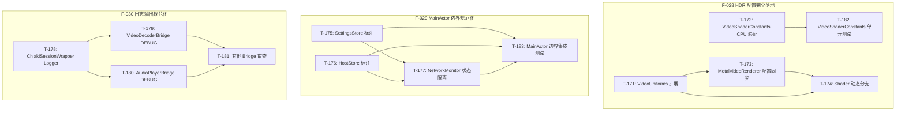
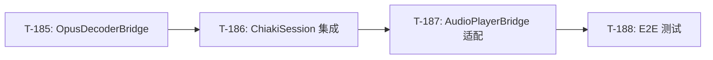
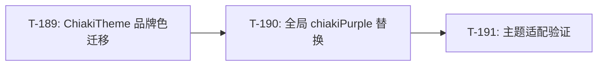
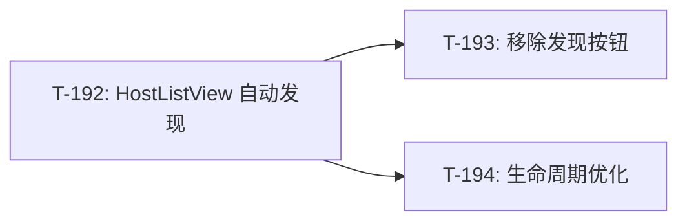
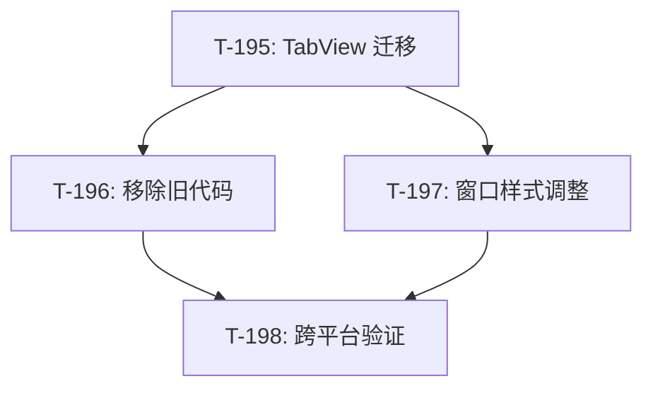

# Chiaki-ng Apple 原生客户端 - 开发任务

> **状态更新**: 2026-02-05
> **当前里程碑**: M13 (HDR 配置完全落地、MainActor 边界规范化、日志输出规范化、主题色系统化、自动发现、macOS 布局优化)
> **归档**: [archive/04-dev-tasks-archive.md](archive/04-dev-tasks-archive.md) (M11: 35 任务, M12: 24 任务)

---

## 归档摘要

### M12 归档 (2026-02-05)

> **阶段目标**: HDR 渲染优化、渲染模块解耦、UI 层 MVVM 合规重构 | **完成率**: 100% (24/24)
> **详情**: [查看归档文件](archive/04-dev-tasks-archive.md#m12-归档---hdr-渲染优化渲染模块解耦ui-层-mvvm-重构)

| 状态 | 数量 | 说明 |
|------|------|------|
| ✅ 已完成 | 24 | T-147~T-170 |

### M11 归档 (2026-02-04)

> **阶段目标**: Beta 1 发布冲刺 | **完成率**: 97% (35/36)
> **详情**: [查看归档文件](archive/04-dev-tasks-archive.md#m11-归档---beta-1-发布冲刺)

| 状态 | 数量 | 说明 |
|------|------|------|
| ✅ 已完成 | 30 | T-111~T-134, T-136~T-139, T-145~T-146 |
| 📦 早前归档 | 5 | T-140~T-144 |
| ⏳ 进行中 | 1 | T-115 (待设计师资产) |

### T-115: 分发：多平台 App Icon 资产准备 ⏳

- **关联需求**: F-018, AC-048
- **当前进度**: tvOS 配置已完成，待设计师提供实际图像资产
- **涉及文件**: `Assets.xcassets/AppIcon.appiconset/`

---

# 开发任务 (M13)

> **状态更新**: 2026-02-04
> **阶段目标**: HDR 配置完全落地、MainActor 边界规范化、日志输出规范化
> **完成率**: 0% (0/13 任务完成)
> **来源**: F-028~F-030 (REVIEW_SUMMARY 审查 → INS-048, INS-050, INS-051)

## M13 任务概览

| 编号 | 名称 | 优先级 | TDD 模式 | 依赖 | 状态 |
|------|------|--------|----------|------|------|
| **T-171** | HDR: VideoUniforms 扩展 | P0 | 🔴 强制 | - | ⏳ |
| **T-172** | HDR: VideoShaderConstants CPU 验证 | P0 | 🔴 强制 | - | ⏳ |
| **T-173** | HDR: MetalVideoRenderer 配置同步 | P0 | 🟡 推荐 | T-171 | ⏳ |
| **T-174** | HDR: Shader 动态分支 (edrIntensity/gamutMapping) | P0 | 🟡 推荐 | T-171, T-173 | ⏳ |
| **T-175** | MainActor: SettingsStore 标注 | P0 | 🔴 强制 | - | ⏳ |
| **T-176** | MainActor: HostStore 标注 | P0 | 🔴 强制 | - | ⏳ |
| **T-177** | MainActor: NetworkMonitor 状态隔离 | P1 | 🟡 推荐 | T-175, T-176 | ⏳ |
| **T-178** | Logging: ChiakiSessionWrapper Logger 替换 | P1 | 🟢 可选 | - | ⏳ |
| **T-179** | Logging: VideoDecoderBridge DEBUG 保护 | P1 | 🟢 可选 | T-178 | ⏳ |
| **T-180** | Logging: AudioPlayerBridge DEBUG 保护 | P1 | 🟢 可选 | T-178 | ⏳ |
| **T-181** | Logging: 其他 Bridge 层审查 | P2 | 🟢 可选 | T-178~T-180 | ⏳ |
| **T-182** | Test: VideoShaderConstants 单元测试 | P0 | 🔴 强制 | T-172 | ⏳ |
| **T-183** | Test: MainActor 边界集成测试 | P1 | 🔴 强制 | T-175~T-177 | ⏳ |

## M13 任务详情

---

### T-171: HDR: VideoUniforms 扩展

> **关联需求**: F-028, AC-097
> **关联测试**: UT-042.1~4
> **TDD 模式**: 🔴 强制

**任务描述**:
扩展 `VideoUniforms` 结构，添加 `edrIntensity` 和 `gamutMappingEnabled` 字段，使 HDRConfiguration 的配置能够传递到 Shader。

**涉及文件**:
- `Chiaki/Core/Video/MetalVideoRenderer.swift` (修改 VideoUniforms)

**验收标准**:
- [ ] `VideoUniforms` 包含 `edrIntensity: Float` 字段（默认 1.0）
- [ ] `VideoUniforms` 包含 `gamutMappingEnabled: UInt32` 字段（默认 1）
- [ ] 结构大小保持 16 字节对齐
- [ ] `VideoUniforms.default` 返回正确默认值

**测试方法**: UT-042.1~4 单元测试

**Review 要点**:
- [ ] 字段类型与 Shader 匹配（Float/UInt32）
- [ ] 对齐填充正确
- [ ] 默认值合理

---

### T-172: HDR: VideoShaderConstants CPU 验证

> **关联需求**: F-028, AC-100
> **关联测试**: UT-044.1~10
> **TDD 模式**: 🔴 强制

**任务描述**:
创建 `VideoShaderConstants.swift`，定义 CPU 端 Shader 常量（PQ EOTF、色域映射矩阵、ACES 参数），用于验证 GPU Shader 行为一致性。

**涉及文件**:
- `Chiaki/Core/Video/VideoShaderConstants.swift` (新建)

**验收标准**:
- [ ] 定义 PQ EOTF 常量（m1, m2, c1, c2, c3）
- [ ] 定义 `rec2020ToP3Matrix` 色域映射矩阵
- [ ] 定义 YUV→RGB 矩阵（BT.709, BT.2020）
- [ ] 实现 `pqEOTF(_:)` CPU 端函数
- [ ] 实现 `applyGamutMapping(_:)` CPU 端函数
- [ ] 实现 `acesTonemap(_:)` CPU 端函数

**测试方法**: UT-044.1~10 单元测试（先写测试）

**Review 要点**:
- [ ] 常量值与 Shader 源码一致
- [ ] 矩阵列主序正确
- [ ] 函数实现与 Shader 逻辑一致

---

### T-173: HDR: MetalVideoRenderer 配置同步

> **关联需求**: F-028, AC-097, AC-098, AC-099
> **关联测试**: UT-043.1~4, IT-015.1~2
> **TDD 模式**: 🟡 推荐

**任务描述**:
修改 `MetalVideoRenderer` 的 `hdrConfiguration` 设置器，同步 `edrIntensity` 和 `gamutMappingEnabled` 到 Uniforms。添加独立的 setter 方法用于实时预览。

**涉及文件**:
- `Chiaki/Core/Video/MetalVideoRenderer.swift` (修改)

**验收标准**:
- [ ] `hdrConfiguration` didSet 同步 `edrIntensity`
- [ ] `hdrConfiguration` didSet 同步 `gamutMappingEnabled`
- [ ] 添加 `setEDRIntensity(_:)` 方法（clamp 到 0.5~2.0）
- [ ] 添加 `setGamutMappingEnabled(_:)` 方法
- [ ] 添加只读属性暴露当前值（用于测试）

**测试方法**: UT-043.1~4 单元测试, IT-015.1~2 集成测试

**Review 要点**:
- [ ] 边界 clamp 正确
- [ ] triggerRedraw 调用正确
- [ ] 线程安全（frameLock 使用）

---

### T-174: HDR: Shader 动态分支 (edrIntensity/gamutMapping)

> **关联需求**: F-028, AC-098, AC-099
> **关联测试**: IT-015.1~2, E2E-012.1
> **TDD 模式**: 🟡 推荐

**任务描述**:
修改 `MetalVideoRenderer` 中的运行时 Shader 源码，根据 `gamutMappingEnabled` 条件执行色域映射，根据 `edrIntensity` 调整 EDR 输出强度。

**涉及文件**:
- `Chiaki/Core/Video/MetalVideoRenderer.swift` (修改 shaderSource)

**验收标准**:
- [ ] Shader VideoUniforms 结构与 Swift 一致
- [ ] `gamutMappingEnabled == 1` 时执行 `applyGamutMapping()`
- [ ] EDR 输出乘以 `uniforms.edrIntensity`
- [ ] BGRA fragment shader 同步更新

**测试方法**: IT-015.1~2 集成测试, E2E-012.1 手动验证

**Review 要点**:
- [ ] Shader 结构与 Swift 对齐
- [ ] 条件分支逻辑正确
- [ ] 无性能回退（分支在 GPU 上高效）

---

### T-175: MainActor: SettingsStore 标注

> **关联需求**: F-029, AC-101
> **关联测试**: UT-045.1~3, IT-016.1
> **TDD 模式**: 🔴 强制

**任务描述**:
为 `SettingsStore` 类整体添加 `@MainActor` 标注，确保所有属性和方法在主线程执行。

**涉及文件**:
- `Chiaki/Core/Storage/SettingsStore.swift` (修改)

**验收标准**:
- [ ] `SettingsStore` 类声明添加 `@MainActor`
- [ ] `static let shared` 保持 `@MainActor`
- [ ] 所有公开方法可在 MainActor 上调用
- [ ] 编译无警告

**测试方法**: UT-045.1~3 单元测试, IT-016.1 集成测试

**Review 要点**:
- [ ] 类级别标注正确
- [ ] 无遗漏的 nonisolated 方法
- [ ] 调用方迁移检查

---

### T-176: MainActor: HostStore 标注

> **关联需求**: F-029, AC-102
> **关联测试**: UT-046.1~3, IT-016.2
> **TDD 模式**: 🔴 强制

**任务描述**:
为 `HostStore` 类整体添加 `@MainActor` 标注，确保所有属性和方法在主线程执行。

**涉及文件**:
- `Chiaki/Core/Storage/HostStore.swift` (修改)

**验收标准**:
- [ ] `HostStore` 类声明添加 `@MainActor`
- [ ] `static let shared` 保持 `@MainActor`
- [ ] CRUD 方法可在 MainActor 上调用
- [ ] 编译无警告

**测试方法**: UT-046.1~3 单元测试, IT-016.2 集成测试

**Review 要点**:
- [ ] 类级别标注正确
- [ ] Logger 调用兼容
- [ ] 调用方迁移检查

---

### T-177: MainActor: NetworkMonitor 状态隔离

> **关联需求**: F-029, AC-103
> **关联测试**: IT-016.3
> **TDD 模式**: 🟡 推荐

**任务描述**:
审查 `NetworkMonitor`，确保状态属性（isConnected, connectionType）的更新在 MainActor 上执行。

**涉及文件**:
- `Chiaki/Core/Network/NetworkMonitor.swift` (修改)

**验收标准**:
- [ ] `isConnected` 属性标注 `@MainActor`
- [ ] `connectionType` 属性标注 `@MainActor`
- [ ] `pathUpdateHandler` 回调使用 `Task { @MainActor in }` 包装
- [ ] 编译无警告

**测试方法**: IT-016.3 集成测试

**Review 要点**:
- [ ] 属性隔离正确
- [ ] 回调线程切换正确
- [ ] 无数据竞争

---

### T-178: Logging: ChiakiSessionWrapper Logger 替换

> **关联需求**: F-030, AC-104
> **关联测试**: UT-047.1~2, CR-002
> **TDD 模式**: 🟢 可选

**任务描述**:
将 `ChiakiSessionWrapper` 中的所有 `print()` 调用替换为 `Logger` 系统调用，使用正确的日志级别。

**涉及文件**:
- `Chiaki/Core/Bridge/ChiakiSession.swift` (修改)

**验收标准**:
- [ ] 无裸 `print()` 调用
- [ ] 错误使用 `Logger.session.error()`
- [ ] 警告使用 `Logger.session.warning()`
- [ ] 信息使用 `Logger.session.info()`
- [ ] 调试使用 `Logger.session.debug()` 或 `logDebug()`

**测试方法**: UT-047.1~2, CR-002 代码审查

**Review 要点**:
- [ ] 日志级别选择正确
- [ ] 无信息泄露（敏感数据）
- [ ] 格式一致

---

### T-179: Logging: VideoDecoderBridge DEBUG 保护

> **关联需求**: F-030, AC-105
> **关联测试**: UT-047.3~4, CR-003
> **TDD 模式**: 🟢 可选

**任务描述**:
审查 `VideoDecoderBridge` 和 `VideoToolboxDecoder`，为高频日志（如帧解码信息）添加 `#if DEBUG` 保护。

**涉及文件**:
- `Chiaki/Core/Video/VideoDecoderBridge.swift` (修改)
- `Chiaki/Core/Video/VideoToolboxDecoder.swift` (修改)

**验收标准**:
- [ ] 帧级日志使用 `#if DEBUG` 保护
- [ ] `logVerbose()` 调用有 DEBUG 保护
- [ ] 错误日志保留（不受 DEBUG 限制）
- [ ] Release 构建无 verbose 输出

**测试方法**: UT-047.3~4, CR-003 代码审查

**Review 要点**:
- [ ] 保护范围正确
- [ ] 不影响错误追踪
- [ ] 编译期过滤

---

### T-180: Logging: AudioPlayerBridge DEBUG 保护

> **关联需求**: F-030, AC-105
> **关联测试**: CR-003
> **TDD 模式**: 🟢 可选

**任务描述**:
审查 `AudioPlayerBridge`，为高频日志（如音频缓冲区信息）添加 `#if DEBUG` 保护。

**涉及文件**:
- `Chiaki/Core/Audio/AudioPlayerBridge.swift` (修改)

**验收标准**:
- [ ] 缓冲区级日志使用 `#if DEBUG` 保护
- [ ] 错误日志保留
- [ ] Release 构建无 verbose 输出

**测试方法**: CR-003 代码审查

**Review 要点**:
- [ ] 保护范围正确
- [ ] 不影响错误追踪

---

### T-181: Logging: 其他 Bridge 层审查

> **关联需求**: F-030, AC-106
> **关联测试**: CR-004
> **TDD 模式**: 🟢 可选

**任务描述**:
审查其他 Bridge 层文件（ChiakiDiscovery, ChiakiRegist），统一日志输出方式。

**涉及文件**:
- `Chiaki/Core/Bridge/ChiakiDiscovery.swift` (审查/修改)
- `Chiaki/Core/Bridge/ChiakiRegist.swift` (审查/修改)

**验收标准**:
- [ ] 无裸 `print()` 调用
- [ ] 使用 `Logger.discovery` / `Logger.regist` 类别
- [ ] 日志级别正确

**测试方法**: CR-004 代码审查, 自动化脚本

**Review 要点**:
- [ ] 日志类别正确
- [ ] 一致的格式

---

### T-182: Test: VideoShaderConstants 单元测试

> **关联需求**: F-028, AC-100
> **关联测试**: UT-044.1~10
> **TDD 模式**: 🔴 强制

**任务描述**:
为 `VideoShaderConstants` 编写完整的单元测试，验证 PQ EOTF、色域映射、ACES Tone Mapping 的正确性。

**涉及文件**:
- `Tests/ChiakiTests/Video/VideoShaderConstantsTests.swift` (新建)

**验收标准**:
- [ ] testPQEOTF_Black: 输入 0.0 → 输出 0.0
- [ ] testPQEOTF_SDRWhite: 输入 0.508 → ~0.0203
- [ ] testPQEOTF_Peak: 输入 1.0 → ~1.0
- [ ] testGamutMapping_White: 白点保持不变
- [ ] testGamutMapping_NoNegatives: 无负值输出
- [ ] testACES_Black: 输入 0 → 输出 0
- [ ] testACES_Clamp: 高输入 clamp 到 1.0
- [ ] testACES_SDRRange: 中灰合理响应
- [ ] testBT709_WhitePoint: Y=1,U=0,V=0 → 白色
- [ ] testRec2020ToP3Matrix: 矩阵值正确

**测试方法**: `xcodebuild test` 运行单元测试

**Review 要点**:
- [ ] 测试覆盖所有关键函数
- [ ] 精度要求合理（accuracy 参数）
- [ ] 边界条件覆盖

---

### T-183: Test: MainActor 边界集成测试

> **关联需求**: F-029, AC-101, AC-102, AC-103
> **关联测试**: IT-016.1~3
> **TDD 模式**: 🔴 强制

**任务描述**:
编写集成测试验证 `@MainActor` 标注的有效性，包括后台线程访问和状态更新隔离。

**涉及文件**:
- `Tests/ChiakiTests/Storage/MainActorBoundaryTests.swift` (新建)

**验收标准**:
- [ ] testBackgroundAccessToSettingsStore: 后台访问需要 MainActor.run
- [ ] testBackgroundAccessToHostStore: 后台访问需要 MainActor.run
- [ ] testNetworkMonitorStateUpdateOnMainActor: 状态更新在 MainActor

**测试方法**: `xcodebuild test` 运行集成测试

**Review 要点**:
- [ ] 测试异步边界正确
- [ ] expectation 超时合理
- [ ] 覆盖关键场景

---

## M13 依赖关系图



## M13 执行检查清单

1. [ ] 开始前确保 M12 所有任务已完成
2. [ ] 建议执行顺序：
   - **Phase 1**: T-171, T-172 (无依赖，可并行)
   - **Phase 2**: T-175, T-176, T-178 (无依赖，可并行)
   - **Phase 3**: T-173, T-182 (依赖 Phase 1)
   - **Phase 4**: T-174, T-177, T-179, T-180 (依赖 Phase 2/3)
   - **Phase 5**: T-181, T-183 (依赖 Phase 4)
3. [ ] 核心逻辑任务（🔴 强制 TDD）必须先写测试
4. [ ] 每个任务完成后运行 `/devdocs-sync --trace` 更新追溯
5. [ ] T-178~T-181 完成后运行 `check_logging_compliance.sh` 验证

---

## M13 需求追溯汇总

| AC 编号 | 验收标准 | 任务 | 测试 |
|---------|----------|------|------|
| AC-097 | Shader 动态分支 | T-171, T-173, T-174 | UT-042, UT-043, IT-015 |
| AC-098 | EDR 强度应用 | T-173, T-174 | UT-043, IT-015, E2E-012 |
| AC-099 | 色域映射开关 | T-173, T-174 | UT-043, IT-015, E2E-012 |
| AC-100 | 单元测试覆盖 | T-172, T-182 | UT-044 |
| AC-101 | SettingsStore 标注 | T-175 | UT-045, IT-016 |
| AC-102 | HostStore 标注 | T-176 | UT-046, IT-016 |
| AC-103 | 其他 Store 审查 | T-177 | IT-016, CR-001 |
| AC-104 | Logger 统一 | T-178 | UT-047, CR-002 |
| AC-105 | DEBUG 保护 | T-179, T-180 | UT-047, CR-003 |
| AC-106 | Bridge 层审查 | T-181 | CR-004 |

---

# Bug 修复任务

## BUG-005: 音频播放异常（咯哒声/杂音）

> **来源**: 用户反馈
> **严重程度**: P0
> **状态**: 🔄 修复中
> **关联 Bug 记录**: [05-bugfix-log.md#BUG-005](05-bugfix-log.md#bug-005-音频播放异常咯哒声杂音)

### 问题摘要

音频数据未经 Opus 解码直接传给 AudioPlayer，导致播放压缩数据产生"咯哒"声。需要在 Swift 端集成 Opus 解码器。

### 任务列表

| 编号 | 名称 | 优先级 | TDD 模式 | 依赖 | 状态 |
|------|------|--------|----------|------|------|
| **T-185** | Audio: OpusDecoderBridge 创建 | P0 | 🔴 强制 | - | ✅ |
| **T-186** | Audio: ChiakiSession Opus 集成 | P0 | 🟡 推荐 | T-185 | ✅ |
| **T-187** | Audio: AudioPlayerBridge 接口适配 | P0 | 🟡 推荐 | T-186 | ✅ |
| **T-188** | Audio: 音频流端到端测试 | P0 | 🔴 强制 | T-187 | ✅ |

---

### T-185: Audio: OpusDecoderBridge 创建 ✅

> **关联需求**: F-001 (核心流媒体)
> **关联测试**: UT-048.1~4
> **TDD 模式**: 🔴 强制
> **优先级**: P0
> **完成提交**: 待提交

**任务描述**:
创建 `OpusDecoderBridge` Swift 类，封装 libchiaki 的 `ChiakiOpusDecoder` C 结构。

**涉及文件**:
- `Chiaki/Core/Audio/OpusDecoderBridge.swift` (新建) ✅
- `ChiakiTests/OpusDecoderBridgeTests.swift` (待补充)

**验收标准**:
- [ ] 初始化时调用 `chiaki_opus_decoder_init()`
- [ ] 正确设置回调函数 `chiaki_opus_decoder_set_cb()`
- [ ] 提供 `getAudioSink() -> ChiakiAudioSink` 方法
- [ ] 正确处理 deinit 清理 `chiaki_opus_decoder_fini()`
- [ ] 解码后的 PCM 数据通过 Swift 回调传递
- [ ] 支持配置变更回调（settings_cb）

**API 设计**:
```swift
final class OpusDecoderBridge {
    typealias SettingsCallback = (UInt32, UInt32) -> Void  // channels, rate
    typealias FrameCallback = (UnsafePointer<Int16>, Int) -> Void  // samples, count

    init(log: UnsafeMutablePointer<ChiakiLog>?)
    func setCallbacks(settings: @escaping SettingsCallback, frame: @escaping FrameCallback)
    func getAudioSink() -> ChiakiAudioSink
}
```

**Review 要点**:
- [ ] C 回调到 Swift 闭包的桥接正确
- [ ] 内存管理（Unmanaged 正确使用）
- [ ] 线程安全（回调可能来自不同线程）

---

### T-186: Audio: ChiakiSession Opus 集成 ✅

> **关联需求**: F-001 (核心流媒体)
> **关联测试**: IT-017.1~2
> **TDD 模式**: 🟡 推荐
> **依赖**: T-185
> **优先级**: P0
> **完成提交**: 待提交

**任务描述**:
修改 `ChiakiSessionWrapper`，使用 `OpusDecoderBridge` 替代直接的 audio sink 设置。

**涉及文件**:
- `Chiaki/Core/Bridge/ChiakiSession.swift` (修改) ✅

**修改要点**:

1. 添加属性:
```swift
private var opusDecoder: OpusDecoderBridge?
```

2. 在 `connect()` 中初始化 Opus 解码器:
```swift
// 初始化 Opus 解码器
opusDecoder = OpusDecoderBridge(log: chiakiLog)
opusDecoder?.setCallbacks(
    settings: { [weak self] channels, rate in
        self?.audioPlayerBridge?.configure(sampleRate: Double(rate), channelCount: channels)
    },
    frame: { [weak self] samples, count in
        self?.audioPlayerBridge?.receiveAudio(samples: samples, frameCount: count)
    }
)

// 使用 Opus 解码器的 sink 替代直接 sink
var audioSink = opusDecoder!.getAudioSink()
chiaki_session_set_audio_sink(session, &audioSink)
```

3. 移除旧的 `audioHeaderCallback` 和 `audioFrameCallback`

**验收标准**:
- [ ] 使用 `OpusDecoderBridge.getAudioSink()` 设置 audio sink
- [ ] 移除直接的 audio header/frame 回调
- [ ] Opus 解码器正确初始化和清理
- [ ] settings 回调正确配置 AudioPlayerBridge
- [ ] frame 回调正确传递 PCM 数据

**Review 要点**:
- [ ] 生命周期管理正确
- [ ] 弱引用避免循环引用
- [ ] 错误处理完善

---

### T-187: Audio: AudioPlayerBridge 接口适配 ✅

> **关联需求**: F-001 (核心流媒体)
> **关联测试**: UT-048.5~6
> **TDD 模式**: 🟡 推荐
> **依赖**: T-186
> **优先级**: P0
> **完成提交**: 待提交

**任务描述**:
验证并适配 `AudioPlayerBridge` 接口，确保与 Opus 解码器输出兼容。

**涉及文件**:
- `Chiaki/Core/Audio/AudioPlayer.swift` (无需修改，接口已兼容)
- `Chiaki/Core/Audio/AudioPlayerBridge.swift` (验证通过)

**验收标准**:
- [ ] `receiveAudio(samples:frameCount:)` 正确处理 Opus 解码输出
- [ ] `configure(sampleRate:channelCount:)` 支持动态配置
- [ ] frame_size 参数正确计算 (samples_count / channels)
- [ ] 无额外转换开销

**关键点**:
- Opus 解码器输出格式: Int16 PCM，samples_count 是总样本数
- AudioPlayer 期望格式: Int16 PCM，frameCount 是帧数（samples / channels）
- 确保单位转换正确

**Review 要点**:
- [ ] 样本数与帧数转换正确
- [ ] 缓冲区大小计算正确
- [ ] 无数据丢失

---

### T-188: Audio: 音频流端到端测试

> **关联需求**: F-001 (核心流媒体)
> **关联测试**: E2E-013.1~3
> **TDD 模式**: 🔴 强制
> **依赖**: T-187
> **优先级**: P0

**任务描述**:
创建端到端测试验证音频流完整性，从 Opus 数据接收到 PCM 播放。

**涉及文件**:
- `ChiakiTests/AudioStreamE2ETests.swift` (新建)

**验收标准**:
- [ ] 测试 Opus 解码器初始化成功
- [ ] 测试模拟 Opus 数据解码正确
- [ ] 测试 PCM 数据正确传递到 AudioPlayer
- [ ] 测试音频参数配置正确传递

**手动测试**:
- [ ] 连接真实 PS5 并验证音频正常
- [ ] 检查无杂音、无咯哒声
- [ ] 验证音量调节正常
- [ ] 验证暂停/恢复正常

**Review 要点**:
- [ ] 测试覆盖关键路径
- [ ] 模拟数据与真实格式一致
- [ ] 断言明确有效

---

### BUG-005 依赖关系图



### BUG-005 执行检查清单

1. [ ] 开始前阅读 `opusdecoder.h` 和 `opusdecoder.c` 理解 C API
2. [ ] T-185 完成后编写单元测试验证桥接正确
3. [ ] T-186 完成后进行手动连接测试
4. [ ] T-187~T-188 完成后进行完整端到端验证
5. [ ] 所有任务完成后更新 `05-bugfix-log.md` 状态为"已修复"

---

## BUG-004: 唤醒主机后首次连接失败

> **来源**: 用户反馈
> **严重程度**: P1
> **状态**: ✅ 已修复
> **关联 Bug 记录**: [05-bugfix-log.md#BUG-004](05-bugfix-log.md#bug-004-唤醒主机后首次连接失败)

### 问题摘要

主机唤醒后首次进入串流界面失败，再次连接成功。根因是 `wakeAndConnect()` 轮询 HostManager 状态，但发现服务可能未运行导致状态不更新。

### T-184: 修复唤醒后连接逻辑

> **关联需求**: F-003 (串流会话管理)
> **关联测试**: 待定
> **TDD 模式**: 🟡 推荐
> **优先级**: P1

**任务描述**:
修复 `StreamingViewModel.wakeAndConnect()` 唤醒后连接失败的问题。确保唤醒后能正确检测主机在线状态。

**涉及文件**:
- `Chiaki/Features/Streaming/StreamingViewModel.swift` (修改)
- `Chiaki/Domain/Services/HostManager.swift` (可能修改)
- `Chiaki/Core/Bridge/ChiakiDiscovery.swift` (可能修改)

**根因分析**:
1. `wakeAndConnect()` 发送唤醒信号后轮询 `HostManager.host(byId:)` 检查状态
2. 状态更新依赖 `DiscoveryService` 的发现回调
3. 如果发现服务未运行或未能及时发现主机，状态保持 `.standby`
4. 超时后返回错误

**修复方案选项**:

| 方案 | 描述 | 优点 | 缺点 |
|------|------|------|------|
| A: 启动发现服务 | 在唤醒前确保 DiscoveryService 启动 | 简单，复用现有逻辑 | 依赖广播发现，可能有延迟 |
| B: 主动 TCP 探测 | 唤醒后主动尝试 TCP 连接探测 | 更快检测到主机 | 需要新增探测逻辑 |
| C: 直接尝试连接 | 唤醒后直接尝试连接，失败则重试 | 最简单 | 可能消耗更多资源 |

**建议方案**: A（启动发现服务）+ 增加重试机制

**验收标准**:
- [ ] 唤醒后首次连接成功率 > 95%
- [ ] 唤醒到连接成功时间 < 15 秒
- [ ] 不影响其他连接流程
- [ ] 错误信息清晰（如超时则显示具体原因）

**测试方法**:
- 手动测试：唤醒主机后立即连接
- 集成测试：模拟发现服务状态

**Review 要点**:
- [ ] 发现服务生命周期管理正确
- [ ] 轮询逻辑不会阻塞主线程
- [ ] 超时后正确清理资源

---

## BUG-006: 主题色系统化 (F-031)

> **来源**: UI/UX 审查 (INS-003)
> **优先级**: P2
> **状态**: ⏳ 待开始
> **关联需求**: F-031, US-019

### 问题摘要

当前应用使用自定义紫色 (#6750A4) 作为主题色，与 Apple 系统风格不一致。需要迁移为 `Color.accentColor`，使应用与系统 UI 风格保持一致，并支持用户自定义系统强调色。

### 任务列表

| 编号 | 名称 | 优先级 | TDD 模式 | 依赖 | 状态 |
|------|------|--------|----------|------|------|
| **T-189** | Theme: ChiakiTheme 品牌色迁移 | P2 | ⚪ 不适用 | - | ⏳ |
| **T-190** | Theme: 全局 chiakiPurple 替换 | P2 | 🟢 可选 | T-189 | ⏳ |
| **T-191** | Theme: 主题适配验证 | P2 | 🟢 可选 | T-190 | ⏳ |

---

### T-189: Theme: ChiakiTheme 品牌色迁移

> **关联需求**: F-031, AC-107
> **关联测试**: CR-005 (代码审查)
> **TDD 模式**: ⚪ 不适用 (基础设施)
> **优先级**: P2

**任务描述**:
修改 `ChiakiTheme.swift`，将品牌色从自定义紫色迁移为 Apple 系统强调色。

**涉及文件**:
- `Chiaki/Utilities/ChiakiTheme.swift` (修改)

**修改内容**:

```swift
// 修改前
static let brandPurple = Color(red: 0.404, green: 0.314, blue: 0.643)

// 修改后
static let brandColor = Color.accentColor

// 修改前
extension Color {
    static let chiakiPurple = ChiakiTheme.brandPurple
}

// 修改后
extension Color {
    /// 应用主题色（使用系统强调色）
    static let chiakiAccent = ChiakiTheme.brandColor

    /// 向后兼容别名（已废弃，请使用 chiakiAccent）
    @available(*, deprecated, renamed: "chiakiAccent")
    static let chiakiPurple = chiakiAccent
}
```

**验收标准**:
- [ ] `ChiakiTheme.brandPurple` 重命名为 `brandColor`
- [ ] `brandColor` 使用 `Color.accentColor`
- [ ] `Color.chiakiPurple` 标记为 deprecated
- [ ] 添加 `Color.chiakiAccent` 新别名
- [ ] 编译无错误

**Review 要点**:
- [ ] 命名符合 Apple 风格
- [ ] deprecation 警告正确
- [ ] 无遗漏的引用

---

### T-190: Theme: 全局 chiakiPurple 替换

> **关联需求**: F-031, AC-108
> **关联测试**: CR-005 (代码审查)
> **TDD 模式**: 🟢 可选
> **依赖**: T-189
> **优先级**: P2

**任务描述**:
将项目中所有使用 `Color.chiakiPurple` 的位置替换为 `Color.accentColor`。

**涉及文件**:
- `Chiaki/Features/HostList/HostRowView.swift` (修改)
- `Chiaki/Features/HostList/TVHostCardView.swift` (修改)
- `Chiaki/Features/Settings/ControllerSettingsView.swift` (修改)
- `Chiaki/Features/Streaming/StreamingControlsView.swift` (修改)
- `Chiaki/Features/Streaming/QuickSettingsSection.swift` (修改)
- `Chiaki/Features/Streaming/TouchableSlider.swift` (修改)

**替换映射**:

| 文件 | 原用法 | 新用法 |
|------|--------|--------|
| HostRowView.swift | `.foregroundStyle(Color.chiakiPurple)` | `.foregroundStyle(.accentColor)` |
| TVHostCardView.swift | `Color.chiakiPurple` | `.accentColor` |
| ControllerSettingsView.swift | `Color.chiakiPurple` | `.accentColor` |
| StreamingControlsView.swift | `.chiakiPurple` | `.accentColor` |
| QuickSettingsSection.swift | `Color.chiakiPurple` | `.accentColor` |
| TouchableSlider.swift | `.chiakiPurple` | `.accentColor` |

**验收标准**:
- [ ] 项目中无 `chiakiPurple` 警告（已 deprecated）
- [ ] 所有主题色使用 `.accentColor`
- [ ] 编译无错误、无警告
- [ ] UI 效果与系统风格一致

**测试方法**:
```bash
# 搜索是否还有遗漏的 chiakiPurple 使用
grep -r "chiakiPurple" --include="*.swift" Chiaki/
```

**Review 要点**:
- [ ] 所有使用点已替换
- [ ] 语法一致（`.accentColor` vs `Color.accentColor`）
- [ ] 不影响其他颜色逻辑

---

### T-191: Theme: 主题适配验证

> **关联需求**: F-031, AC-109, AC-110
> **关联测试**: E2E-014.1~3 (手动验证)
> **TDD 模式**: 🟢 可选
> **依赖**: T-190
> **优先级**: P2

**任务描述**:
验证主题色在不同模式和平台下的表现正确。

**验证清单**:

| 平台 | 浅色模式 | 深色模式 | 自定义强调色 |
|------|----------|----------|--------------|
| macOS | [ ] 正常 | [ ] 正常 | [ ] 正常 |
| iOS | [ ] 正常 | [ ] 正常 | N/A |
| iPadOS | [ ] 正常 | [ ] 正常 | N/A |
| tvOS | [ ] 正常 | [ ] 正常 | N/A |

**手动测试步骤**:

1. **浅色模式测试** (AC-109):
   - [ ] macOS: 系统偏好设置 → 外观 → 浅色
   - [ ] iOS/iPadOS: 设置 → 显示与亮度 → 浅色
   - [ ] 验证按钮、图标、滑块颜色正常

2. **深色模式测试** (AC-109):
   - [ ] macOS: 系统偏好设置 → 外观 → 深色
   - [ ] iOS/iPadOS: 设置 → 显示与亮度 → 深色
   - [ ] 验证按钮、图标、滑块颜色正常

3. **macOS 自定义强调色测试** (AC-110):
   - [ ] 系统偏好设置 → 外观 → 强调色
   - [ ] 分别测试：蓝、紫、粉、红、橙、黄、绿、石墨
   - [ ] 验证应用主题色随系统变化

**验收标准**:
- [ ] 浅色/深色模式下颜色对比度符合 WCAG 2.1 AA 标准
- [ ] macOS 自定义强调色正确响应
- [ ] 无视觉异常（颜色消失、不可见等）

**Review 要点**:
- [ ] 验证覆盖所有目标平台
- [ ] 边缘情况（高对比度模式）考虑
- [ ] 截图证据保留

---

### F-031 依赖关系图



### F-031 执行检查清单

1. [ ] T-189: 修改 ChiakiTheme.swift 核心定义
2. [ ] T-190: 批量替换所有 chiakiPurple 使用
3. [ ] T-191: 在各平台验证主题效果
4. [ ] 完成后运行 `/devdocs-sync --trace` 更新追溯

### F-031 需求追溯汇总

| AC 编号 | 验收标准 | 任务 | 测试 |
|---------|----------|------|------|
| AC-107 | 品牌色迁移 | T-189 | CR-005 |
| AC-108 | 全局颜色更新 | T-190 | CR-005 |
| AC-109 | 主题适配验证 | T-191 | E2E-014 |
| AC-110 | 系统强调色支持 | T-191 | E2E-014 |

---

## F-032: 自动发现主机

> **来源**: UI/UX 审查 (INS-004)
> **优先级**: P2
> **状态**: ⏳ 待开始
> **关联需求**: F-032, US-020

### 问题摘要

当前用户需要手动点击发现按钮才能扫描局域网主机。应改为自动发现，进入主机列表时自动启动，提升用户体验。

### 任务列表

| 编号 | 名称 | 优先级 | TDD 模式 | 依赖 | 状态 |
|------|------|--------|----------|------|------|
| **T-192** | Discovery: HostListView 自动发现 | P2 | 🟢 可选 | - | ⏳ |
| **T-193** | Discovery: 移除发现按钮 | P2 | 🟢 可选 | T-192 | ⏳ |
| **T-194** | Discovery: 生命周期优化 | P2 | 🟡 推荐 | T-192 | ⏳ |

---

### T-192: Discovery: HostListView 自动发现

> **关联需求**: F-032, AC-111, AC-114
> **关联测试**: E2E-015.1 (手动验证)
> **TDD 模式**: 🟢 可选
> **优先级**: P2

**任务描述**:
修改 `HostListView`，在视图出现时自动启动主机发现。

**涉及文件**:
- `Chiaki/Features/HostList/HostListView.swift` (修改)
- `Chiaki/Features/HostList/HostListViewModel.swift` (修改)

**修改内容**:

```swift
// HostListView.swift - 在 .task 中添加自动发现
.task {
    viewModel.initializeIfNeeded()
    viewModel.startDiscoveryIfNeeded()  // 新增
}

// HostListViewModel.swift - 添加自动发现方法
func startDiscoveryIfNeeded() {
    guard !isDiscovering else { return }
    startDiscovery()
}
```

**验收标准**:
- [ ] 进入 `HostListView` 时自动调用 `startDiscovery()`
- [ ] 已在发现中时不重复启动
- [ ] 下拉刷新仍可手动触发发现
- [ ] 编译无错误

**测试方法**: E2E-015.1 手动验证 - 启动应用，观察主机是否自动出现

**Review 要点**:
- [ ] 自动发现不阻塞 UI
- [ ] 防重入逻辑正确
- [ ] 日志记录发现启动

---

### T-193: Discovery: 移除发现按钮

> **关联需求**: F-032, AC-113, AC-115
> **关联测试**: CR-006 (代码审查)
> **TDD 模式**: 🟢 可选
> **依赖**: T-192
> **优先级**: P2

**任务描述**:
从 `HostListView` 工具栏移除发现按钮，保留 macOS 菜单栏的 Refresh Discovery 命令。

**涉及文件**:
- `Chiaki/Features/HostList/HostListView.swift` (修改)

**修改内容**:

```swift
// 删除以下代码块
#if !os(tvOS)
ToolbarItem(placement: .navigation) {
    Button(action: {
        HapticFeedback.button()
        viewModel.toggleDiscovery()
    }) {
        Label(
            viewModel.isDiscovering ? L10n.HostList.stopDiscovery : L10n.HostList.startDiscovery,
            systemImage: viewModel.isDiscovering ? "wifi" : "wifi.slash"
        )
    }
    .help(viewModel.isDiscovering ? L10n.HostList.stopDiscovery : L10n.HostList.startDiscovery)
}
#endif
```

**验收标准**:
- [ ] 工具栏无发现按钮（wifi/wifi.slash 图标）
- [ ] macOS 菜单栏 "Refresh Discovery" (Cmd+R) 仍可用
- [ ] tvOS 行为不受影响
- [ ] 编译无错误、无遗留引用

**测试方法**: CR-006 代码审查 + 手动验证 UI

**Review 要点**:
- [ ] 工具栏布局正确
- [ ] 无遗留的 `toggleDiscovery` 调用
- [ ] Localization 字符串可保留（供菜单使用）

---

### T-194: Discovery: 生命周期优化

> **关联需求**: F-032, AC-112
> **关联测试**: IT-018.1 (集成测试)
> **TDD 模式**: 🟡 推荐
> **依赖**: T-192
> **优先级**: P2

**任务描述**:
优化发现服务生命周期：离开主机列表或进入流媒体时停止发现，节省资源。

**涉及文件**:
- `Chiaki/Features/HostList/HostListView.swift` (修改)
- `Chiaki/Features/HostList/HostListViewModel.swift` (修改)

**修改内容**:

```swift
// HostListView.swift - 添加 onDisappear
.onDisappear {
    viewModel.stopDiscoveryIfNeeded()
}

// HostListViewModel.swift - 添加停止方法
func stopDiscoveryIfNeeded() {
    guard isDiscovering else { return }
    stopDiscovery()
}
```

**验收标准**:
- [ ] 离开 `HostListView` 时停止发现
- [ ] 进入流媒体界面时停止发现（已有逻辑）
- [ ] 返回 `HostListView` 时重新启动发现
- [ ] 不影响下拉刷新和菜单栏命令

**测试方法**: IT-018.1 集成测试 - 监控发现服务状态

**Review 要点**:
- [ ] 生命周期时机正确
- [ ] 不会过于频繁启停
- [ ] 日志记录状态变化

---

### F-032 依赖关系图



### F-032 执行检查清单

1. [ ] T-192: 实现自动发现逻辑
2. [ ] T-193: 移除工具栏发现按钮
3. [ ] T-194: 优化发现服务生命周期
4. [ ] 完成后运行 `/devdocs-sync --trace` 更新追溯

### F-032 需求追溯汇总

| AC 编号 | 验收标准 | 任务 | 测试 |
|---------|----------|------|------|
| AC-111 | 自动启动发现 | T-192 | E2E-015 |
| AC-112 | 自动停止发现 | T-194 | IT-018 |
| AC-113 | 移除发现按钮 | T-193 | CR-006 |
| AC-114 | 保留下拉刷新 | T-192 | E2E-015 |
| AC-115 | macOS 菜单保留 | T-193 | CR-006 |

---

## F-033: macOS TabView 布局

> **来源**: UI/UX 审查 (INS-005)
> **优先级**: P2
> **状态**: ⏳ 待开始
> **关联需求**: F-033, US-021

### 问题摘要

当前 macOS 使用 `NavigationSplitView` 侧边栏布局，与 iOS/iPadOS 的 `TabView` 布局不一致。统一使用 TabView 可简化代码并提供跨平台一致体验。

### 任务列表

| 编号 | 名称 | 优先级 | TDD 模式 | 依赖 | 状态 |
|------|------|--------|----------|------|------|
| **T-195** | Layout: macOS ContentView TabView 迁移 | P2 | 🟢 可选 | - | ⏳ |
| **T-196** | Layout: 移除 NavigationSplitView 相关代码 | P2 | 🟢 可选 | T-195 | ⏳ |
| **T-197** | Layout: macOS 窗口样式调整 | P2 | 🟢 可选 | T-195 | ⏳ |
| **T-198** | Layout: 跨平台布局验证 | P2 | 🟢 可选 | T-195, T-196, T-197 | ⏳ |

---

### T-195: Layout: macOS ContentView TabView 迁移

> **关联需求**: F-033, AC-116, AC-117
> **关联测试**: E2E-016.1 (手动验证)
> **TDD 模式**: 🟢 可选
> **优先级**: P2

**任务描述**:
修改 `ContentView.swift`，将 macOS 的 `NavigationSplitView` 替换为 `TabView`，与 iOS/iPadOS 统一。

**涉及文件**:
- `Chiaki/App/ContentView.swift` (修改)

**修改内容**:

```swift
// 修改前 (macOS)
#if os(macOS)
@Bindable var manager = navigationManager
NavigationSplitView {
    List(selection: $manager.sidebarSelection) {
        NavigationLink(value: SidebarItem.hosts) {
            Label("Hosts", systemImage: "gamecontroller")
        }
        NavigationLink(value: SidebarItem.settings) {
            Label("Settings", systemImage: "gear")
        }
    }
    .navigationTitle("Chiaki")
} detail: {
    NavigationStack {
        switch navigationManager.sidebarSelection {
        case .hosts:
            HostListView()
        case .settings:
            SettingsView()
        case nil:
            WelcomeView()
        }
    }
}
#else
TabView { ... }
#endif

// 修改后 (统一)
TabView {
    NavigationStack {
        HostListView()
    }
    .tabItem {
        Label("Hosts", systemImage: "gamecontroller")
    }

    SettingsView()
    .tabItem {
        Label("Settings", systemImage: "gear")
    }
}
```

**验收标准**:
- [ ] macOS 使用 `TabView` 布局
- [ ] Tab 项：Hosts (gamecontroller)、Settings (gear)
- [ ] Tab 切换正常
- [ ] 编译无错误

**测试方法**: E2E-016.1 手动验证 - macOS 上运行应用

**Review 要点**:
- [ ] 条件编译正确移除
- [ ] NavigationStack 保留
- [ ] Tab 项与 iOS 一致

---

### T-196: Layout: 移除 NavigationSplitView 相关代码

> **关联需求**: F-033, AC-118
> **关联测试**: CR-007 (代码审查)
> **TDD 模式**: 🟢 可选
> **依赖**: T-195
> **优先级**: P2

**任务描述**:
移除与 `NavigationSplitView` 相关的代码，包括 `SidebarItem`、`WelcomeView`、`sidebarSelection` 等。

**涉及文件**:
- `Chiaki/App/ContentView.swift` (修改)
- `Chiaki/App/NavigationManager.swift` (修改)

**修改内容**:

1. **ContentView.swift**:
   - 删除 `WelcomeView` 结构体
   - 删除 `#if os(macOS)` 分支中的 NavigationSplitView 代码

2. **NavigationManager.swift**:
   - 删除 `SidebarItem` 枚举（如果存在）
   - 删除 `sidebarSelection` 属性（如果存在）

**验收标准**:
- [ ] `WelcomeView` 已删除
- [ ] `SidebarItem` 枚举已删除（如有）
- [ ] `sidebarSelection` 属性已删除（如有）
- [ ] 编译无错误、无遗留引用

**测试方法**: CR-007 代码审查

**Review 要点**:
- [ ] 无遗留的死代码
- [ ] 无编译警告
- [ ] Preview 正常工作

---

### T-197: Layout: macOS 窗口样式调整

> **关联需求**: F-033, AC-119, AC-120
> **关联测试**: E2E-016.2 (手动验证)
> **TDD 模式**: 🟢 可选
> **依赖**: T-195
> **优先级**: P2

**任务描述**:
评估并调整 macOS 窗口样式，确保 TabView 布局下窗口外观合适。

**涉及文件**:
- `Chiaki/App/ChiakiApp.swift` (修改)

**评估项**:

| 配置项 | 当前值 | 评估 |
|--------|--------|------|
| `.windowStyle(.hiddenTitleBar)` | 启用 | 考虑移除（TabView 不需要隐藏标题栏） |
| `.defaultSize(width: 1280, height: 720)` | 保持 | 可适当减小 |
| `SidebarCommands()` | 启用 | 应移除（无侧边栏） |

**修改建议**:

```swift
// 修改前
.windowStyle(.hiddenTitleBar)
.commands {
    // ...
    SidebarCommands()
}

// 修改后
// 移除 .windowStyle(.hiddenTitleBar) 或改为其他样式
.commands {
    // 移除 SidebarCommands()
}
```

**验收标准**:
- [ ] 窗口标题栏显示正常
- [ ] 菜单栏功能保持不变（Cmd+N、Cmd+R 等）
- [ ] `SidebarCommands()` 已移除
- [ ] 窗口尺寸合适

**测试方法**: E2E-016.2 手动验证 - macOS 上检查窗口外观

**Review 要点**:
- [ ] 窗口样式符合 macOS 规范
- [ ] 无多余的窗口命令
- [ ] 与系统外观一致

---

### T-198: Layout: 跨平台布局验证

> **关联需求**: F-033, AC-116~AC-120
> **关联测试**: E2E-016.1~3 (手动验证)
> **TDD 模式**: 🟢 可选
> **依赖**: T-195, T-196, T-197
> **优先级**: P2

**任务描述**:
在所有目标平台验证 TabView 布局的正确性和一致性。

**验证清单**:

| 平台 | Tab 切换 | 导航正常 | 流媒体入口 | 设置页面 |
|------|----------|----------|------------|----------|
| macOS | [ ] | [ ] | [ ] | [ ] |
| iOS | [ ] | [ ] | [ ] | [ ] |
| iPadOS | [ ] | [ ] | [ ] | [ ] |

**手动测试步骤**:

1. **macOS 验证**:
   - [ ] 启动应用，确认显示 TabView
   - [ ] 点击 Hosts tab，显示主机列表
   - [ ] 点击 Settings tab，显示设置页面
   - [ ] 从主机列表进入流媒体
   - [ ] Cmd+N 添加主机
   - [ ] Cmd+R 刷新发现
   - [ ] Cmd+, 打开设置

2. **iOS/iPadOS 验证**:
   - [ ] 确认布局与修改前一致
   - [ ] 功能无回归

**验收标准**:
- [ ] 所有平台 TabView 正常显示
- [ ] 所有平台导航功能正常
- [ ] 所有平台流媒体功能正常
- [ ] macOS 菜单快捷键正常

**Review 要点**:
- [ ] 跨平台测试覆盖完整
- [ ] 无功能回归
- [ ] 截图证据保留

---

### F-033 依赖关系图



### F-033 执行检查清单

1. [ ] T-195: 将 macOS 布局改为 TabView
2. [ ] T-196: 移除 NavigationSplitView 相关代码
3. [ ] T-197: 调整 macOS 窗口样式
4. [ ] T-198: 在所有平台验证布局
5. [ ] 完成后运行 `/devdocs-sync --trace` 更新追溯

### F-033 需求追溯汇总

| AC 编号 | 验收标准 | 任务 | 测试 |
|---------|----------|------|------|
| AC-116 | TabView 替代侧边栏 | T-195 | E2E-016 |
| AC-117 | Tab 项一致 | T-195 | E2E-016 |
| AC-118 | 移除欢迎页 | T-196 | CR-007 |
| AC-119 | 菜单栏保留 | T-197 | E2E-016 |
| AC-120 | 窗口样式调整 | T-197 | E2E-016 |
