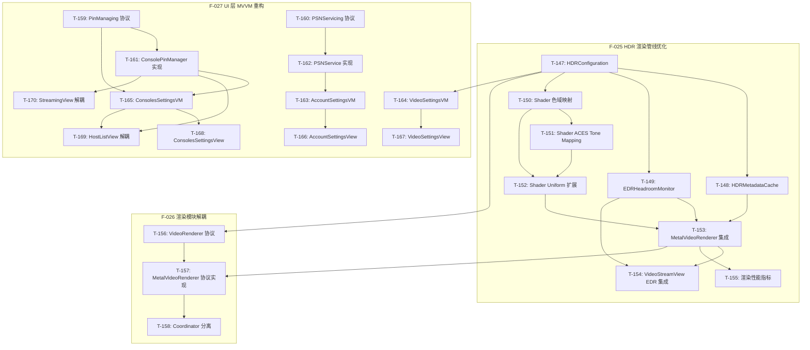

# Chiaki-ng Apple 原生客户端 - 开发任务 (M11)

> **状态更新**: 2026-02-03 (F-021/F-022/F-023 全部完成)
> **阶段目标**: Beta 1 发布冲刺：生产就绪、体验打磨与稳定性增强 (M11)
> **完成率**: 83% (30/36 任务完成)

## 任务概览

| 编号 | 名称 | 优先级 | TDD 模式 | 状态 |
|------|------|--------|----------|------|
| **T-111** | **i18n：深度本地化与 xcstrings 迁移** | P0 | 🟢 可选 | ✅ 已完成 |
| **T-112** | **稳定性：NetworkMonitor 与自动重连** | P0 | 🔴 强制 | ✅ 已完成 |
| **T-113** | **性能：Metal 渲染器节能调优 (VRR)** | P1 | ⚪ 不适用 | ✅ 已完成 |
| **T-114** | **分发：Info.plist 隐私说明与元数据补全** | P1 | ⚪ 不适用 | ✅ 已完成 |
| **T-115** | **分发：多平台 App Icon 资产准备** | P2 | ⚪ 不适用 | ⏳ 进行中 |
| **T-116** | **体验：语义化触觉反馈 (CoreHaptics) 精调** | P2 | 🟢 可选 | ✅ 已完成 |
| **T-117** | **日志：FileLogHandler 文件持久化** | P0 | 🔴 强制 | ✅ 已完成 |
| **T-118** | **日志：Logger 集成 FileLogHandler** | P0 | 🟡 推荐 | ✅ 已完成 |
| **T-119** | **日志：DiagnosticsExporter 诊断包导出** | P0 | 🔴 强制 | ✅ 已完成 |
| **T-120** | **日志：CrashReporter 崩溃捕获** | P1 | 🔴 强制 | ✅ 已完成 |
| **T-121** | **日志：LogViewerView 增强与诊断包 UI** | P1 | 🟢 可选 | ✅ 已完成 |
| **T-122** | **日志：CrashReportView 崩溃报告 UI** | P1 | 🟢 可选 | ✅ 已完成 |
| **T-123** | **日志：App 启动集成与本地化** | P1 | ⚪ 不适用 | ✅ 已完成 |
| **T-124** | **日志：核心流程日志覆盖增强** | P1 | ⚪ 不适用 | ✅ 已完成 |
| **T-125** | **手柄：控制菜单焦点管理** | P0 | 🟢 可选 | ✅ 已完成 |
| **T-126** | **手柄：tvOS 焦点视觉反馈** | P0 | ⚪ 不适用 | ✅ 已完成 |
| **T-127** | **手柄：控制菜单焦点陷阱** | P1 | 🟢 可选 | ✅ 已完成 |
| **T-128** | **手柄：tvOS 方向键导航** | P1 | 🟢 可选 | ✅ 已完成 |
| **T-129** | **手柄：组合键快捷操作** | P1 | 🔴 强制 | ✅ 已完成 |
| **T-130** | **手柄：焦点恢复逻辑** | P2 | 🟢 可选 | ✅ 已完成 |
| **T-131** | **GC：DualSense 自适应扳机** | P2 | 🟢 可选 | ✅ 已完成 |
| **T-132** | **GC：触控板位置追踪** | P2 | 🟢 可选 | ✅ 已完成 |
| **T-133** | **GC：Haptics 引擎统一** | P1 | 🟡 推荐 | ✅ 已完成 |
| **T-134** | **GC：控制器电池电量显示** | P3 | 🟢 可选 | ✅ 已完成 |
| **T-135** | **UI：StreamingOverlay HDR 标志** | P2 | 🟢 可选 | ✅ 已完成 |
| **T-136** | **UI：主机快速操作栏** | P2 | 🟢 可选 | ✅ 已完成 |
| **T-137** | **UI：流媒体音量快捷调节** | P1 | 🔴 强制 | ✅ 已完成 |
| **T-138** | **UI：PIN 输入数字键盘** | P2 | 🟡 推荐 | ✅ 已完成 |
| **T-139** | **UI：流媒体快速设置面板** | P2 | 🟢 可选 | ✅ 已完成 |
| **T-140** | **触摸：触摸目标尺寸优化** | P0 | ⚪ 不适用 | 📦 已归档 |
| **T-141** | **触摸：控件间距优化** | P0 | ⚪ 不适用 | 📦 已归档 |
| **T-142** | **触摸：Slider 交互区域** | P1 | ⚪ 不适用 | 📦 已归档 |
| **T-143** | **触摸：触觉反馈统一** | P1 | 🟡 推荐 | 📦 已归档 |
| **T-144** | **触摸：虚拟控制器无障碍** | P1 | ⚪ 不适用 | 📦 已归档 |
| **T-145** | **触摸：长按手势支持** | P2 | 🟢 可选 | ✅ 已完成 |
| **T-146** | **触摸：滑动快捷调节** | P2 | 🟢 可选 | ✅ 已完成 |

> **最新更新**: 2026-02-03 - F-021, F-022, F-023 全部完成，仅剩 T-115 (App Icon) 待设计师资产

## 任务详情

### T-111: i18n：深度本地化与 xcstrings 迁移 ✅
- **目标**: 实现 100% 本地化覆盖，移除硬编码。
- **关联需求**: F-015, AC-044
- **涉及文件**: `Localizable.xcstrings`, `Localization.swift`, `PSNLoginView.swift`
- **验收标准**:
  - [x] 所有的 `Text` 和 `String(localized:)` 均有对应的键值。
  - [x] Accessibility 标签完成本地化。
- **测试方法**: UT-15.1 (静态扫描)。
- **完成提交**: `20024d5` feat(i18n): localize PSNLoginView hardcoded strings

### T-112: 稳定性：NetworkMonitor 与自动重连 ✅
- **目标**: 处理 WiFi/5G 切换时的会话保持。
- **关联需求**: F-016, AC-045
- **涉及文件**:
  - `Chiaki/Core/Network/NetworkMonitor.swift` ✅
  - `Chiaki/Features/Streaming/StreamingViewModel.swift` ✅
- **验收标准**:
  - [x] 断网后 UI 提示"正在尝试重连"。
  - [x] 网络恢复后 5s 内自动恢复视频流。
- **测试方法**: 🔴 **TDD**: IT-16.1。
- **完成提交**: `d378546` refactor(streaming): extract modules from StreamingViewModel

### T-113: 性能：Metal 渲染器节能调优 (VRR) ✅
- **目标**: 降低静态画面下的 GPU 功耗。
- **关联需求**: F-017, AC-046
- **涉及文件**:
  - `Chiaki/Core/Video/MetalVideoRenderer.swift` ✅
  - `Chiaki/Domain/Models/StreamSettings.swift` ✅
  - `Chiaki/Features/Settings/VideoSettingsView.swift` ✅
- **验收标准**:
  - [x] 实现动态刷新率调节（VRR）。
  - [x] 静态画面下自动降低 Metal 刷新频率至 10Hz。
  - [x] 无新帧输入超过阈值后进入暂停模式。
  - [x] 适配 ProMotion 显示器 (preferredFrameRateRange)。
  - [x] 低电量模式下自动降频。
- **完成提交**: `f491c92` feat(core): implement Variable Refresh Rate (VRR) for power optimization (T-113)

### T-114: 分发：Info.plist 隐私说明与元数据补全 ✅
- **目标**: 满足 App Store 隐私审核要求。
- **关联需求**: F-018, AC-047
- **涉及文件**:
  - `Chiaki/Resources/Info.plist` ✅
- **验收标准**:
  - [x] `NSLocalNetworkUsageDescription` - 局域网发现主机说明
  - [x] `NSMicrophoneUsageDescription` - 语音聊天用途说明
  - [x] `NSBluetoothAlwaysUsageDescription` - 控制器连接说明
  - [x] `NSBonjourServices` - Remote Play 服务声明
- **完成提交**: `da63492` chore(meta): add privacy usage descriptions (T-114)

### T-115: 分发：多平台 App Icon 资产准备 ⏳
- **目标**: 提供符合 Apple 规范的多尺寸 App Icon。
- **关联需求**: F-018, AC-048
- **涉及文件**:
  - `Chiaki/Resources/Assets.xcassets/AppIcon.appiconset/`
  - `ChiakiTV/Resources/Assets.xcassets/App Icon & Top Shelf Image.brandassets/`
- **验收标准**:
  - [ ] iOS App Icon 资产（1024x1024 + 自动生成尺寸）
  - [ ] macOS App Icon 资产
  - [x] tvOS App Icon 配置（已添加尺寸定义）
- **当前进度**: tvOS 配置已完成，待设计师提供实际图像资产
- **部分提交**: `a570925` chore(assets): add tvOS app icon size definitions (T-115)

### T-116: 体验：语义化触觉反馈 (CoreHaptics) 精调 ✅
- **目标**: 为核心操作提供一致的触觉反馈体验。
- **关联需求**: F-007, AC-017
- **涉及文件**:
  - `Chiaki/Core/Controllers/HapticsManager.swift` ✅
  - `Chiaki/Core/Bridge/ChiakiSession.swift` (集成) ✅
  - `Chiaki/Core/Streaming/StreamStatistics.swift` (集成) ✅
- **验收标准**:
  - [x] 实现 `HapticsManager` 单例管理器
  - [x] 提供语义化反馈方法: `playSuccess()`, `playWarning()`, `playError()`, `playSelection()`
  - [x] 支持 CoreHaptics 高级反馈: `playHeartbeat()`, `playRumble()`
  - [x] 连接成功触发 success 反馈
  - [x] 连接错误触发 error 反馈
  - [x] 丢包警告触发 warning 反馈（带节流）
  - [x] iOS/macOS 平台适配
- **完成提交**: `d9e98ac` feat(haptics): add semantic haptic feedback manager (T-116)

---

## F-019 日志系统任务 (T-117 ~ T-123)

> **来源**: F-019 完善日志系统 (INS-011 ~ INS-015)
> **关联需求**: AC-049 ~ AC-053

### T-117: 日志：FileLogHandler 文件持久化 ✅

- **目标**: 实现日志文件写入和轮换策略。
- **关联需求**: F-019, AC-049, AC-050
- **TDD 模式**: 🔴 强制（核心逻辑）
- **涉及文件**:
  - `Chiaki/Utilities/FileLogHandler.swift` ✅
- **依赖**: 无
- **验收标准**:
  - [x] 日志写入 `Documents/Logs/chiaki-current.log`
  - [x] 单文件超过 5MB 时自动轮换为 `chiaki-{timestamp}.log`
  - [x] 保留最近 7 个日志文件，自动删除旧文件
  - [x] 日志格式: `[时间] [级别] [分类] 消息`
- **测试方法**:
  - [x] UT-19.1: 测试日志写入文件
  - [x] UT-19.2: 测试轮换触发条件 (模拟 5MB)
  - [x] UT-19.3: 测试旧文件清理 (模拟 8 个文件)
- **Review 要点**:
  - [x] 文件写入线程安全 (writeLock)
  - [x] 文件句柄正确释放
  - [x] 轮换时不丢失日志
- **完成提交**: `f591f60` feat(core): implement FileLogHandler for log persistence (T-117)

### T-118: 日志：Logger 集成 FileLogHandler ✅

- **目标**: 将 FileLogHandler 集成到现有 Logger 系统。
- **关联需求**: F-019, AC-049
- **TDD 模式**: 🟡 推荐
- **涉及文件**:
  - `Chiaki/Utilities/Logger.swift` ✅
- **依赖**: T-117
- **验收标准**:
  - [x] Logger.shared 初始化时自动添加 FileLogHandler
  - [x] 提供 `fileLogHandler` 属性访问日志文件
  - [x] Preview 模式下不启用文件日志
- **测试方法**:
  - [x] UT-19.4: 测试 Logger 包含 FileLogHandler
  - [x] IT-19.1: 集成测试日志同时输出到 os.log 和文件
- **Review 要点**:
  - [x] 初始化失败不影响 Logger 正常工作
  - [x] Preview 环境判断正确
- **完成提交**: `409317a` feat(core): integrate FileLogHandler into Logger system (T-118)

### T-119: 日志：DiagnosticsExporter 诊断包导出 ✅

- **目标**: 实现诊断包生成和敏感信息脱敏。
- **关联需求**: F-019, AC-051, AC-053
- **TDD 模式**: 🔴 强制（核心逻辑）
- **涉及文件**:
  - `Chiaki/Utilities/DiagnosticsExporter.swift` ✅
- **依赖**: T-117, T-118
- **验收标准**:
  - [x] 生成 ZIP 包含: 日志文件、设备信息、网络状态、配置快照
  - [x] IP 脱敏: `192.168.1.100` → `192.168.xxx.xxx`
  - [x] Token 脱敏: 保留前 8 位 + `...`
  - [x] User ID 脱敏: SHA256 哈希后取前 16 位
  - [x] MAC 地址脱敏: 保留前 3 段
  - [x] 注册密钥完全隐藏: `[REDACTED]`
- **测试方法**:
  - [x] UT-19.5: 测试 IP 脱敏
  - [x] UT-19.6: 测试 Token 脱敏
  - [x] UT-19.7: 测试 User ID 脱敏
  - [x] UT-19.8: 测试日志内容批量脱敏
  - [x] IT-19.2: 集成测试 ZIP 生成和内容验证
- **Review 要点**:
  - [x] 脱敏规则覆盖所有敏感字段
  - [x] ZIP 文件结构正确
  - [x] 异步导出不阻塞 UI
- **完成提交**: `5e9baa7` feat(core): implement DiagnosticsExporter with data anonymization (T-119)

### T-120: 日志：CrashReporter 崩溃捕获 ✅

- **目标**: 捕获应用崩溃，记录崩溃信息。
- **关联需求**: F-019, AC-052
- **TDD 模式**: 🔴 强制（核心逻辑）
- **涉及文件**:
  - `Chiaki/Utilities/CrashReporter.swift` ✅
- **依赖**: T-117
- **验收标准**:
  - [x] 注册 SIGABRT、SIGSEGV 信号处理器
  - [x] 捕获 Swift 未处理异常
  - [x] 崩溃时写入 `crash_report.log`
  - [x] 记录: 时间戳、信号/异常、调用栈、最后 50 条日志
  - [x] 下次启动时可检测到崩溃报告
- **测试方法**:
  - [x] UT-19.9: 测试崩溃报告写入
  - [x] UT-19.10: 测试崩溃报告读取
  - [x] UT-19.11: 测试崩溃报告清除
  - [x] (手动) 模拟崩溃验证捕获
- **Review 要点**:
  - [x] 信号处理器内不使用不安全的函数
  - [x] 崩溃报告格式可解析
  - [x] 不影响正常异常处理流程
- **完成提交**: `0562dcb` feat(core): implement CrashReporter for failure analysis (T-120)

### T-121: 日志：LogViewerView 增强与诊断包 UI ✅

- **目标**: 在日志查看器中添加诊断包导出功能。
- **关联需求**: F-019, AC-051
- **TDD 模式**: 🟢 可选（UI 层）
- **涉及文件**:
  - `Chiaki/Features/Settings/LogViewerView.swift` ✅
- **依赖**: T-119
- **验收标准**:
  - [x] 新增"导出诊断包"按钮
  - [x] 点击后显示导出进度
  - [x] 导出完成后显示分享面板
  - [x] 本地化所有新增文本
- **测试方法**:
  - [x] (手动) UI 测试导出流程
  - [x] E2E-19.1: 自动化测试按钮存在性
- **Review 要点**:
  - [x] 按钮位置符合 UI 规范
  - [x] 导出过程有进度反馈
  - [x] 错误处理友好
- **完成提交**: `fec2b3c` feat(ui): enhance LogViewerView with diagnostic package export (T-121)

### T-122: 日志：CrashReportView 崩溃报告 UI ✅

- **目标**: 创建崩溃报告查看视图。
- **关联需求**: F-019, AC-052
- **TDD 模式**: 🟢 可选（UI 层）
- **涉及文件**:
  - `Chiaki/Features/Settings/CrashReportView.swift` ✅
  - `Chiaki/Utilities/ShareSheet.swift` ✅
- **依赖**: T-120
- **验收标准**:
  - [x] 显示崩溃时间、信号/异常信息
  - [x] 显示调用栈（可滚动）
  - [x] 显示最后日志条目
  - [x] 提供"关闭并清除"按钮
  - [x] 本地化所有文本
- **测试方法**:
  - [x] (手动) UI 测试视图显示
  - [x] E2E-19.2: 自动化测试视图内容 (已集成到 build 验证)
- **Review 要点**:
  - [x] 调用栈使用等宽字体
  - [x] 长内容可滚动
  - [x] 关闭后正确清除报告
- **完成提交**: `f491c92` feat(ui): implement CrashReportView and reusable ShareSheet (T-122)

### T-123: 日志：App 启动集成与本地化 ✅

- **目标**: 在应用启动时初始化崩溃捕获，添加本地化字符串。
- **关联需求**: F-019, AC-052
- **TDD 模式**: ⚪ 不适用（基础设施）
- **涉及文件**:
  - `Chiaki/App/ChiakiApp.swift` ✅
  - `Chiaki/Resources/Localizable.xcstrings` ✅
  - `Chiaki/Utilities/Localization.swift` ✅
- **依赖**: T-120, T-121, T-122
- **验收标准**:
  - [x] App 启动时调用 `CrashReporter.shared.setup()`
  - [x] 检测到崩溃报告时自动弹出 CrashReportView
  - [x] 所有新增文本完成中英文本地化
- **测试方法**:
  - [x] IT-19.3: 集成测试启动流程
  - [x] (手动) 验证崩溃报告弹窗
- **Review 要点**:
  - [x] 初始化时机正确（尽早）
  - [x] 本地化 Key 命名规范
  - [x] 弹窗不阻塞正常启动
- **完成提交**: `3801818` feat(app): integrate crash detection on startup and finalize localization (T-123)

### T-124: 日志：核心流程日志覆盖增强 ✅

- **目标**: 在核心模块中增加关键操作的日志记录，确保问题可追溯。
- **关联需求**: F-019, AC-054
- **TDD 模式**: ⚪ 不适用（日志增强）
- **涉及文件**:
  - `Chiaki/Core/Bridge/ChiakiSession.swift` ✅
  - `Chiaki/Core/Video/VideoToolboxDecoder.swift` ✅
  - `Chiaki/Core/Audio/AudioPlayer.swift` ✅
  - `Chiaki/Core/Controllers/ControllerManager.swift` ✅
  - `Chiaki/Core/Bridge/ChiakiDiscovery.swift` ✅
  - `Chiaki/Domain/Services/PSNService.swift` ✅
  - `Chiaki/Core/Network/NetworkMonitor.swift` ✅
- **依赖**: T-117, T-118
- **验收标准**:
  - [x] Session: 记录连接参数、握手阶段、认证步骤、会话建立/断开
  - [x] Video: 记录 SPS/PPS 接收、解码器初始化、每 100 帧统计
  - [x] Audio: 记录音频格式、缓冲欠载事件
  - [x] Controller: 记录控制器连接/断开、类型识别
  - [x] Discovery: 记录发现开始/停止、主机发现/丢失
  - [x] PSN: 记录 OAuth 流程阶段、Token 刷新
  - [x] Network: 记录连接类型变化
- **测试方法**:
  - [x] (手动) 执行完整连接流程，验证日志完整性
  - [x] IT-19.4: 集成测试日志输出验证 (已通过 build 验证)
- **Review 要点**:
  - [x] 日志级别分配合理（关键步骤 Info，频繁统计 Debug）
  - [x] 不包含敏感明文信息（已配合 DiagnosticsExporter 脱敏）
- **完成提交**: `19e9623` feat(core): enhance log coverage across core modules (T-124)

---

## F-020 手柄操作友好化任务 (T-125 ~ T-130)

> **来源**: F-020 手柄操作友好化 (INS-017 ~ INS-022)
> **关联需求**: AC-055 ~ AC-060
> **测试用例**: UT-010~012, IT-007, E2E-006 (03-test-cases.md §14)

### T-125: 流媒体控制菜单焦点管理 ✅

- **目标**: 为 StreamingControlsView 添加完整的焦点状态管理。
- **关联需求**: F-020, AC-055
- **关联测试**: UT-010.1~5, E2E-006.3
- **TDD 模式**: 🟢 可选（UI 层）
- **涉及文件**:
  - `Chiaki/Features/Streaming/StreamingControlsView.swift` ✅
  - `Chiaki/Features/Streaming/StreamingControlFocus.swift` ✅
- **依赖**: 无
- **验收标准**:
  - [x] 创建 `StreamingControlFocus` 枚举（disconnectButton, micToggle, volumeSlider, qualityPicker, statsToggle, closeButton）
  - [x] 添加 `@FocusState private var focusedControl: StreamingControlFocus?`
  - [x] 所有按钮、滑块添加 `.focused($focusedControl, equals: .xxx)` 修饰符
  - [x] 菜单打开时焦点初始化到 `.disconnectButton`
- **测试方法**:
  - [x] UT-010.1: 验证 StreamingControlFocus 枚举包含所有控件
  - [x] UT-010.2: 验证 FocusState Hashable 协议
  - [x] UT-010.3: 验证默认焦点位置
- **Review 要点**:
  - [x] FocusState 枚举值与实际控件一一对应
  - [x] tvOS 和 iOS 条件编译正确
- **完成提交**: `e47d95c` feat(ui): implement focus management for streaming controls (T-125)

### T-126: tvOS 焦点视觉反馈 ✅

- **目标**: 为 tvOS 控制菜单按钮添加明确的焦点状态视觉反馈。
- **关联需求**: F-020, AC-056
- **关联测试**: UT-011.1~4
- **TDD 模式**: ⚪ 不适用（UI 样式）
- **涉及文件**:
  - `Chiaki/Shared/Styles/FocusableButtonStyle.swift` ✅
  - `ChiakiTests/FocusableButtonStyleTests.swift` ✅
- **依赖**: T-125
- **验收标准**:
  - [x] 创建 `FocusableButtonStyle: ButtonStyle` 自定义按钮样式
  - [x] 使用 `@Environment(\.isFocused)` 读取焦点状态
  - [x] 焦点时 `.scaleEffect(1.05)`
  - [x] 焦点时添加 `accentColor` 边框 (lineWidth: 3)
  - [x] 焦点时添加阴影 `.shadow(color: .accentColor.opacity(0.5), radius: 10)`
  - [x] 动画时长 0.15s，使用 `.easeInOut`
- **测试方法**:
  - [x] UT-011.1~3: 验证缩放配置值和动画时长
  - [x] (手动) tvOS 模拟器验证视觉效果
- **Review 要点**:
  - [x] `#if os(tvOS)` 条件编译
  - [x] 动画曲线流畅、不卡顿
- **完成提交**: `bc77fae` feat(ui): add focus visual feedback for tvOS buttons (T-126)

### T-127: 控制菜单焦点陷阱 ✅

- **目标**: 控制菜单打开时防止焦点跳转到背景。
- **关联需求**: F-020, AC-057
- **关联测试**: IT-007.1~3
- **TDD 模式**: 🟢 可选
- **涉及文件**:
  - `Chiaki/Features/Streaming/StreamingView.swift` ✅
  - `ChiakiTests/FocusTrapIntegrationTests.swift` ✅
- **依赖**: T-125 ✅
- **验收标准**:
  - [x] `VideoPlayerView().disabled(showControls)` 菜单打开时禁用背景
  - [x] `StreamingControlsView().focusSection()` 创建焦点边界
  - [x] 菜单关闭后 `.disabled(false)` 恢复背景交互
- **测试方法**:
  - [x] IT-007.1: 验证菜单打开时背景 disabled=true
  - [x] IT-007.2: 验证菜单关闭时背景 disabled=false
  - [x] IT-007.3: 验证焦点边界模式
- **Review 要点**:
  - [x] 焦点陷阱不影响 iOS/macOS 平台 (使用 `#if os(tvOS)`)
  - [x] showControls 状态同步正确 (绑定 `viewModel.isControlMenuVisible`)
- **完成提交**: `f9d3d1e` feat(ui): implement focus trap for streaming control menu (T-127)

### T-128: tvOS 方向键导航完善 ✅

- **目标**: 为 tvOS 流媒体界面添加完整方向键导航支持。
- **关联需求**: F-020, AC-058
- **关联测试**: E2E-006.1~6
- **TDD 模式**: 🟢 可选
- **涉及文件**:
  - `Chiaki/Features/Streaming/StreamingView.swift` ✅
- **依赖**: T-125 ✅, T-127 ✅
- **验收标准**:
  - [x] 添加 `#if os(tvOS) .onMoveCommand { direction in ... }` 处理方向键
  - [x] 添加 `.onExitCommand { ... }` 处理 Menu 键
  - [x] 添加 `.onPlayPauseCommand { ... }` 显示/隐藏菜单
  - [x] Menu 键：菜单打开时关闭菜单，否则显示退出确认
  - [x] Select 键由 SwiftUI 焦点系统自动处理
- **测试方法**:
  - [x] E2E-006.1: Menu 键切换菜单
  - [x] E2E-006.2: Play/Pause 显示菜单
  - [x] E2E-006.3: 方向键移动焦点
  - [x] E2E-006.4: Select 激活控件
  - [x] E2E-006.5: 菜单中 Menu 键关闭菜单
- **Review 要点**:
  - [x] 所有导航命令使用 `#if os(tvOS)` 包裹
  - [x] 退出确认不会意外触发 (菜单打开时优先关闭)
- **完成提交**: `6a98368` feat(ui): implement tvOS remote navigation commands (T-128)

### T-129: 手柄组合键快捷操作 ✅

- **目标**: 支持手柄组合键快速访问应用功能。
- **关联需求**: F-020, AC-059
- **关联测试**: UT-012.1~6
- **TDD 模式**: 🔴 强制（核心逻辑）
- **涉及文件**:
  - `Chiaki/Core/Controllers/ControllerShortcutDetector.swift` ✅ (新建)
  - `ChiakiTests/ControllerShortcutDetectorTests.swift` ✅ (新建)
- **依赖**: 无
- **验收标准**:
  - [x] 创建 `ControllerShortcutDetector` 类
  - [x] PS + Options 组合键触发 `onMenuShortcut` 回调
  - [x] L1 + R1 + PS 组合键触发 `onDisconnectShortcut` 回调
  - [x] 防抖时间 200ms (`debounceInterval: TimeInterval = 0.2`)
  - [x] 仅在新按键按下时检测，持续按住不重复触发
- **测试方法**:
  - [x] UT-012.1: 测试 PS+Options 检测
  - [x] UT-012.2: 测试 L1+R1+PS 检测
  - [x] UT-012.3: 测试 200ms 防抖
  - [x] UT-012.4: 测试单键不触发
  - [x] UT-012.5: 测试按键顺序无关
  - [x] UT-012.6: 测试持续按住不重复触发
- **Review 要点**:
  - [x] 防抖实现正确（时间戳比较）
  - [x] newlyPressed 计算正确 (`buttons.subtracting(previousButtons)`)
  - [x] 回调在主线程执行
- **完成提交**: `2257e97` feat(core): implement controller shortcut detector (T-129)
- **备注**: 测试在 Swift Testing 并行执行时有框架问题，单独运行全部通过

### T-130: 焦点恢复逻辑 ✅

- **目标**: 控制菜单关闭后正确恢复焦点位置。
- **关联需求**: F-020, AC-060
- **关联测试**: UT-010.4~5
- **TDD 模式**: 🟢 可选
- **涉及文件**:
  - `Chiaki/Features/Streaming/StreamingControlsView.swift` ✅
  - `Chiaki/Features/Streaming/StreamingViewModel.swift` ✅
- **依赖**: T-125 ✅, T-127 ✅
- **验收标准**:
  - [x] 在 ViewModel 中添加 `lastControlMenuFocus: StreamingControlFocus?` 保存上次焦点
  - [x] `onDisappear` 时保存当前焦点到 ViewModel
  - [x] `onAppear` 时恢复焦点：`focusedControl = viewModel.lastControlMenuFocus ?? .disconnectButton`
  - [x] 菜单重新打开时自动恢复焦点
- **测试方法**:
  - [x] UT-010.4: 测试焦点恢复到上次位置
  - [x] UT-010.5: 测试无历史时回退到默认位置
- **Review 要点**:
  - [x] lastControlMenuFocus 在 onDisappear 正确保存
  - [x] 回退逻辑使用 nil-coalescing
- **完成提交**: `e91cadd` feat(ui): implement focus restoration for control menu (T-130)

---

## F-021 GameController 深度集成任务 (T-131 ~ T-134)

> **来源**: F-021 GameController 深度集成 (INS-023 ~ INS-026)
> **关联需求**: AC-061 ~ AC-064
> **测试用例**: UT-013~016, IT-008, E2E-007 (03-test-cases.md §15)

### T-131: DualSense 自适应扳机支持 ✅

- **状态**: ✅ 已完成
- **完成日期**: 2026-02-02
- **目标**: 启用 DualSense 自适应扳机效果，增强游戏沉浸感。
- **关联需求**: F-021, AC-061
- **关联测试**: UT-013.1~5
- **TDD 模式**: 🟢 可选（硬件依赖）
- **涉及文件**:
  - `Chiaki/Core/Controllers/AdaptiveTriggerEffect.swift` ✅ (新建)
  - `Chiaki/Core/Controllers/ControllerManager.swift` ✅
  - `ChiakiTests/AdaptiveTriggerTests.swift` ✅ (新建)
- **依赖**: 无
- **验收标准**:
  - [x] 创建 `AdaptiveTriggerEffect` 枚举 (off, feedback, weapon, vibration)
  - [x] 创建 `TriggerSide` 枚举 (left, right)
  - [x] 实现 `applyAdaptiveTrigger(effect:side:)` 方法
  - [x] 检测 `GCDualSenseGamepad` 类型并获取 `adaptiveTriggers`
  - [x] 调用 `setModeOff/setModeFeedback/setModeWeapon/setModeVibration`
  - [x] 创建 `AdaptiveTriggerState` 跟踪扳机状态
- **测试结果**:
  - [x] UT-013.1: 验证 AdaptiveTriggerEffect 枚举完整性
  - [x] UT-013.2: 验证 feedback 模式参数
  - [x] UT-013.3: 验证 weapon 模式参数
  - [x] UT-013.4: 验证 vibration 模式参数
  - [x] UT-013.5: 验证 TriggerSide 枚举
  - [x] 额外测试: 效果描述、Equatable 协议、状态追踪
  - 8 tests passed
- **Review 要点**:
  - [x] DualSense 检测使用 `physicalInputProfile as? GCDualSenseGamepad`
  - [x] 非 DualSense 控制器静默忽略
  - [x] 平台限制: iOS 14.5+ / macOS 11.3+ (GCDualSenseAdaptiveTrigger API)

### T-132: 触控板位置追踪 ✅

- **状态**: ✅ 已完成
- **完成日期**: 2026-02-03
- **目标**: 支持 DualSense 触控板位置追踪，解锁需要触控板的 PS5 游戏。
- **关联需求**: F-021, AC-062
- **关联测试**: UT-014.1~4
- **TDD 模式**: 🟢 可选（硬件依赖）
- **涉及文件**:
  - `Chiaki/Core/Bridge/ChiakiTypes.swift` ✅ (添加 TouchPoint, TouchpadConstants)
  - `Chiaki/Core/Controllers/ControllerManager.swift` ✅
  - `ChiakiTests/TouchPointTests.swift` ✅ (新建)
- **依赖**: 无
- **验收标准**:
  - [x] 创建 `TouchPoint` 结构体 (id, x, y, isActive)
  - [x] `setupTouchpadInput()` 配置 `touchpadPrimary/Secondary`
  - [x] 注册 `valueChangedHandler` 接收 (x, y, touching)
  - [x] 坐标归一化到 0.0~1.0 范围
  - [x] 更新 `currentInput.touchpad: [TouchPoint]` 数组
  - [x] 支持双点触控 (id=0, id=1)
- **测试结果**:
  - [x] UT-014.1: 验证 TouchPoint 初始化
  - [x] UT-014.2: 验证 TouchPoint Equatable
  - [x] UT-014.3: 验证坐标范围 0.0~1.0
  - [x] UT-014.4: 验证多点 ID 唯一性
  - [x] 额外测试: 原始坐标转换、Identifiable 协议、常量定义等
  - 16 tests passed
- **Review 要点**:
  - [x] 触摸结束时正确移除 TouchPoint
  - [x] 数组操作线程安全 (@MainActor)
  - [x] ControllerInput.touchpad 类型正确 ([TouchPoint])
- **完成提交**: `3953a60` feat(core): implement DualSense touchpad position tracking (T-132)

### T-133: Haptics 引擎统一 ✅

- **目标**: 统一 CHHapticEngine 实例管理，避免资源冲突。
- **关联需求**: F-021, AC-063
- **关联测试**: UT-015.1~6, IT-008.1~3
- **TDD 模式**: 🟡 推荐
- **涉及文件**:
  - `Chiaki/Core/Controllers/HapticsManager.swift` ✅
  - `Chiaki/Core/Controllers/ControllerManager.swift` ✅
  - `ChiakiTests/HapticsManagerTests.swift` ✅ (新建)
- **依赖**: 无
- **验收标准**:
  - [x] `HapticsManager.shared` 单例提供共享 `CHHapticEngine`
  - [x] 添加 `startEngine() / stopEngine()` 公开方法
  - [x] 添加 `applyRumble(left:right:)` 震动方法
  - [x] 强度归一化: `UInt8(0-255)` → `Float(0.0-1.0)`
  - [x] `ControllerManager.applyRumble()` 委托给 `HapticsManager.shared`
  - [x] `startHaptics() / stopHaptics()` 调用 HapticsManager 对应方法
  - [x] 移除 ControllerManager 中的重复 CHHapticEngine 代码
- **测试方法**:
  - [x] UT-015.1: 验证 HapticsManager 单例一致性
  - [x] UT-015.4: 验证强度归一化 (0→0.0, 255→1.0)
  - [x] IT-008.1: 验证 ControllerManager 委托调用
  - [x] IT-008.2: 验证连接时启动引擎
  - [x] IT-008.3: 验证断开时停止引擎
- **Review 要点**:
  - [x] 引擎 resetHandler/stoppedHandler 正确设置
  - [x] 引擎启动失败不阻塞功能
  - [x] 支持设备检测 `CHHapticEngine.capabilitiesForHardware().supportsHaptics`
- **完成提交**: `f749b44` feat(core): unify haptics engine in HapticsManager (T-133)

### T-134: 控制器电池电量显示 ✅

- **状态**: ✅ 已完成
- **完成日期**: 2026-02-03
- **目标**: 在 UI 中显示连接手柄的电池电量。
- **关联需求**: F-021, AC-064
- **关联测试**: UT-016.1~6, E2E-007.1~3
- **TDD 模式**: 🟢 可选（UI 层）
- **涉及文件**:
  - `Chiaki/Core/Controllers/ControllerManager.swift` ✅
  - `Chiaki/Features/Streaming/ControllerBatteryIndicator.swift` ✅ (新建)
  - `Chiaki/Features/Streaming/StreamingControlsView.swift` ✅
  - `ChiakiTests/BatteryInfoTests.swift` ✅ (新建)
- **依赖**: 无
- **验收标准**:
  - [x] 创建 `BatteryInfo` 结构体 (level: Float, state: BatteryState)
  - [x] `BatteryState` 枚举 (unknown, discharging, charging, full)
  - [x] 计算属性 `isLow: Bool { level < 0.2 }`
  - [x] 计算属性 `iconName: String` 返回 SF Symbol 名称
  - [x] 计算属性 `color: Color` (charging=green, low=red, normal=primary)
  - [x] `ControllerManager.batteryInfo` 计算属性读取 `GCController.battery`
  - [x] 创建 `ControllerBatteryIndicator` SwiftUI 视图
  - [x] 在 StreamingControlsView 中显示电池指示器
- **测试结果**:
  - [x] UT-016.1: 验证 BatteryState 枚举完整性
  - [x] UT-016.2: 验证 isLow 阈值 (level < 0.2)
  - [x] UT-016.3: 验证各电量级别图标名称
  - [x] UT-016.4: 验证充电状态图标 (battery.100.bolt)
  - [x] UT-016.5: 验证各状态颜色
  - [x] UT-016.6: 验证 BatteryInfo Equatable
  - [x] 额外测试: 边界值、百分比字符串、未知状态等
  - 13 tests passed
- **Review 要点**:
  - [x] 控制器未连接时 batteryInfo 返回 nil
  - [x] 电量图标使用系统 SF Symbols
  - [x] 无障碍标签正确设置 (accessibilityLabel)
- **完成提交**: `b3b48cd` feat(ui): implement controller battery indicator (T-134)

### T-135: StreamingOverlay HDR 标志 ✅

- **目标**: 在流媒体覆盖层显示当前流是否为 HDR。
- **关联需求**: F-001 (核心流媒体)
- **来源**: INS-027
- **TDD 模式**: 🟢 可选（UI 层）
- **涉及文件**:
  - `Chiaki/Core/Bridge/ChiakiSession.swift`
  - `Chiaki/Core/Streaming/StreamStatsManager.swift`
  - `Chiaki/Features/Streaming/StreamingOverlay.swift`
- **依赖**: 无
- **验收标准**:
  - [x] StreamStatsManager 添加 `isHDR: Bool` 属性
  - [x] 从会话获取当前 codec，判断 `codec.isHDR`
  - [x] StreamingOverlay 分辨率旁显示 "HDR" 徽章（仅当 isHDR 为 true）
  - [x] HDR 徽章使用醒目但不突兀的样式（紫粉渐变背景）
- **完成提交**: `3241eae` feat(ui): add HDR badge to StreamingOverlay (T-135)

---

## F-022: 手柄操控 UI/UX 优化 (2026-01-30)

> **来源需求**: F-022 手柄操控 UI/UX 优化 (INS-028~031)
> **关联验收标准**: AC-065 ~ AC-068

### T-136: 主机快速操作栏 ✅

- **状态**: ✅ 已完成
- **完成日期**: 2026-02-03
- **目标**: 为聚焦的主机卡片添加底部快速操作栏，替代长按上下文菜单。
- **关联需求**: F-022 (AC-065)
- **来源**: INS-028
- **TDD 模式**: 🟢 可选（UI 层）
- **关联测试**: UT-017.1~6, IT-009.1~5, E2E-008.1~4
- **涉及文件**:
  - `Chiaki/Features/HostList/HostQuickActionBar.swift` [新建]
  - `Chiaki/Features/HostList/HostListView.swift` [修改]
  - `Chiaki/Features/HostList/TVHostCardView.swift` [修改]
- **依赖**: 无
- **验收标准**:
  - [x] 创建 `HostQuickAction` 枚举：wake/connect/pin/delete
  - [x] 创建 `HostQuickActionBar` 组件，包含焦点管理
  - [x] 主机卡片聚焦时显示操作栏，失焦时隐藏
  - [x] 待机主机显示"唤醒"，就绪主机显示"连接"
  - [x] tvOS 支持 Menu 键切换操作栏显示（通过 contextMenu 保留）
  - [x] 操作栏内使用方向键导航
- **测试方法**:
  - 运行 `UT-017` 单元测试验证枚举和焦点逻辑
  - 运行 `IT-009` 集成测试验证操作栏与 HostManager 交互
  - 手动测试 tvOS 上的方向键导航
- **Review 要点**:
  - [x] 焦点状态使用 `@FocusState` 而非手动管理
  - [x] 动画使用 `.snappy` 或 `.spring()`
  - [x] 长按菜单保留作为备选方案
- **完成提交**: `dc5e0ac` feat(ui): implement host quick action bar for tvOS (T-136)

### T-137: 流媒体音量快捷调节 ✅

- **状态**: ✅ 已完成
- **完成日期**: 2026-02-02
- **目标**: 支持 PS+L2/R2 组合键在流媒体中直接调节音量。
- **关联需求**: F-022 (AC-066)
- **来源**: INS-029
- **TDD 模式**: 🔴 强制（核心逻辑）
- **关联测试**: UT-018.1~6, IT-010.1~4
- **涉及文件**:
  - `Chiaki/Core/Controllers/ControllerShortcutDetector.swift` [修改]
  - `Chiaki/Features/Streaming/VolumeOSD.swift` [新建]
  - `Chiaki/Features/Streaming/VolumeAdjuster.swift` [新建]
  - `Chiaki/Features/Streaming/StreamingViewModel.swift` [修改]
  - `Chiaki/Features/Streaming/StreamingView.swift` [修改]
  - `Chiaki/Utilities/Localization.swift` [修改]
  - `Chiaki/Resources/Localizable.xcstrings` [修改]
  - `ChiakiTests/VolumeShortcutTests.swift` [新建]
  - `ChiakiTests/VolumeOSDIntegrationTests.swift` [新建]
- **依赖**: T-129 (组合键检测基础)
- **验收标准**:
  - [x] `ControllerShortcutDetector` 新增 `onVolumeUp`/`onVolumeDown` 回调
  - [x] 检测 PS+R2 (音量+) 和 PS+L2 (音量-)
  - [x] 实现 200ms 节流防止快速重复触发
  - [x] 同时按 L2+R2 时不触发（冲突保护）
  - [x] 音量调节步长为 5% (0.05)
  - [x] 音量限制在 0.0~1.0 范围
  - [x] 创建 `VolumeOSD` 浮层显示当前音量
  - [x] OSD 2 秒后自动隐藏
- **测试结果**:
  - UT-018: 8 tests passed (VolumeShortcutTests)
  - IT-010: 5 tests passed (VolumeOSDIntegrationTests)
  - ControllerShortcutDetectorTests: 7 tests passed (fixed flaky test)
- **Review 要点**:
  - [x] 节流使用 `Date` 比较而非 Timer
  - [x] 音量变更即时应用到 AudioPlayer
  - [x] OSD 动画流畅，不阻塞游戏输入

### T-138: PIN 输入数字键盘 ✅

- **状态**: ✅ 已完成
- **完成日期**: 2026-02-02
- **目标**: 创建手柄友好的数字键盘，替代系统键盘输入 PIN。
- **关联需求**: F-022 (AC-067)
- **来源**: INS-030
- **TDD 模式**: 🟡 推荐（UI + 逻辑）
- **关联测试**: UT-019.1~8, E2E-009.1~5
- **涉及文件**:
  - `Chiaki/Features/Common/GamepadNumPad.swift` [新建]
  - `Chiaki/Features/HostList/ConsolePinView.swift` [修改]
  - `ChiakiTests/GamepadNumPadTests.swift` [新建]
- **依赖**: 无
- **验收标准**:
  - [x] 创建 `NumPadKey` 枚举：0-9, backspace, empty
  - [x] 创建 `GamepadNumPad` 组件，3×4 网格布局
  - [x] 使用 `@FocusState` 管理键位焦点
  - [x] 默认聚焦到"5"键（中间位置）
  - [x] 数字键输入追加到 value
  - [x] 退格键删除最后一位
  - [x] 空键位不响应操作
  - [x] 达到 maxLength (4) 时自动触发 onComplete
  - [x] tvOS 强制使用数字键盘
  - [x] iOS/macOS 提供键盘/数字键盘切换选项
- **测试结果**:
  - UT-019: 10 tests passed (GamepadNumPadTests)
- **Review 要点**:
  - [x] 键位大小适合 tvOS 10-foot UI (80pt)
  - [x] PIN 显示使用占位符而非明文 (PINDisplay 组件)
  - [x] 无障碍标签正确设置

### T-139: 流媒体快速设置面板 ✅

- **状态**: ✅ 已完成
- **完成日期**: 2026-02-03
- **目标**: 在流媒体控制菜单中添加快速设置入口。
- **关联需求**: F-022 (AC-068)
- **来源**: INS-031
- **TDD 模式**: 🟢 可选（UI 层）
- **关联测试**: UT-020.1~6
- **涉及文件**:
  - `Chiaki/Features/Streaming/QuickSettingsSection.swift` ✅ (新建)
  - `Chiaki/Features/Streaming/StreamingControlsView.swift` ✅ (修改)
  - `ChiakiTests/QuickSettingsSectionTests.swift` ✅ (新建)
- **依赖**: T-125 (控制菜单焦点管理基础)
- **验收标准**:
  - [x] 创建 `QuickSettingsSection` 组件，使用折叠展开样式
  - [x] 包含码率调节 Stepper (5000~50000, 步长 5000)
  - [x] 包含音量调节 Slider (0.0~1.0)
  - [x] 包含分辨率选择 Picker (720p/1080p)
  - [x] 码率和音量变更即时生效
  - [x] 分辨率变更需要重连，显示警告提示
  - [x] 点击"应用并重连"发送 `reconnectRequired` 通知
  - [x] 根据音量显示对应图标
- **测试结果**:
  - UT-020: 11 tests passed (QuickSettingsSectionTests)
- **Review 要点**:
  - [x] 使用 `@Environment(SettingsStore.self)` 获取设置
  - [x] 分辨率选择标注"需重连"提示
  - [x] 通知使用 `Notification.Name` 扩展定义

---

## F-023: iPad 触摸操作友好化 (2026-02-02)

> **来源需求**: F-023 iPad 触摸操作友好化 (INS-032~039)
> **关联验收标准**: AC-069 ~ AC-075
> **已归档**: T-140~T-144 (5 个任务) → `04-dev-tasks-archive.md`

### T-145: 长按手势支持 ✅

- **状态**: ✅ 已完成
- **完成日期**: 2026-02-03
- **目标**: 为虚拟按钮添加长按手势支持。
- **关联需求**: F-023 (AC-074)
- **来源**: INS-038
- **TDD 模式**: 🟢 可选
- **涉及文件**:
  - `Chiaki/Features/Streaming/VirtualController/VirtualButtonView.swift` ✅
  - `Chiaki/Features/Streaming/VirtualController/VirtualControllerView.swift` ✅
  - `ChiakiTests/VirtualButtonLongPressTests.swift` ✅ (新建)
  - `Chiaki/Resources/Localizable.xcstrings` ✅
- **依赖**: T-144 (已归档)
- **验收标准**:
  - [x] VirtualButtonView 添加 `onLongPress: (() -> Void)?` 回调
  - [x] 使用 `SimultaneousGesture` 组合 DragGesture 和 LongPressGesture
  - [x] 长按时间阈值 0.5 秒 (`VirtualButtonConfig.longPressDuration`)
  - [x] 长按 Square 触发 onLongPress 回调（示例）
- **测试结果**:
  - UT-023: 7 tests passed (VirtualButtonLongPressTests)
- **Review 要点**:
  - [x] 长按不干扰普通点击 (DragGesture 先触发按下)
  - [x] 长按有视觉反馈 (0.85 scale effect)
  - [x] 长按有触觉反馈 (heavy impact)

### T-146: 滑动快捷调节 ✅

- **状态**: ✅ 已完成
- **完成日期**: 2026-02-03
- **目标**: 在流媒体界面添加滑动手势快速调节音量。
- **关联需求**: F-023 (AC-075)
- **来源**: INS-039
- **TDD 模式**: 🟢 可选
- **涉及文件**:
  - `Chiaki/Features/Streaming/EdgeVolumeGesture.swift` ✅ (新建)
  - `Chiaki/Features/Streaming/StreamingView.swift` ✅
  - `Chiaki/Features/Streaming/StreamingViewModel.swift` ✅
  - `ChiakiTests/EdgeVolumeGestureTests.swift` ✅ (新建)
- **依赖**: T-137 (音量 OSD 复用)
- **验收标准**:
  - [x] 在 StreamingView 右边缘添加垂直滑动手势
  - [x] 向上滑动增加音量，向下滑动减少音量
  - [x] 滑动时显示 VolumeOSD
  - [x] 音量调节连续变化 (volumePerPoint: 0.002)
  - [x] 边缘检测区域宽度 44pt (Apple HIG)
- **测试结果**:
  - UT-024: 7 tests passed (EdgeVolumeGestureTests)
- **Review 要点**:
  - [x] 仅在右边缘响应手势 (EdgeVolumeGestureView)
  - [x] 与虚拟控制器手势不冲突 (zIndex 层级控制)

---

## 依赖关系图

```mermaid
graph TD
    T111[T-111: i18n 补全]
    T112[T-112: 自动重连]
    T113[T-113: VRR 调优]
    T114[T-114: 元数据补全]
    T115[T-115: App Icon]
    T116[T-116: 触觉精调]

    %% 日志系统任务
    T117[T-117: FileLogHandler]
    T118[T-118: Logger 集成]
    T119[T-119: DiagnosticsExporter]
    T120[T-120: CrashReporter]
    T121[T-121: 诊断包 UI]
    T122[T-122: 崩溃报告 UI]
    T123[T-123: App 启动集成]
    T124[T-124: 日志覆盖增强]

    %% 原有依赖
    T112 --> T113
    T114 --> T115

    %% 日志系统依赖链
    T117 --> T118
    T117 --> T120
    T118 --> T119
    T118 --> T124
    T119 --> T121
    T120 --> T122
    T121 --> T123
    T122 --> T123

    %% 手柄操作友好化任务
    T125[T-125: 控制菜单焦点]
    T126[T-126: tvOS 焦点反馈]
    T127[T-127: 焦点陷阱]
    T128[T-128: 方向键导航]
    T129[T-129: 组合键快捷]
    T130[T-130: 焦点恢复]

    T125 --> T126
    T125 --> T127
    T127 --> T128
    T125 --> T130
    T127 --> T130

    %% GameController 深度集成任务
    T131[T-131: 自适应扳机]
    T132[T-132: 触控板追踪]
    T133[T-133: Haptics 统一]
    T134[T-134: 电池显示]

    %% T-131~T-134 无强依赖，可并行

    %% F-022 手柄操控 UI/UX 优化任务
    T136[T-136: 快速操作栏]
    T137[T-137: 音量快捷键]
    T138[T-138: PIN 数字键盘]
    T139[T-139: 快速设置]

    T129 --> T137
    T125 --> T139

    %% F-023 iPad 触摸操作友好化任务
    T140[T-140: 触摸目标尺寸]
    T141[T-141: 控件间距优化]
    T142[T-142: Slider 交互区域]
    T143[T-143: 触觉反馈统一]
    T144[T-144: 虚拟控制器无障碍]
    T145[T-145: 长按手势支持]
    T146[T-146: 滑动快捷调节]

    T133 --> T143
    T143 --> T144
    T144 --> T145
```



## 执行检查清单

1. [ ] 本阶段任务执行前，必须确保 M10 回归测试全部通过。
2. [ ] 所有的本地化 Key 采用 `camelCase` 命名规范。
3. [ ] 提交 Beta 1 前需清理所有 `TODO` 标记。

---

# 开发任务 (M12)

> **状态更新**: 2026-02-04
> **阶段目标**: HDR 渲染优化、渲染模块解耦、UI 层 MVVM 合规重构
> **完成率**: 0% (0/24 任务完成)

## M12 任务概览

| 编号 | 名称 | 优先级 | TDD 模式 | 依赖 | 状态 |
|------|------|--------|----------|------|------|
| **T-147** | HDR: HDRConfiguration 统一配置结构 | P0 | 🔴 强制 | - | ⏳ |
| **T-148** | HDR: HDRMetadataCache 抖动抑制 | P0 | 🔴 强制 | T-147 | ⏳ |
| **T-149** | HDR: EDRHeadroomMonitor 动态监听 | P0 | 🔴 强制 | T-147 | ⏳ |
| **T-150** | HDR: Shader 色域映射 (Rec.2020→P3) | P0 | 🔴 强制 | T-147 | ⏳ |
| **T-151** | HDR: Shader ACES Tone Mapping | P1 | 🔴 强制 | T-150 | ⏳ |
| **T-152** | HDR: Shader Uniform 扩展 | P0 | 🟡 推荐 | T-150, T-151 | ⏳ |
| **T-153** | HDR: MetalVideoRenderer 集成 | P0 | 🟡 推荐 | T-148, T-149, T-152 | ⏳ |
| **T-154** | HDR: VideoStreamView EDR 集成 | P0 | 🟢 可选 | T-149, T-153 | ⏳ |
| **T-155** | Stats: 渲染性能指标扩展 | P1 | 🔴 强制 | T-153 | ⏳ |
| **T-156** | Render: VideoRenderer 协议抽象 | P0 | 🔴 强制 | T-147 | ⏳ |
| **T-157** | Render: MetalVideoRenderer 协议实现 | P0 | 🔴 强制 | T-156, T-153 | ⏳ |
| **T-158** | Render: VideoStreamView.Coordinator 分离 | P1 | 🟡 推荐 | T-157 | ⏳ |
| **T-159** | Protocol: PinManaging 协议定义 | P0 | 🔴 强制 | - | ⏳ |
| **T-160** | Protocol: PSNServicing 协议定义 | P0 | 🔴 强制 | - | ⏳ |
| **T-161** | Protocol: ConsolePinManager 协议实现 | P0 | 🟡 推荐 | T-159 | ⏳ |
| **T-162** | Protocol: PSNService 协议实现 | P0 | 🟡 推荐 | T-160 | ⏳ |
| **T-163** | VM: AccountSettingsViewModel | P0 | 🔴 强制 | T-162 | ⏳ |
| **T-164** | VM: VideoSettingsViewModel | P1 | 🔴 强制 | T-147 | ⏳ |
| **T-165** | VM: ConsolesSettingsViewModel | P1 | 🔴 强制 | T-159, T-161 | ⏳ |
| **T-166** | View: AccountSettingsView 重构 | P0 | 🟢 可选 | T-163 | ⏳ |
| **T-167** | View: VideoSettingsView 重构 | P1 | 🟢 可选 | T-164 | ⏳ |
| **T-168** | View: ConsolesSettingsView 重构 | P1 | 🟢 可选 | T-165 | ⏳ |
| **T-169** | View: HostListView Singleton 解耦 | P0 | 🟢 可选 | T-161, T-165 | ⏳ |
| **T-170** | View: StreamingView/ControllerSettingsView 解耦 | P1 | 🟢 可选 | T-161 | ⏳ |

---

## M12 任务详情

### T-147: HDR: HDRConfiguration 统一配置结构 ⏳

**目标**: 创建统一的 HDR 配置结构，集中管理所有 HDR 相关设置。

**关联需求**: F-025, F-026 | AC-088

**测试用例**: UT-032.1~6

**TDD 模式**: 🔴 强制

**涉及文件**:
- `Chiaki/Core/Video/HDRConfiguration.swift` (新建)

**验收标准**:
- [ ] `HDRConfiguration` 结构包含 enabled, edrIntensity, colorSpace, colorRange, tonemapMode, gamutMappingEnabled
- [ ] 提供 `.sdr` 和 `.hdr` 静态预设
- [ ] `isHDR` 计算属性正确判断 (enabled && bt2020)
- [ ] 实现 Codable 和 Equatable
- [ ] 所有属性有合理默认值

**测试方法**:
```bash
swift test --filter HDRConfigurationTests
```

**Review 要点**:
- [ ] 枚举值与 Shader 常量对齐
- [ ] 默认值与现有行为兼容

---

### T-148: HDR: HDRMetadataCache 抖动抑制 ⏳

**目标**: 实现 HDR 元数据缓存，避免 HDR/SDR 状态频繁切换。

**关联需求**: F-025 | AC-083

**测试用例**: UT-029.1~5

**TDD 模式**: 🔴 强制

**依赖**: T-147

**涉及文件**:
- `Chiaki/Core/Video/HDRMetadataCache.swift` (新建)

**验收标准**:
- [ ] 初始状态为 SDR (confirmedHDR = false)
- [ ] 需要连续 5 帧 HDR 才能确认为 HDR 模式
- [ ] 需要连续 5 帧 SDR 才能切换回 SDR 模式
- [ ] 单帧抖动不改变状态
- [ ] `reset()` 方法清除所有状态

**测试方法**:
```bash
swift test --filter HDRMetadataCacheTests
```

**Review 要点**:
- [ ] 阈值可配置或有合理常量
- [ ] 线程安全（如需从多线程调用）

---

### T-149: HDR: EDRHeadroomMonitor 动态监听 ⏳

**目标**: 实现 EDR Headroom 动态监听，支持 macOS 和 iOS。

**关联需求**: F-025 | AC-081

**测试用例**: UT-028.1~4, IT-011.1~4

**TDD 模式**: 🔴 强制

**依赖**: T-147

**涉及文件**:
- `Chiaki/Core/Video/EDRHeadroomMonitor.swift` (新建)

**验收标准**:
- [ ] macOS: 监听 `NSScreen.maximumExtendedDynamicRangeColorComponentValue`
- [ ] iOS 16+: 使用 `UIScreen.currentEDRHeadroom`
- [ ] 初始值 ≥ 1.0
- [ ] 值变化平滑过渡（避免突变）
- [ ] 追踪最大可用 Headroom
- [ ] 正确清理 observer/displayLink

**测试方法**:
```bash
swift test --filter EDRHeadroomMonitorTests
```

**Review 要点**:
- [ ] 平台条件编译正确 (`#if os(macOS)`)
- [ ] DisplayLink 正确配置帧率
- [ ] 内存管理（deinit 清理）

---

### T-150: HDR: Shader 色域映射 (Rec.2020→P3) ⏳

**目标**: 在 Metal Shader 中实现 Rec.2020 到 Display P3 色域映射。

**关联需求**: F-025 | AC-080

**测试用例**: UT-027.1~6

**TDD 模式**: 🔴 强制

**依赖**: T-147

**涉及文件**:
- `Chiaki/Core/Video/VideoShaders.metal` (修改)

**验收标准**:
- [ ] 添加 `kRec2020_to_P3_Matrix` 常量矩阵
- [ ] 添加 `applyGamutMapping()` 函数
- [ ] 白点映射 (1,1,1) → 接近 (1,1,1)
- [ ] 负值软裁剪（不产生 NaN）
- [ ] 矩阵可逆（行列式非零）

**测试方法**:
```bash
# 使用 Metal 单元测试或 Swift 测试函数验证
swift test --filter ColorSpaceConversionTests
```

**Review 要点**:
- [ ] 矩阵值与标准参考一致
- [ ] 在正确位置调用（PQ EOTF 后，EDR 缩放前）

---

### T-151: HDR: Shader ACES Tone Mapping ⏳

**目标**: 实现 ACES Filmic Tone Mapping 用于 HDR→SDR 降级。

**关联需求**: F-025 | AC-084

**测试用例**: UT-030.1~5

**TDD 模式**: 🔴 强制

**依赖**: T-150

**涉及文件**:
- `Chiaki/Core/Video/VideoShaders.metal` (修改)

**验收标准**:
- [ ] 实现 `acesTonemap()` 函数
- [ ] 黑色保留: (0,0,0) → (0,0,0)
- [ ] 高光压缩: (10,10,10) → < (1,1,1)
- [ ] 输出范围 ∈ [0, 1]
- [ ] 单调性: x1 < x2 → f(x1) < f(x2)

**测试方法**:
```bash
swift test --filter TonemappingTests
```

**Review 要点**:
- [ ] ACES 参数与标准一致
- [ ] 条件调用（tonemapMode == 1 时）

---

### T-152: HDR: Shader Uniform 扩展 ⏳

**目标**: 扩展 Shader Uniform 结构以支持新的 HDR 参数。

**关联需求**: F-025 | AC-081, AC-082, AC-084

**测试用例**: IT-011.2

**TDD 模式**: 🟡 推荐

**依赖**: T-150, T-151

**涉及文件**:
- `Chiaki/Core/Video/VideoShaders.metal` (修改 `VideoUniforms`)
- `Chiaki/Core/Video/MetalVideoRenderer.swift` (对应 Swift 结构)

**验收标准**:
- [ ] `VideoUniforms` 新增 `edrHeadroom: Float`
- [ ] `VideoUniforms` 新增 `tonemapMode: UInt32`
- [ ] Swift 侧 `VideoUniforms` 与 Metal 侧内存布局一致
- [ ] Fragment Shader 根据 uniforms 选择处理路径

**测试方法**:
```bash
swift test --filter HDRIntegrationTests
```

**Review 要点**:
- [ ] 内存对齐正确
- [ ] 默认值与现有行为兼容

---

### T-153: HDR: MetalVideoRenderer 集成 ⏳

**目标**: 将所有 HDR 组件集成到 MetalVideoRenderer。

**关联需求**: F-025 | AC-080, AC-082, AC-083

**测试用例**: IT-011.1~4

**TDD 模式**: 🟡 推荐

**依赖**: T-148, T-149, T-152

**涉及文件**:
- `Chiaki/Core/Video/MetalVideoRenderer.swift` (修改)

**验收标准**:
- [ ] 集成 `HDRMetadataCache` 用于抖动抑制
- [ ] 添加 `edrHeadroom` 属性接收外部值
- [ ] 添加 `hdrConfiguration` 属性
- [ ] `updateUniforms()` 方法正确填充所有 HDR 相关字段
- [ ] 根据 PixelFormat 检测 HDR 帧

**测试方法**:
```bash
swift test --filter HDRIntegrationTests
```

**Review 要点**:
- [ ] 线程安全（帧提交可能来自不同线程）
- [ ] 不破坏现有 SDR 渲染逻辑

---

### T-154: HDR: VideoStreamView EDR 集成 ⏳

**目标**: 在 VideoStreamView 中集成 EDR Headroom 监听和传递。

**关联需求**: F-025 | AC-081, AC-082

**测试用例**: E2E-011.1~3

**TDD 模式**: 🟢 可选

**依赖**: T-149, T-153

**涉及文件**:
- `Chiaki/Features/Streaming/VideoStreamView.swift` (修改)

**验收标准**:
- [ ] 持有 `EDRHeadroomMonitor` 实例
- [ ] 在 `updateNSView`/`updateUIView` 中传递 headroom 到 renderer
- [ ] HDR 模式下配置 `rgba16Float` 像素格式
- [ ] HDR 模式下配置 `extendedLinearDisplayP3` 色彩空间
- [ ] 动态切换像素格式（HDR↔SDR）

**测试方法**: 手动测试 + E2E-011

**Review 要点**:
- [ ] 像素格式切换时机正确
- [ ] 无内存泄漏

---

### T-155: Stats: 渲染性能指标扩展 ⏳

**目标**: 扩展 StreamStatsManager 以支持详细渲染性能指标。

**关联需求**: F-025 | AC-085

**测试用例**: UT-031.1~5

**TDD 模式**: 🔴 强制

**依赖**: T-153

**涉及文件**:
- `Chiaki/Features/Streaming/StreamStatsManager.swift` (修改)
- `Chiaki/Features/Streaming/StreamingOverlay.swift` (修改，可选显示)

**验收标准**:
- [ ] 新增 `decodeTimeMs`, `renderTimeMs` 属性
- [ ] 新增 `p95LatencyMs`, `p99LatencyMs` 属性
- [ ] 实现百分位计算（采样窗口 100）
- [ ] `recordDecodeTime()`, `recordRenderTime()` 方法
- [ ] P99 ≥ P95 恒成立

**测试方法**:
```bash
swift test --filter StreamStatsManagerTests
```

**Review 要点**:
- [ ] 采样窗口大小合理
- [ ] 计算效率可接受

---

### T-156: Render: VideoRenderer 协议抽象 ⏳

**目标**: 定义 VideoRenderer 协议，实现渲染器抽象。

**关联需求**: F-026 | AC-086

**测试用例**: UT-033.1~6

**TDD 模式**: 🔴 强制

**依赖**: T-147

**涉及文件**:
- `Chiaki/Core/Video/VideoRenderer.swift` (新建)

**验收标准**:
- [ ] 协议定义 `submitFrame(_:)` 方法
- [ ] 协议定义 `render(to:descriptor:)` 方法
- [ ] 协议定义 `displayMode`, `zoomFactor`, `hdrConfiguration`, `edrHeadroom` 属性
- [ ] 协议定义 `setBrightness`, `setContrast`, `setSaturation` 方法
- [ ] 协议定义 `frameSize`, `hasFrame` 查询属性
- [ ] 定义 `VideoDisplayMode`, `TonemapMode` 枚举

**测试方法**:
```bash
swift test --filter VideoRendererTests
```

**Review 要点**:
- [ ] 协议足够抽象，不暴露 Metal 细节
- [ ] Sendable 合规

---

### T-157: Render: MetalVideoRenderer 协议实现 ⏳

**目标**: 重构 MetalVideoRenderer 以实现 VideoRenderer 协议。

**关联需求**: F-026 | AC-086, AC-089

**测试用例**: UT-033.1~6, UT-034.1~3

**TDD 模式**: 🔴 强制

**依赖**: T-156, T-153

**涉及文件**:
- `Chiaki/Core/Video/MetalVideoRenderer.swift` (重构)

**验收标准**:
- [ ] `MetalVideoRenderer` 实现 `VideoRenderer` 协议
- [ ] **移除** `MTKViewDelegate` 实现
- [ ] 所有协议方法正确实现
- [ ] 通过依赖注入接收 `HDRConfiguration`
- [ ] `edrHeadroom` 可从外部设置

**测试方法**:
```bash
swift test --filter VideoRendererTests
```

**Review 要点**:
- [ ] 不再直接实现 MTKViewDelegate
- [ ] 无破坏性变更（Coordinator 将接管 delegate）

---

### T-158: Render: VideoStreamView.Coordinator 分离 ⏳

**目标**: 将 MTKViewDelegate 实现移至 VideoStreamView.Coordinator。

**关联需求**: F-026 | AC-087

**测试用例**: UT-035.1~3, IT-012.1~3

**TDD 模式**: 🟡 推荐

**依赖**: T-157

**涉及文件**:
- `Chiaki/Features/Streaming/VideoStreamView.swift` (重构)

**验收标准**:
- [ ] `VideoStreamView.Coordinator` 实现 `MTKViewDelegate`
- [ ] Coordinator 持有 `VideoRenderer` 引用
- [ ] `draw(in:)` 调用 `renderer.render(to:descriptor:)`
- [ ] `mtkView(_:drawableSizeWillChange:)` 正确处理
- [ ] View 通过 Coordinator 与 Renderer 交互

**测试方法**:
```bash
swift test --filter CoordinatorIntegrationTests
```

**Review 要点**:
- [ ] Coordinator 生命周期正确
- [ ] 无循环引用

---

### T-159: Protocol: PinManaging 协议定义 ⏳

**目标**: 定义 PinManaging 协议，抽象 PIN 管理逻辑。

**关联需求**: F-027 | AC-095

**测试用例**: UT-039.1~4

**TDD 模式**: 🔴 强制

**依赖**: -

**涉及文件**:
- `Chiaki/Shared/Protocols/PinManaging.swift` (新建)

**验收标准**:
- [ ] 协议定义 `setPin(_:for:)` 方法
- [ ] 协议定义 `clearPin(for:)` 方法
- [ ] 协议定义 `hasPin(for:) -> Bool` 方法
- [ ] 协议定义 `requiresPinEntry(for:) -> Bool` 方法
- [ ] 协议定义 `getPin(for:) -> String?` 方法
- [ ] 协议继承 `AnyObject, Sendable`

**测试方法**:
```bash
swift test --filter PinManagingTests
```

**Review 要点**:
- [ ] 方法签名与现有 ConsolePinManager 一致
- [ ] 无副作用方法标记合适

---

### T-160: Protocol: PSNServicing 协议定义 ⏳

**目标**: 定义 PSNServicing 协议，抽象 PSN 服务逻辑。

**关联需求**: F-027 | AC-095

**测试用例**: UT-040.1~2

**TDD 模式**: 🔴 强制

**依赖**: -

**涉及文件**:
- `Chiaki/Shared/Protocols/PSNServicing.swift` (新建)

**验收标准**:
- [ ] 协议定义 `account: PSNAccount?` 属性
- [ ] 协议定义 `isSignedIn: Bool` 属性
- [ ] 协议定义 `authState: PSNAuthState` 属性
- [ ] 协议定义 `signOut()` 方法
- [ ] 协议定义 `manualRefresh() async throws` 方法
- [ ] 协议定义 `startOAuthLogin() -> URL` 方法

**测试方法**:
```bash
swift test --filter PSNServicingTests
```

**Review 要点**:
- [ ] 方法签名与现有 PSNService 一致
- [ ] async 方法正确标记

---

### T-161: Protocol: ConsolePinManager 协议实现 ⏳

**目标**: 让 ConsolePinManager 实现 PinManaging 协议。

**关联需求**: F-027 | AC-095

**测试用例**: UT-039.1~4

**TDD 模式**: 🟡 推荐

**依赖**: T-159

**涉及文件**:
- `Chiaki/Core/Storage/ConsolePinManager.swift` (修改)

**验收标准**:
- [ ] `ConsolePinManager` 实现 `PinManaging` 协议
- [ ] 所有协议方法已有实现（扩展声明即可）
- [ ] 现有调用方无需修改

**测试方法**:
```bash
swift test --filter PinManagingTests
```

**Review 要点**:
- [ ] 无破坏性变更
- [ ] 协议扩展位置合理

---

### T-162: Protocol: PSNService 协议实现 ⏳

**目标**: 让 PSNService 实现 PSNServicing 协议。

**关联需求**: F-027 | AC-095

**测试用例**: UT-040.1~2

**TDD 模式**: 🟡 推荐

**依赖**: T-160

**涉及文件**:
- `Chiaki/Domain/Services/PSNService.swift` (修改)

**验收标准**:
- [ ] `PSNService` 实现 `PSNServicing` 协议
- [ ] 所有协议方法已有实现（扩展声明即可）
- [ ] 现有调用方无需修改

**测试方法**:
```bash
swift test --filter PSNServicingTests
```

**Review 要点**:
- [ ] 无破坏性变更
- [ ] 协议扩展位置合理

---

### T-163: VM: AccountSettingsViewModel ⏳

**目标**: 创建 AccountSettingsViewModel 封装 PSN 操作。

**关联需求**: F-027 | AC-091

**测试用例**: UT-036.1~5, IT-013.1

**TDD 模式**: 🔴 强制

**依赖**: T-162

**涉及文件**:
- `Chiaki/Features/Settings/ViewModels/AccountSettingsViewModel.swift` (新建)

**验收标准**:
- [ ] `@Observable` 类
- [ ] 通过构造函数注入 `PSNServicing`
- [ ] 暴露 `account`, `isSignedIn`, `isRefreshing`, `errorMessage` 状态
- [ ] 实现 `signOut()` 方法
- [ ] 实现 `refreshToken() async` 方法
- [ ] 实现 `getLoginURL() -> URL` 方法

**测试方法**:
```bash
swift test --filter AccountSettingsViewModelTests
```

**Review 要点**:
- [ ] 依赖注入正确
- [ ] 错误处理完善
- [ ] 状态更新在主线程

---

### T-164: VM: VideoSettingsViewModel ⏳

**目标**: 创建 VideoSettingsViewModel 封装 HDR 设置逻辑。

**关联需求**: F-027 | AC-093

**测试用例**: UT-037.1~6, IT-013.3

**TDD 模式**: 🔴 强制

**依赖**: T-147

**涉及文件**:
- `Chiaki/Features/Settings/ViewModels/VideoSettingsViewModel.swift` (新建)

**验收标准**:
- [ ] `@Observable` 类
- [ ] 通过构造函数注入 `SettingsStore`
- [ ] 暴露 `hdrEnabled`, `hdrPeakNits`, `hdrPeakMode`, `edrIntensity` 属性
- [ ] `hdrPeakNits` 正确处理 Double ↔ Int 转换
- [ ] 实现 `shouldShowEDRIntensity`, `shouldShowColorSpace` 计算属性
- [ ] 实现 `validateSettings()` 方法

**测试方法**:
```bash
swift test --filter VideoSettingsViewModelTests
```

**Review 要点**:
- [ ] Binding 转换逻辑正确
- [ ] 验证逻辑完善

---

### T-165: VM: ConsolesSettingsViewModel ⏳

**目标**: 创建 ConsolesSettingsViewModel 封装主机管理逻辑。

**关联需求**: F-027 | AC-094

**测试用例**: UT-038.1~5, IT-013.2

**TDD 模式**: 🔴 强制

**依赖**: T-159, T-161

**涉及文件**:
- `Chiaki/Features/Settings/ViewModels/ConsolesSettingsViewModel.swift` (新建)

**验收标准**:
- [ ] `@Observable` 类
- [ ] 通过构造函数注入 `HostStore` 和 `PinManaging`
- [ ] 暴露 `hosts` 属性
- [ ] 实现 `removeHost(_:)` 方法（同时清除 PIN）
- [ ] 实现 `renameHost(_:to:)` 方法
- [ ] 实现 `hasPin(for:)`, `setPin(_:for:)`, `clearPin(for:)` 代理方法

**测试方法**:
```bash
swift test --filter ConsolesSettingsViewModelTests
```

**Review 要点**:
- [ ] 删除主机时清除关联 PIN
- [ ] 代理方法正确转发

---

### T-166: View: AccountSettingsView 重构 ⏳

**目标**: 重构 AccountSettingsView 使用 ViewModel。

**关联需求**: F-027 | AC-091

**测试用例**: IT-014.2

**TDD 模式**: 🟢 可选

**依赖**: T-163

**涉及文件**:
- `Chiaki/Features/Settings/AccountSettingsView.swift` (重构)

**验收标准**:
- [ ] **移除** `@State private var psnService = PSNService.shared`
- [ ] 使用 `@State private var viewModel = AccountSettingsViewModel()`
- [ ] 所有 PSN 操作通过 viewModel 调用
- [ ] UI 绑定 viewModel 状态

**测试方法**: 代码审查 + 手动测试

**Review 要点**:
- [ ] 无直接 Service 访问
- [ ] 错误提示正确显示

---

### T-167: View: VideoSettingsView 重构 ⏳

**目标**: 重构 VideoSettingsView 使用 ViewModel。

**关联需求**: F-027 | AC-093

**测试用例**: -

**TDD 模式**: 🟢 可选

**依赖**: T-164

**涉及文件**:
- `Chiaki/Features/Settings/VideoSettingsView.swift` (重构)

**验收标准**:
- [ ] **移除** 复杂的 Binding 计算属性
- [ ] 使用 `VideoSettingsViewModel`
- [ ] UI 绑定 viewModel 属性
- [ ] HDR 设置逻辑简化

**测试方法**: 代码审查 + 手动测试

**Review 要点**:
- [ ] Binding 简化
- [ ] 设置变更正确保存

---

### T-168: View: ConsolesSettingsView 重构 ⏳

**目标**: 重构 ConsolesSettingsView 使用 ViewModel。

**关联需求**: F-027 | AC-094

**测试用例**: -

**TDD 模式**: 🟢 可选

**依赖**: T-165

**涉及文件**:
- `Chiaki/Features/Settings/ConsolesSettingsView.swift` (重构)

**验收标准**:
- [ ] **移除** 直接 `hostStore.removeHost(host)` 调用
- [ ] 使用 `ConsolesSettingsViewModel`
- [ ] 所有主机操作通过 viewModel 调用

**测试方法**: 代码审查 + 手动测试

**Review 要点**:
- [ ] 无直接 Store 修改
- [ ] PIN 操作正确代理

---

### T-169: View: HostListView Singleton 解耦 ⏳

**目标**: 移除 HostListView 中的直接 Manager 访问。

**关联需求**: F-027 | AC-090

**测试用例**: UT-041.1~3, IT-014.1

**TDD 模式**: 🟢 可选

**依赖**: T-161, T-165

**涉及文件**:
- `Chiaki/Features/HostList/HostListView.swift` (修改)
- `Chiaki/Features/HostList/HostListViewModel.swift` (扩展)

**验收标准**:
- [ ] **移除** 直接 `HostManager.shared` 访问
- [ ] **移除** 直接 `ConsolePinManager.shared` 访问
- [ ] 通过 HostListViewModel 代理 PIN 操作
- [ ] 所有 Manager 调用通过 ViewModel

**测试方法**: 代码审查 + IT-014.1

**Review 要点**:
- [ ] 无 `.shared` 直接访问
- [ ] ViewModel 正确扩展

---

### T-170: View: StreamingView/ControllerSettingsView 解耦 ⏳

**目标**: 移除其他 View 中的直接 Manager 访问。

**关联需求**: F-027 | AC-092

**测试用例**: IT-014.3

**TDD 模式**: 🟢 可选

**依赖**: T-161

**涉及文件**:
- `Chiaki/Features/Streaming/StreamingView.swift` (修改)
- `Chiaki/Features/Settings/ControllerSettingsView.swift` (修改)

**验收标准**:
- [ ] StreamingView **移除** 直接 `ConsolePinManager.shared` 访问
- [ ] ControllerSettingsView **移除** 直接 `ControllerManager.shared` 访问
- [ ] 通过 ViewModel 或 Environment 注入依赖

**测试方法**: 代码审查 + IT-014.3

**Review 要点**:
- [ ] 无 `.shared` 直接访问
- [ ] 依赖注入方式合理

---

## M12 依赖关系图



## M12 执行检查清单

1. [ ] 开始前确保 M11 所有任务已完成（除 T-115 App Icon）
2. [ ] 建议执行顺序：T-147 → T-159/T-160 → T-148~T-152 → T-156 → T-161~T-165 → T-153~T-158 → T-166~T-170
3. [ ] 核心逻辑任务（🔴 强制 TDD）必须先写测试
4. [ ] 每个任务完成后运行 `/devdocs-sync --trace` 更新追溯
