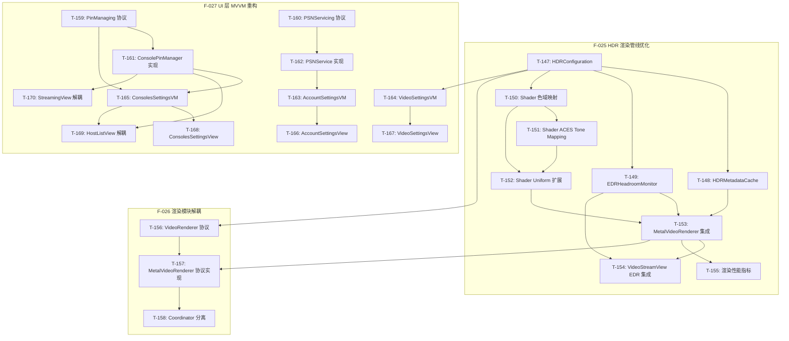

# Chiaki-ng Apple 原生客户端 - 开发任务

> **状态更新**: 2026-02-04
> **当前里程碑**: M12 (HDR 渲染优化、渲染模块解耦、UI 层 MVVM 重构)
> **M11 归档**: [archive/04-dev-tasks-archive.md](archive/04-dev-tasks-archive.md) (35 任务)

---

## M11 归档摘要

> **阶段目标**: Beta 1 发布冲刺 | **完成率**: 97% (35/36)
> **详情**: [查看归档文件](archive/04-dev-tasks-archive.md)

| 状态 | 数量 | 说明 |
|------|------|------|
| ✅ 已完成 | 30 | T-111~T-134, T-136~T-139, T-145~T-146 |
| 📦 早前归档 | 5 | T-140~T-144 |
| ⏳ 进行中 | 1 | T-115 (待设计师资产) |

### T-115: 分发：多平台 App Icon 资产准备 ⏳

- **关联需求**: F-018, AC-048
- **当前进度**: tvOS 配置已完成，待设计师提供实际图像资产
- **涉及文件**: `Assets.xcassets/AppIcon.appiconset/`

---

# 开发任务 (M12)

> **状态更新**: 2026-02-04
> **阶段目标**: HDR 渲染优化、渲染模块解耦、UI 层 MVVM 合规重构
> **完成率**: 0% (0/24 任务完成)

## M12 任务概览

| 编号 | 名称 | 优先级 | TDD 模式 | 依赖 | 状态 |
|------|------|--------|----------|------|------|
| **T-147** | HDR: HDRConfiguration 统一配置结构 | P0 | 🔴 强制 | - | ⏳ |
| **T-148** | HDR: HDRMetadataCache 抖动抑制 | P0 | 🔴 强制 | T-147 | ⏳ |
| **T-149** | HDR: EDRHeadroomMonitor 动态监听 | P0 | 🔴 强制 | T-147 | ⏳ |
| **T-150** | HDR: Shader 色域映射 (Rec.2020→P3) | P0 | 🔴 强制 | T-147 | ⏳ |
| **T-151** | HDR: Shader ACES Tone Mapping | P1 | 🔴 强制 | T-150 | ⏳ |
| **T-152** | HDR: Shader Uniform 扩展 | P0 | 🟡 推荐 | T-150, T-151 | ⏳ |
| **T-153** | HDR: MetalVideoRenderer 集成 | P0 | 🟡 推荐 | T-148, T-149, T-152 | ⏳ |
| **T-154** | HDR: VideoStreamView EDR 集成 | P0 | 🟢 可选 | T-149, T-153 | ⏳ |
| **T-155** | Stats: 渲染性能指标扩展 | P1 | 🔴 强制 | T-153 | ⏳ |
| **T-156** | Render: VideoRenderer 协议抽象 | P0 | 🔴 强制 | T-147 | ⏳ |
| **T-157** | Render: MetalVideoRenderer 协议实现 | P0 | 🔴 强制 | T-156, T-153 | ⏳ |
| **T-158** | Render: VideoStreamView.Coordinator 分离 | P1 | 🟡 推荐 | T-157 | ⏳ |
| **T-159** | Protocol: PinManaging 协议定义 | P0 | 🔴 强制 | - | ⏳ |
| **T-160** | Protocol: PSNServicing 协议定义 | P0 | 🔴 强制 | - | ⏳ |
| **T-161** | Protocol: ConsolePinManager 协议实现 | P0 | 🟡 推荐 | T-159 | ⏳ |
| **T-162** | Protocol: PSNService 协议实现 | P0 | 🟡 推荐 | T-160 | ⏳ |
| **T-163** | VM: AccountSettingsViewModel | P0 | 🔴 强制 | T-162 | ⏳ |
| **T-164** | VM: VideoSettingsViewModel | P1 | 🔴 强制 | T-147 | ⏳ |
| **T-165** | VM: ConsolesSettingsViewModel | P1 | 🔴 强制 | T-159, T-161 | ⏳ |
| **T-166** | View: AccountSettingsView 重构 | P0 | 🟢 可选 | T-163 | ⏳ |
| **T-167** | View: VideoSettingsView 重构 | P1 | 🟢 可选 | T-164 | ⏳ |
| **T-168** | View: ConsolesSettingsView 重构 | P1 | 🟢 可选 | T-165 | ⏳ |
| **T-169** | View: HostListView Singleton 解耦 | P0 | 🟢 可选 | T-161, T-165 | ⏳ |
| **T-170** | View: StreamingView/ControllerSettingsView 解耦 | P1 | 🟢 可选 | T-161 | ⏳ |

---

## M12 任务详情

### T-147: HDR: HDRConfiguration 统一配置结构 ⏳

**目标**: 创建统一的 HDR 配置结构，集中管理所有 HDR 相关设置。

**关联需求**: F-025, F-026 | AC-088

**测试用例**: UT-032.1~6

**TDD 模式**: 🔴 强制

**涉及文件**:
- `Chiaki/Core/Video/HDRConfiguration.swift` (新建)

**验收标准**:
- [ ] `HDRConfiguration` 结构包含 enabled, edrIntensity, colorSpace, colorRange, tonemapMode, gamutMappingEnabled
- [ ] 提供 `.sdr` 和 `.hdr` 静态预设
- [ ] `isHDR` 计算属性正确判断 (enabled && bt2020)
- [ ] 实现 Codable 和 Equatable
- [ ] 所有属性有合理默认值

**测试方法**:
```bash
swift test --filter HDRConfigurationTests
```

**Review 要点**:
- [ ] 枚举值与 Shader 常量对齐
- [ ] 默认值与现有行为兼容

---

### T-148: HDR: HDRMetadataCache 抖动抑制 ⏳

**目标**: 实现 HDR 元数据缓存，避免 HDR/SDR 状态频繁切换。

**关联需求**: F-025 | AC-083

**测试用例**: UT-029.1~5

**TDD 模式**: 🔴 强制

**依赖**: T-147

**涉及文件**:
- `Chiaki/Core/Video/HDRMetadataCache.swift` (新建)

**验收标准**:
- [ ] 初始状态为 SDR (confirmedHDR = false)
- [ ] 需要连续 5 帧 HDR 才能确认为 HDR 模式
- [ ] 需要连续 5 帧 SDR 才能切换回 SDR 模式
- [ ] 单帧抖动不改变状态
- [ ] `reset()` 方法清除所有状态

**测试方法**:
```bash
swift test --filter HDRMetadataCacheTests
```

**Review 要点**:
- [ ] 阈值可配置或有合理常量
- [ ] 线程安全（如需从多线程调用）

---

### T-149: HDR: EDRHeadroomMonitor 动态监听 ⏳

**目标**: 实现 EDR Headroom 动态监听，支持 macOS 和 iOS。

**关联需求**: F-025 | AC-081

**测试用例**: UT-028.1~4, IT-011.1~4

**TDD 模式**: 🔴 强制

**依赖**: T-147

**涉及文件**:
- `Chiaki/Core/Video/EDRHeadroomMonitor.swift` (新建)

**验收标准**:
- [ ] macOS: 监听 `NSScreen.maximumExtendedDynamicRangeColorComponentValue`
- [ ] iOS 16+: 使用 `UIScreen.currentEDRHeadroom`
- [ ] 初始值 ≥ 1.0
- [ ] 值变化平滑过渡（避免突变）
- [ ] 追踪最大可用 Headroom
- [ ] 正确清理 observer/displayLink

**测试方法**:
```bash
swift test --filter EDRHeadroomMonitorTests
```

**Review 要点**:
- [ ] 平台条件编译正确 (`#if os(macOS)`)
- [ ] DisplayLink 正确配置帧率
- [ ] 内存管理（deinit 清理）

---

### T-150: HDR: Shader 色域映射 (Rec.2020→P3) ⏳

**目标**: 在 Metal Shader 中实现 Rec.2020 到 Display P3 色域映射。

**关联需求**: F-025 | AC-080

**测试用例**: UT-027.1~6

**TDD 模式**: 🔴 强制

**依赖**: T-147

**涉及文件**:
- `Chiaki/Core/Video/VideoShaders.metal` (修改)

**验收标准**:
- [ ] 添加 `kRec2020_to_P3_Matrix` 常量矩阵
- [ ] 添加 `applyGamutMapping()` 函数
- [ ] 白点映射 (1,1,1) → 接近 (1,1,1)
- [ ] 负值软裁剪（不产生 NaN）
- [ ] 矩阵可逆（行列式非零）

**测试方法**:
```bash
# 使用 Metal 单元测试或 Swift 测试函数验证
swift test --filter ColorSpaceConversionTests
```

**Review 要点**:
- [ ] 矩阵值与标准参考一致
- [ ] 在正确位置调用（PQ EOTF 后，EDR 缩放前）

---

### T-151: HDR: Shader ACES Tone Mapping ⏳

**目标**: 实现 ACES Filmic Tone Mapping 用于 HDR→SDR 降级。

**关联需求**: F-025 | AC-084

**测试用例**: UT-030.1~5

**TDD 模式**: 🔴 强制

**依赖**: T-150

**涉及文件**:
- `Chiaki/Core/Video/VideoShaders.metal` (修改)

**验收标准**:
- [ ] 实现 `acesTonemap()` 函数
- [ ] 黑色保留: (0,0,0) → (0,0,0)
- [ ] 高光压缩: (10,10,10) → < (1,1,1)
- [ ] 输出范围 ∈ [0, 1]
- [ ] 单调性: x1 < x2 → f(x1) < f(x2)

**测试方法**:
```bash
swift test --filter TonemappingTests
```

**Review 要点**:
- [ ] ACES 参数与标准一致
- [ ] 条件调用（tonemapMode == 1 时）

---

### T-152: HDR: Shader Uniform 扩展 ⏳

**目标**: 扩展 Shader Uniform 结构以支持新的 HDR 参数。

**关联需求**: F-025 | AC-081, AC-082, AC-084

**测试用例**: IT-011.2

**TDD 模式**: 🟡 推荐

**依赖**: T-150, T-151

**涉及文件**:
- `Chiaki/Core/Video/VideoShaders.metal` (修改 `VideoUniforms`)
- `Chiaki/Core/Video/MetalVideoRenderer.swift` (对应 Swift 结构)

**验收标准**:
- [ ] `VideoUniforms` 新增 `edrHeadroom: Float`
- [ ] `VideoUniforms` 新增 `tonemapMode: UInt32`
- [ ] Swift 侧 `VideoUniforms` 与 Metal 侧内存布局一致
- [ ] Fragment Shader 根据 uniforms 选择处理路径

**测试方法**:
```bash
swift test --filter HDRIntegrationTests
```

**Review 要点**:
- [ ] 内存对齐正确
- [ ] 默认值与现有行为兼容

---

### T-153: HDR: MetalVideoRenderer 集成 ⏳

**目标**: 将所有 HDR 组件集成到 MetalVideoRenderer。

**关联需求**: F-025 | AC-080, AC-082, AC-083

**测试用例**: IT-011.1~4

**TDD 模式**: 🟡 推荐

**依赖**: T-148, T-149, T-152

**涉及文件**:
- `Chiaki/Core/Video/MetalVideoRenderer.swift` (修改)

**验收标准**:
- [ ] 集成 `HDRMetadataCache` 用于抖动抑制
- [ ] 添加 `edrHeadroom` 属性接收外部值
- [ ] 添加 `hdrConfiguration` 属性
- [ ] `updateUniforms()` 方法正确填充所有 HDR 相关字段
- [ ] 根据 PixelFormat 检测 HDR 帧

**测试方法**:
```bash
swift test --filter HDRIntegrationTests
```

**Review 要点**:
- [ ] 线程安全（帧提交可能来自不同线程）
- [ ] 不破坏现有 SDR 渲染逻辑

---

### T-154: HDR: VideoStreamView EDR 集成 ⏳

**目标**: 在 VideoStreamView 中集成 EDR Headroom 监听和传递。

**关联需求**: F-025 | AC-081, AC-082

**测试用例**: E2E-011.1~3

**TDD 模式**: 🟢 可选

**依赖**: T-149, T-153

**涉及文件**:
- `Chiaki/Features/Streaming/VideoStreamView.swift` (修改)

**验收标准**:
- [ ] 持有 `EDRHeadroomMonitor` 实例
- [ ] 在 `updateNSView`/`updateUIView` 中传递 headroom 到 renderer
- [ ] HDR 模式下配置 `rgba16Float` 像素格式
- [ ] HDR 模式下配置 `extendedLinearDisplayP3` 色彩空间
- [ ] 动态切换像素格式（HDR↔SDR）

**测试方法**: 手动测试 + E2E-011

**Review 要点**:
- [ ] 像素格式切换时机正确
- [ ] 无内存泄漏

---

### T-155: Stats: 渲染性能指标扩展 ⏳

**目标**: 扩展 StreamStatsManager 以支持详细渲染性能指标。

**关联需求**: F-025 | AC-085

**测试用例**: UT-031.1~5

**TDD 模式**: 🔴 强制

**依赖**: T-153

**涉及文件**:
- `Chiaki/Features/Streaming/StreamStatsManager.swift` (修改)
- `Chiaki/Features/Streaming/StreamingOverlay.swift` (修改，可选显示)

**验收标准**:
- [ ] 新增 `decodeTimeMs`, `renderTimeMs` 属性
- [ ] 新增 `p95LatencyMs`, `p99LatencyMs` 属性
- [ ] 实现百分位计算（采样窗口 100）
- [ ] `recordDecodeTime()`, `recordRenderTime()` 方法
- [ ] P99 ≥ P95 恒成立

**测试方法**:
```bash
swift test --filter StreamStatsManagerTests
```

**Review 要点**:
- [ ] 采样窗口大小合理
- [ ] 计算效率可接受

---

### T-156: Render: VideoRenderer 协议抽象 ⏳

**目标**: 定义 VideoRenderer 协议，实现渲染器抽象。

**关联需求**: F-026 | AC-086

**测试用例**: UT-033.1~6

**TDD 模式**: 🔴 强制

**依赖**: T-147

**涉及文件**:
- `Chiaki/Core/Video/VideoRenderer.swift` (新建)

**验收标准**:
- [ ] 协议定义 `submitFrame(_:)` 方法
- [ ] 协议定义 `render(to:descriptor:)` 方法
- [ ] 协议定义 `displayMode`, `zoomFactor`, `hdrConfiguration`, `edrHeadroom` 属性
- [ ] 协议定义 `setBrightness`, `setContrast`, `setSaturation` 方法
- [ ] 协议定义 `frameSize`, `hasFrame` 查询属性
- [ ] 定义 `VideoDisplayMode`, `TonemapMode` 枚举

**测试方法**:
```bash
swift test --filter VideoRendererTests
```

**Review 要点**:
- [ ] 协议足够抽象，不暴露 Metal 细节
- [ ] Sendable 合规

---

### T-157: Render: MetalVideoRenderer 协议实现 ⏳

**目标**: 重构 MetalVideoRenderer 以实现 VideoRenderer 协议。

**关联需求**: F-026 | AC-086, AC-089

**测试用例**: UT-033.1~6, UT-034.1~3

**TDD 模式**: 🔴 强制

**依赖**: T-156, T-153

**涉及文件**:
- `Chiaki/Core/Video/MetalVideoRenderer.swift` (重构)

**验收标准**:
- [ ] `MetalVideoRenderer` 实现 `VideoRenderer` 协议
- [ ] **移除** `MTKViewDelegate` 实现
- [ ] 所有协议方法正确实现
- [ ] 通过依赖注入接收 `HDRConfiguration`
- [ ] `edrHeadroom` 可从外部设置

**测试方法**:
```bash
swift test --filter VideoRendererTests
```

**Review 要点**:
- [ ] 不再直接实现 MTKViewDelegate
- [ ] 无破坏性变更（Coordinator 将接管 delegate）

---

### T-158: Render: VideoStreamView.Coordinator 分离 ⏳

**目标**: 将 MTKViewDelegate 实现移至 VideoStreamView.Coordinator。

**关联需求**: F-026 | AC-087

**测试用例**: UT-035.1~3, IT-012.1~3

**TDD 模式**: 🟡 推荐

**依赖**: T-157

**涉及文件**:
- `Chiaki/Features/Streaming/VideoStreamView.swift` (重构)

**验收标准**:
- [ ] `VideoStreamView.Coordinator` 实现 `MTKViewDelegate`
- [ ] Coordinator 持有 `VideoRenderer` 引用
- [ ] `draw(in:)` 调用 `renderer.render(to:descriptor:)`
- [ ] `mtkView(_:drawableSizeWillChange:)` 正确处理
- [ ] View 通过 Coordinator 与 Renderer 交互

**测试方法**:
```bash
swift test --filter CoordinatorIntegrationTests
```

**Review 要点**:
- [ ] Coordinator 生命周期正确
- [ ] 无循环引用

---

### T-159: Protocol: PinManaging 协议定义 ⏳

**目标**: 定义 PinManaging 协议，抽象 PIN 管理逻辑。

**关联需求**: F-027 | AC-095

**测试用例**: UT-039.1~4

**TDD 模式**: 🔴 强制

**依赖**: -

**涉及文件**:
- `Chiaki/Shared/Protocols/PinManaging.swift` (新建)

**验收标准**:
- [ ] 协议定义 `setPin(_:for:)` 方法
- [ ] 协议定义 `clearPin(for:)` 方法
- [ ] 协议定义 `hasPin(for:) -> Bool` 方法
- [ ] 协议定义 `requiresPinEntry(for:) -> Bool` 方法
- [ ] 协议定义 `getPin(for:) -> String?` 方法
- [ ] 协议继承 `AnyObject, Sendable`

**测试方法**:
```bash
swift test --filter PinManagingTests
```

**Review 要点**:
- [ ] 方法签名与现有 ConsolePinManager 一致
- [ ] 无副作用方法标记合适

---

### T-160: Protocol: PSNServicing 协议定义 ⏳

**目标**: 定义 PSNServicing 协议，抽象 PSN 服务逻辑。

**关联需求**: F-027 | AC-095

**测试用例**: UT-040.1~2

**TDD 模式**: 🔴 强制

**依赖**: -

**涉及文件**:
- `Chiaki/Shared/Protocols/PSNServicing.swift` (新建)

**验收标准**:
- [ ] 协议定义 `account: PSNAccount?` 属性
- [ ] 协议定义 `isSignedIn: Bool` 属性
- [ ] 协议定义 `authState: PSNAuthState` 属性
- [ ] 协议定义 `signOut()` 方法
- [ ] 协议定义 `manualRefresh() async throws` 方法
- [ ] 协议定义 `startOAuthLogin() -> URL` 方法

**测试方法**:
```bash
swift test --filter PSNServicingTests
```

**Review 要点**:
- [ ] 方法签名与现有 PSNService 一致
- [ ] async 方法正确标记

---

### T-161: Protocol: ConsolePinManager 协议实现 ⏳

**目标**: 让 ConsolePinManager 实现 PinManaging 协议。

**关联需求**: F-027 | AC-095

**测试用例**: UT-039.1~4

**TDD 模式**: 🟡 推荐

**依赖**: T-159

**涉及文件**:
- `Chiaki/Core/Storage/ConsolePinManager.swift` (修改)

**验收标准**:
- [ ] `ConsolePinManager` 实现 `PinManaging` 协议
- [ ] 所有协议方法已有实现（扩展声明即可）
- [ ] 现有调用方无需修改

**测试方法**:
```bash
swift test --filter PinManagingTests
```

**Review 要点**:
- [ ] 无破坏性变更
- [ ] 协议扩展位置合理

---

### T-162: Protocol: PSNService 协议实现 ⏳

**目标**: 让 PSNService 实现 PSNServicing 协议。

**关联需求**: F-027 | AC-095

**测试用例**: UT-040.1~2

**TDD 模式**: 🟡 推荐

**依赖**: T-160

**涉及文件**:
- `Chiaki/Domain/Services/PSNService.swift` (修改)

**验收标准**:
- [ ] `PSNService` 实现 `PSNServicing` 协议
- [ ] 所有协议方法已有实现（扩展声明即可）
- [ ] 现有调用方无需修改

**测试方法**:
```bash
swift test --filter PSNServicingTests
```

**Review 要点**:
- [ ] 无破坏性变更
- [ ] 协议扩展位置合理

---

### T-163: VM: AccountSettingsViewModel ⏳

**目标**: 创建 AccountSettingsViewModel 封装 PSN 操作。

**关联需求**: F-027 | AC-091

**测试用例**: UT-036.1~5, IT-013.1

**TDD 模式**: 🔴 强制

**依赖**: T-162

**涉及文件**:
- `Chiaki/Features/Settings/ViewModels/AccountSettingsViewModel.swift` (新建)

**验收标准**:
- [ ] `@Observable` 类
- [ ] 通过构造函数注入 `PSNServicing`
- [ ] 暴露 `account`, `isSignedIn`, `isRefreshing`, `errorMessage` 状态
- [ ] 实现 `signOut()` 方法
- [ ] 实现 `refreshToken() async` 方法
- [ ] 实现 `getLoginURL() -> URL` 方法

**测试方法**:
```bash
swift test --filter AccountSettingsViewModelTests
```

**Review 要点**:
- [ ] 依赖注入正确
- [ ] 错误处理完善
- [ ] 状态更新在主线程

---

### T-164: VM: VideoSettingsViewModel ⏳

**目标**: 创建 VideoSettingsViewModel 封装 HDR 设置逻辑。

**关联需求**: F-027 | AC-093

**测试用例**: UT-037.1~6, IT-013.3

**TDD 模式**: 🔴 强制

**依赖**: T-147

**涉及文件**:
- `Chiaki/Features/Settings/ViewModels/VideoSettingsViewModel.swift` (新建)

**验收标准**:
- [ ] `@Observable` 类
- [ ] 通过构造函数注入 `SettingsStore`
- [ ] 暴露 `hdrEnabled`, `hdrPeakNits`, `hdrPeakMode`, `edrIntensity` 属性
- [ ] `hdrPeakNits` 正确处理 Double ↔ Int 转换
- [ ] 实现 `shouldShowEDRIntensity`, `shouldShowColorSpace` 计算属性
- [ ] 实现 `validateSettings()` 方法

**测试方法**:
```bash
swift test --filter VideoSettingsViewModelTests
```

**Review 要点**:
- [ ] Binding 转换逻辑正确
- [ ] 验证逻辑完善

---

### T-165: VM: ConsolesSettingsViewModel ⏳

**目标**: 创建 ConsolesSettingsViewModel 封装主机管理逻辑。

**关联需求**: F-027 | AC-094

**测试用例**: UT-038.1~5, IT-013.2

**TDD 模式**: 🔴 强制

**依赖**: T-159, T-161

**涉及文件**:
- `Chiaki/Features/Settings/ViewModels/ConsolesSettingsViewModel.swift` (新建)

**验收标准**:
- [ ] `@Observable` 类
- [ ] 通过构造函数注入 `HostStore` 和 `PinManaging`
- [ ] 暴露 `hosts` 属性
- [ ] 实现 `removeHost(_:)` 方法（同时清除 PIN）
- [ ] 实现 `renameHost(_:to:)` 方法
- [ ] 实现 `hasPin(for:)`, `setPin(_:for:)`, `clearPin(for:)` 代理方法

**测试方法**:
```bash
swift test --filter ConsolesSettingsViewModelTests
```

**Review 要点**:
- [ ] 删除主机时清除关联 PIN
- [ ] 代理方法正确转发

---

### T-166: View: AccountSettingsView 重构 ⏳

**目标**: 重构 AccountSettingsView 使用 ViewModel。

**关联需求**: F-027 | AC-091

**测试用例**: IT-014.2

**TDD 模式**: 🟢 可选

**依赖**: T-163

**涉及文件**:
- `Chiaki/Features/Settings/AccountSettingsView.swift` (重构)

**验收标准**:
- [ ] **移除** `@State private var psnService = PSNService.shared`
- [ ] 使用 `@State private var viewModel = AccountSettingsViewModel()`
- [ ] 所有 PSN 操作通过 viewModel 调用
- [ ] UI 绑定 viewModel 状态

**测试方法**: 代码审查 + 手动测试

**Review 要点**:
- [ ] 无直接 Service 访问
- [ ] 错误提示正确显示

---

### T-167: View: VideoSettingsView 重构 ⏳

**目标**: 重构 VideoSettingsView 使用 ViewModel。

**关联需求**: F-027 | AC-093

**测试用例**: -

**TDD 模式**: 🟢 可选

**依赖**: T-164

**涉及文件**:
- `Chiaki/Features/Settings/VideoSettingsView.swift` (重构)

**验收标准**:
- [ ] **移除** 复杂的 Binding 计算属性
- [ ] 使用 `VideoSettingsViewModel`
- [ ] UI 绑定 viewModel 属性
- [ ] HDR 设置逻辑简化

**测试方法**: 代码审查 + 手动测试

**Review 要点**:
- [ ] Binding 简化
- [ ] 设置变更正确保存

---

### T-168: View: ConsolesSettingsView 重构 ⏳

**目标**: 重构 ConsolesSettingsView 使用 ViewModel。

**关联需求**: F-027 | AC-094

**测试用例**: -

**TDD 模式**: 🟢 可选

**依赖**: T-165

**涉及文件**:
- `Chiaki/Features/Settings/ConsolesSettingsView.swift` (重构)

**验收标准**:
- [ ] **移除** 直接 `hostStore.removeHost(host)` 调用
- [ ] 使用 `ConsolesSettingsViewModel`
- [ ] 所有主机操作通过 viewModel 调用

**测试方法**: 代码审查 + 手动测试

**Review 要点**:
- [ ] 无直接 Store 修改
- [ ] PIN 操作正确代理

---

### T-169: View: HostListView Singleton 解耦 ⏳

**目标**: 移除 HostListView 中的直接 Manager 访问。

**关联需求**: F-027 | AC-090

**测试用例**: UT-041.1~3, IT-014.1

**TDD 模式**: 🟢 可选

**依赖**: T-161, T-165

**涉及文件**:
- `Chiaki/Features/HostList/HostListView.swift` (修改)
- `Chiaki/Features/HostList/HostListViewModel.swift` (扩展)

**验收标准**:
- [ ] **移除** 直接 `HostManager.shared` 访问
- [ ] **移除** 直接 `ConsolePinManager.shared` 访问
- [ ] 通过 HostListViewModel 代理 PIN 操作
- [ ] 所有 Manager 调用通过 ViewModel

**测试方法**: 代码审查 + IT-014.1

**Review 要点**:
- [ ] 无 `.shared` 直接访问
- [ ] ViewModel 正确扩展

---

### T-170: View: StreamingView/ControllerSettingsView 解耦 ⏳

**目标**: 移除其他 View 中的直接 Manager 访问。

**关联需求**: F-027 | AC-092

**测试用例**: IT-014.3

**TDD 模式**: 🟢 可选

**依赖**: T-161

**涉及文件**:
- `Chiaki/Features/Streaming/StreamingView.swift` (修改)
- `Chiaki/Features/Settings/ControllerSettingsView.swift` (修改)

**验收标准**:
- [ ] StreamingView **移除** 直接 `ConsolePinManager.shared` 访问
- [ ] ControllerSettingsView **移除** 直接 `ControllerManager.shared` 访问
- [ ] 通过 ViewModel 或 Environment 注入依赖

**测试方法**: 代码审查 + IT-014.3

**Review 要点**:
- [ ] 无 `.shared` 直接访问
- [ ] 依赖注入方式合理

---

## M12 依赖关系图



## M12 执行检查清单

1. [ ] 开始前确保 M11 所有任务已完成（除 T-115 App Icon）
2. [ ] 建议执行顺序：T-147 → T-159/T-160 → T-148~T-152 → T-156 → T-161~T-165 → T-153~T-158 → T-166~T-170
3. [ ] 核心逻辑任务（🔴 强制 TDD）必须先写测试
4. [ ] 每个任务完成后运行 `/devdocs-sync --trace` 更新追溯
